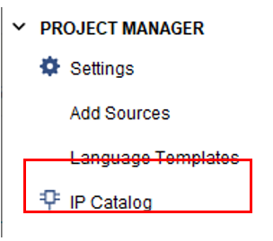
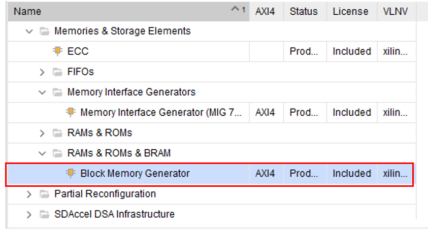
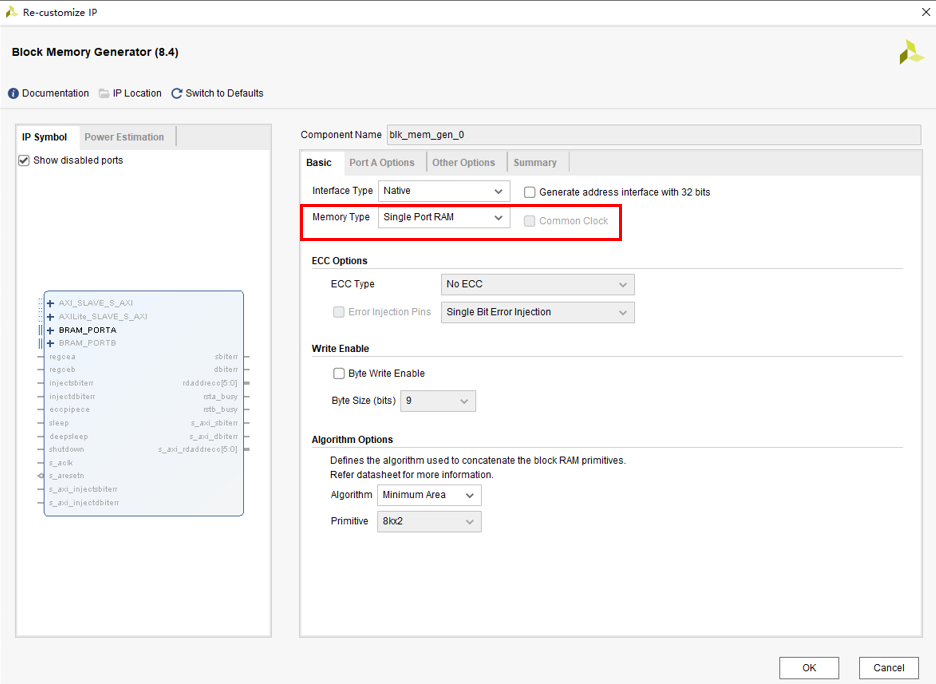
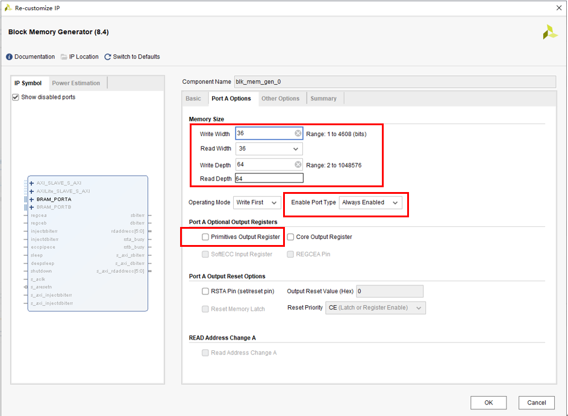
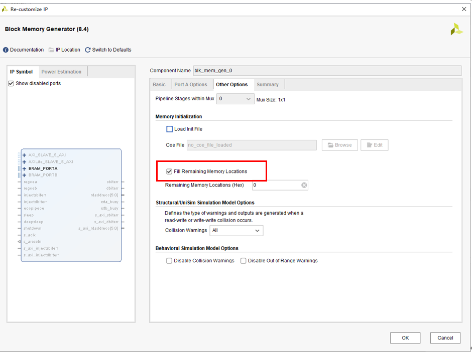
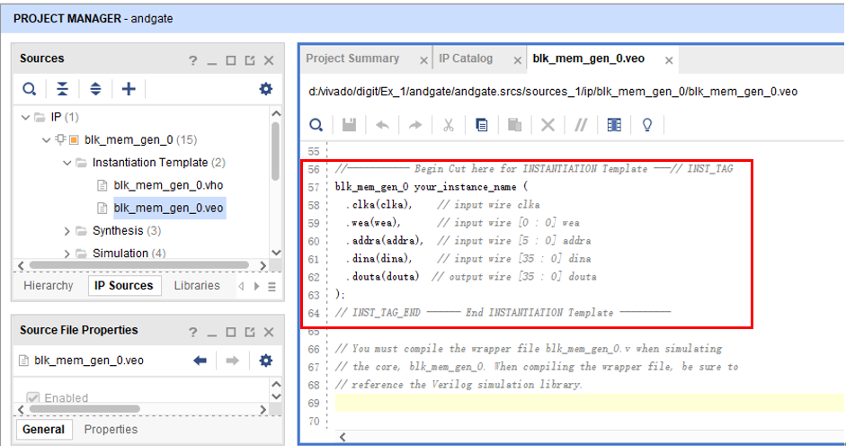

# Block RAM IP核的使用步骤

1. 加入IP：Block memory generator

点击Flow Navigator中的IP Catalog，打开窗口添加IP核。

在Memories & Strorage Elements –> RAM & ROMs & BRAM文件夹，双击Block Memory Generator。

2、点击Basic选项卡配置RAM为简单单口RAM。点击`Port A Options`设置`Write Width`为36，`Read Width`为36，`Write Depth`为64，`Read Depth`为64，端口使能选择`Always Enable`，去掉勾选`Primitives Output Register`。点击`Other Options`，勾选`Fill Remaining Memory Locations`。点击`OK`等待片刻即可生成IP。

3、生成好IP后，点击`IP Sources`展开IP，进入`Instantiation Template`下的`blk_mem_gen_0.veo`文件下复制实例化模板到自己的设计文件下将此IP实例化。

 

 

 