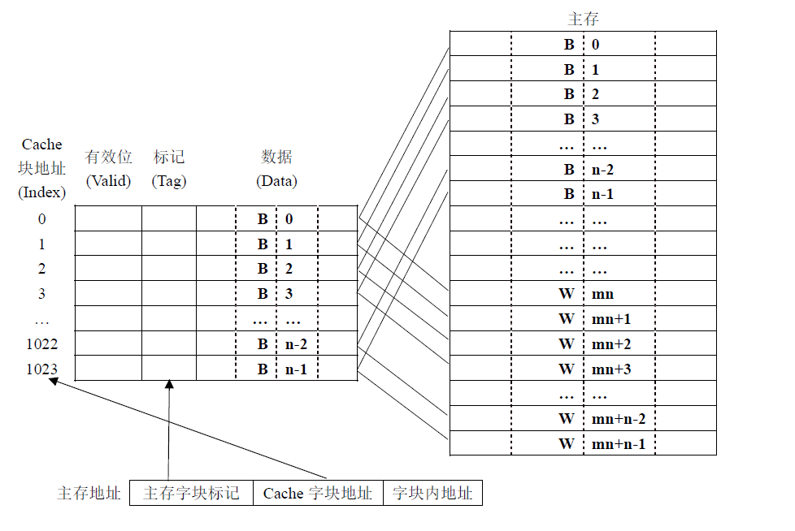
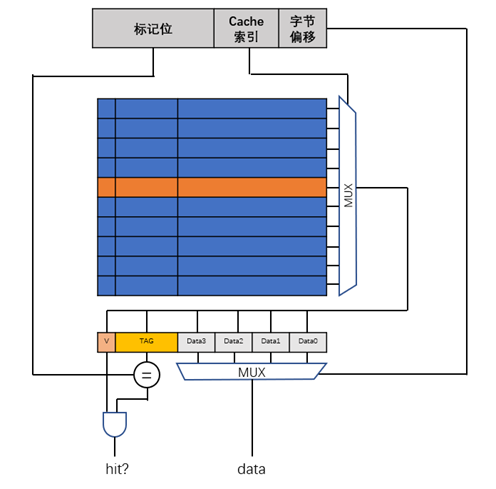

# 实验原理

## Cache的结构

Cache由存储体和控制机构两大主要部分构成。

### Cache的存储体

- 有效位（Valid）：标识该行内存储的数据是否有效，未装入任何数据之前无效。

- 标记（Tag）：用以唯一地标识某个地址，判断是否访问命中。

- 数据域（Data）：连续存储的k个相邻的在主存中连续的数据。

  

## 映射机制

如上所示的地址映射机制，`低2位`为字块内偏移，代表一个Cache行存储有4个字节。`中间10位`为Cache字块地址，代表Cache有1024个Cache行。`高20位`为Tag，用以唯一地标识某个主存地址，与Cache中的标记位比对，判断是否访问命中。

### 地址分解

要设计一个Cache，我们首先需要明确存储系统中主存容量、Cache的容量以及Cache的映射方式，此后进行地址的分解（Address Breakdown）。

例如，我们系统的主存容量为256KB，则主存地址宽度为18位；Cache容量为256B，且设计的方式是直接相联，则Cache字块地址为8位；我们设计Cache每个字块中存储4个字节，则每个块中需要用2位去寻址相应的字节；剩余的18-8-4=6位，则作为Tag使用。此时，我们即完成了地址的分解工作。

如上图所示，一个典型的直接映射Cache访问主要完成几项工作：

- Cache寻址：根据主存地址中的Cache索引，选出对应的Cache块（行）
- 标记比对：主存中的标记位和取出行中的标记位对比，加上Valid位，判断是否命中
- 选出数据：如果命中，根据地址的低位偏移，在读出的Cache Line的数据域中，选择相应的数据，回送给主设备，并采取相应的机制通知主设备，在本次实验中，我们要求拉高Cache模块的hit信号，同时将数据输出到data_out上。
- 缺失处理：如果不命中的话，还需要进行缺失的处理，在下一部分将会提到。

> 下面是一次Cache访问的实例：
>
> 访问地址`0x7c00685d`
>
> 转换为二进制为`0111 1100 0000 0000 0110 1000 0101 1101`
>
> 我们看到，Tag部分为`01111100000000000110`，Cache索引为`1000010111`，则将访问Cache的第535行，取出第535行后，将判断其`Valid`域是否为1，并且Tag部分是否相等，如果相等，则取出4个字节中，偏移为1的字节。

## 缺失处理机制

当Cache的访问发生缺失时，应要有相应的机制，确定缺失的位置，并向下一级存储器发出读字块的请求。

### 缺失动作

在缺失时，Cache向下一级存储器（本实验中为`mem_wrap`）发起读请求，请求读取4个连续存储的字，待下级存储器响应后，将返回的数据采集、打上相应的标签，然后写入自身的存储体中。

### 实现原理

在时序电路中，如果要执行顺序发生的动作，并带有条件跳转，状态机是通用的做法。我们使用状态机生成控制信号，对数据通路进行操纵，从而达到处理各种情况的目的。

下面，我们给出两种状态机实现的例子。Moore状态机状态较多，Mealy状态机控制较为灵活，实现较为简单，大家可以自由选择。

#### Moore状态机实现

由上面的描述，我们可以总结出Cache具有五个状态：

- `READY`：Cache处在就绪状态，可以接受访问请求，一旦有访问请求，接受访问地址，下一周期即可转到`TAG_CHECK`状态，相应的Cache行将被读出

- `TAG_CHECK`：在这一阶段，Cache对读出的Cache行进行标签和有效性的检查
  - 如果命中，则转移到`HIT`状态，输出相应的数据，并拉高`hit`信号。
  - 如果未命中，则需要进行重填，进入`WAIT_MEM`状态

- `HIT`：Cache访问命中，将数据输出一周期后，返回`READY`状态，准备接受下一个输入。

- `WAIT_MEM`：在这一阶段，Cache对主存模块发起访问请求，等待主存相应的连续字块传输回来，直到主存通知字块传输完成，转入`REFILL`状态。

- `REFILL`：此时，将取回的字块，加上相应的标签，存进自己的存储体内，此后，返回到`TAG_CHECK`状态。

#### Mealy状态机实现

- `READY`：Cache处在就绪状态，可以接受访问请求，一旦有访问请求，接受访问地址，下一周期即可转到`TAG_CHECK`状态，相应的Cache行将被读出

- `TAG_CHECK`：在这一阶段，Cache对读出的Cache行进行标签和有效性的检查
  - 如果命中，则输出相应的数据，并拉高`hit`信号。
  - 如果未命中，则需要进行重填，进入`REFILL`状态

- `REFILL`：在这一阶段，Cache对主存模块发起访问请求，等待主存相应的连续字块传输回来，直到主存通知字块传输完成，此时，将取回的字块，加上相应的标签，存进自己的存储体内，此后，返回到`TAG_CHECK`状态。