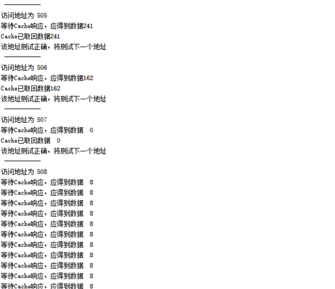
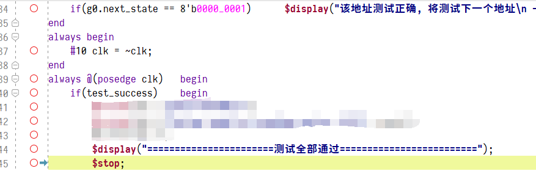

# 实验准备

## 熟悉存储系统模型

本次实验采用的存储系统大小为2K，地址宽度为11，字长为1字节。

存储器模块为`mem_wrap.v`，为简化实验流程，我们已将Cache缺失时连续读取4个块并拼接的工作完成，具体时序图如下：

<svg xmlns="http://www.w3.org/2000/svg" xmlns:xlink="http://www.w3.org/1999/xlink" id="svgcontent_0" height="216" width="1040" viewBox="0 0 1040 216" overflow="hidden" class="WaveDrom"><style type="text/css">text{font-size:11pt;font-style:normal;font-variant:normal;font-weight:normal;font-stretch:normal;text-align:center;fill-opacity:1;font-family:Helvetica}.muted{fill:#aaa}.warning{fill:#f6b900}.error{fill:#f60000}.info{fill:#0041c4}.success{fill:#00ab00}.h1{font-size:33pt;font-weight:bold}.h2{font-size:27pt;font-weight:bold}.h3{font-size:20pt;font-weight:bold}.h4{font-size:14pt;font-weight:bold}.h5{font-size:11pt;font-weight:bold}.h6{font-size:8pt;font-weight:bold}.s1{fill:none;stroke:#000;stroke-width:1;stroke-linecap:round;stroke-linejoin:miter;stroke-miterlimit:4;stroke-opacity:1;stroke-dasharray:none}.s2{fill:none;stroke:#000;stroke-width:0.5;stroke-linecap:round;stroke-linejoin:miter;stroke-miterlimit:4;stroke-opacity:1;stroke-dasharray:none}.s3{color:#000;fill:none;stroke:#000;stroke-width:1;stroke-linecap:round;stroke-linejoin:miter;stroke-miterlimit:4;stroke-opacity:1;stroke-dasharray:1, 3;stroke-dashoffset:0;marker:none;visibility:visible;display:inline;overflow:visible;enable-background:accumulate}.s4{color:#000;fill:none;stroke:#000;stroke-width:1;stroke-linecap:round;stroke-linejoin:miter;stroke-miterlimit:4;stroke-opacity:1;stroke-dasharray:none;stroke-dashoffset:0;marker:none;visibility:visible;display:inline;overflow:visible}.s5{fill:#fff;stroke:none}.s6{fill:#000;fill-opacity:1;stroke:none}.s7{color:#000;fill:#fff;fill-opacity:1;fill-rule:nonzero;stroke:none;stroke-width:1px;marker:none;visibility:visible;display:inline;overflow:visible;enable-background:accumulate}.s8{color:#000;fill:#ffffb4;fill-opacity:1;fill-rule:nonzero;stroke:none;stroke-width:1px;marker:none;visibility:visible;display:inline;overflow:visible;enable-background:accumulate}.s9{color:#000;fill:#ffe0b9;fill-opacity:1;fill-rule:nonzero;stroke:none;stroke-width:1px;marker:none;visibility:visible;display:inline;overflow:visible;enable-background:accumulate}.s10{color:#000;fill:#b9e0ff;fill-opacity:1;fill-rule:nonzero;stroke:none;stroke-width:1px;marker:none;visibility:visible;display:inline;overflow:visible;enable-background:accumulate}.s11{color:#000;fill:#ccfdfe;fill-opacity:1;fill-rule:nonzero;stroke:none;stroke-width:1px;marker:none;visibility:visible;display:inline;overflow:visible;enable-background:accumulate}.s12{color:#000;fill:#cdfdc5;fill-opacity:1;fill-rule:nonzero;stroke:none;stroke-width:1px;marker:none;visibility:visible;display:inline;overflow:visible;enable-background:accumulate}.s13{color:#000;fill:#f0c1fb;fill-opacity:1;fill-rule:nonzero;stroke:none;stroke-width:1px;marker:none;visibility:visible;display:inline;overflow:visible;enable-background:accumulate}.s14{color:#000;fill:#f5c2c0;fill-opacity:1;fill-rule:nonzero;stroke:none;stroke-width:1px;marker:none;visibility:visible;display:inline;overflow:visible;enable-background:accumulate}.s15{fill:#0041c4;fill-opacity:1;stroke:none}.s16{fill:none;stroke:#0041c4;stroke-width:1;stroke-linecap:round;stroke-linejoin:miter;stroke-miterlimit:4;stroke-opacity:1;stroke-dasharray:none}</style><defs><g id="socket"><rect y="15" x="6" height="20" width="20"/></g><g id="pclk"><path d="M0,20 0,0 20,0" class="s1"/></g><g id="nclk"><path d="m0,0 0,20 20,0" class="s1"/></g><g id="000"><path d="m0,20 20,0" class="s1"/></g><g id="0m0"><path d="m0,20 3,0 3,-10 3,10 11,0" class="s1"/></g><g id="0m1"><path d="M0,20 3,20 9,0 20,0" class="s1"/></g><g id="0mx"><path d="M3,20 9,0 20,0" class="s1"/><path d="m20,15 -5,5" class="s2"/><path d="M20,10 10,20" class="s2"/><path d="M20,5 5,20" class="s2"/><path d="M20,0 4,16" class="s2"/><path d="M15,0 6,9" class="s2"/><path d="M10,0 9,1" class="s2"/><path d="m0,20 20,0" class="s1"/></g><g id="0md"><path d="m8,20 10,0" class="s3"/><path d="m0,20 5,0" class="s1"/></g><g id="0mu"><path d="m0,20 3,0 C 7,10 10.107603,0 20,0" class="s1"/></g><g id="0mz"><path d="m0,20 3,0 C 10,10 15,10 20,10" class="s1"/></g><g id="111"><path d="M0,0 20,0" class="s1"/></g><g id="1m0"><path d="m0,0 3,0 6,20 11,0" class="s1"/></g><g id="1m1"><path d="M0,0 3,0 6,10 9,0 20,0" class="s1"/></g><g id="1mx"><path d="m3,0 6,20 11,0" class="s1"/><path d="M0,0 20,0" class="s1"/><path d="m20,15 -5,5" class="s2"/><path d="M20,10 10,20" class="s2"/><path d="M20,5 8,17" class="s2"/><path d="M20,0 7,13" class="s2"/><path d="M15,0 6,9" class="s2"/><path d="M10,0 5,5" class="s2"/><path d="M3.5,1.5 5,0" class="s2"/></g><g id="1md"><path d="m0,0 3,0 c 4,10 7,20 17,20" class="s1"/></g><g id="1mu"><path d="M0,0 5,0" class="s1"/><path d="M8,0 18,0" class="s3"/></g><g id="1mz"><path d="m0,0 3,0 c 7,10 12,10 17,10" class="s1"/></g><g id="xxx"><path d="m0,20 20,0" class="s1"/><path d="M0,0 20,0" class="s1"/><path d="M0,5 5,0" class="s2"/><path d="M0,10 10,0" class="s2"/><path d="M0,15 15,0" class="s2"/><path d="M0,20 20,0" class="s2"/><path d="M5,20 20,5" class="s2"/><path d="M10,20 20,10" class="s2"/><path d="m15,20 5,-5" class="s2"/></g><g id="xm0"><path d="M0,0 4,0 9,20" class="s1"/><path d="m0,20 20,0" class="s1"/><path d="M0,5 4,1" class="s2"/><path d="M0,10 5,5" class="s2"/><path d="M0,15 6,9" class="s2"/><path d="M0,20 7,13" class="s2"/><path d="M5,20 8,17" class="s2"/></g><g id="xm1"><path d="M0,0 20,0" class="s1"/><path d="M0,20 4,20 9,0" class="s1"/><path d="M0,5 5,0" class="s2"/><path d="M0,10 9,1" class="s2"/><path d="M0,15 7,8" class="s2"/><path d="M0,20 5,15" class="s2"/></g><g id="xmx"><path d="m0,20 20,0" class="s1"/><path d="M0,0 20,0" class="s1"/><path d="M0,5 5,0" class="s2"/><path d="M0,10 10,0" class="s2"/><path d="M0,15 15,0" class="s2"/><path d="M0,20 20,0" class="s2"/><path d="M5,20 20,5" class="s2"/><path d="M10,20 20,10" class="s2"/><path d="m15,20 5,-5" class="s2"/></g><g id="xmd"><path d="m0,0 4,0 c 3,10 6,20 16,20" class="s1"/><path d="m0,20 20,0" class="s1"/><path d="M0,5 4,1" class="s2"/><path d="M0,10 5.5,4.5" class="s2"/><path d="M0,15 6.5,8.5" class="s2"/><path d="M0,20 8,12" class="s2"/><path d="m5,20 5,-5" class="s2"/><path d="m10,20 2.5,-2.5" class="s2"/></g><g id="xmu"><path d="M0,0 20,0" class="s1"/><path d="m0,20 4,0 C 7,10 10,0 20,0" class="s1"/><path d="M0,5 5,0" class="s2"/><path d="M0,10 10,0" class="s2"/><path d="M0,15 10,5" class="s2"/><path d="M0,20 6,14" class="s2"/></g><g id="xmz"><path d="m0,0 4,0 c 6,10 11,10 16,10" class="s1"/><path d="m0,20 4,0 C 10,10 15,10 20,10" class="s1"/><path d="M0,5 4.5,0.5" class="s2"/><path d="M0,10 6.5,3.5" class="s2"/><path d="M0,15 8.5,6.5" class="s2"/><path d="M0,20 11.5,8.5" class="s2"/></g><g id="ddd"><path d="m0,20 20,0" class="s3"/></g><g id="dm0"><path d="m0,20 10,0" class="s3"/><path d="m12,20 8,0" class="s1"/></g><g id="dm1"><path d="M0,20 3,20 9,0 20,0" class="s1"/></g><g id="dmx"><path d="M3,20 9,0 20,0" class="s1"/><path d="m20,15 -5,5" class="s2"/><path d="M20,10 10,20" class="s2"/><path d="M20,5 5,20" class="s2"/><path d="M20,0 4,16" class="s2"/><path d="M15,0 6,9" class="s2"/><path d="M10,0 9,1" class="s2"/><path d="m0,20 20,0" class="s1"/></g><g id="dmd"><path d="m0,20 20,0" class="s3"/></g><g id="dmu"><path d="m0,20 3,0 C 7,10 10.107603,0 20,0" class="s1"/></g><g id="dmz"><path d="m0,20 3,0 C 10,10 15,10 20,10" class="s1"/></g><g id="uuu"><path d="M0,0 20,0" class="s3"/></g><g id="um0"><path d="m0,0 3,0 6,20 11,0" class="s1"/></g><g id="um1"><path d="M0,0 10,0" class="s3"/><path d="m12,0 8,0" class="s1"/></g><g id="umx"><path d="m3,0 6,20 11,0" class="s1"/><path d="M0,0 20,0" class="s1"/><path d="m20,15 -5,5" class="s2"/><path d="M20,10 10,20" class="s2"/><path d="M20,5 8,17" class="s2"/><path d="M20,0 7,13" class="s2"/><path d="M15,0 6,9" class="s2"/><path d="M10,0 5,5" class="s2"/><path d="M3.5,1.5 5,0" class="s2"/></g><g id="umd"><path d="m0,0 3,0 c 4,10 7,20 17,20" class="s1"/></g><g id="umu"><path d="M0,0 20,0" class="s3"/></g><g id="umz"><path d="m0,0 3,0 c 7,10 12,10 17,10" class="s4"/></g><g id="zzz"><path d="m0,10 20,0" class="s1"/></g><g id="zm0"><path d="m0,10 6,0 3,10 11,0" class="s1"/></g><g id="zm1"><path d="M0,10 6,10 9,0 20,0" class="s1"/></g><g id="zmx"><path d="m6,10 3,10 11,0" class="s1"/><path d="M0,10 6,10 9,0 20,0" class="s1"/><path d="m20,15 -5,5" class="s2"/><path d="M20,10 10,20" class="s2"/><path d="M20,5 8,17" class="s2"/><path d="M20,0 7,13" class="s2"/><path d="M15,0 6.5,8.5" class="s2"/><path d="M10,0 9,1" class="s2"/></g><g id="zmd"><path d="m0,10 7,0 c 3,5 8,10 13,10" class="s1"/></g><g id="zmu"><path d="m0,10 7,0 C 10,5 15,0 20,0" class="s1"/></g><g id="zmz"><path d="m0,10 20,0" class="s1"/></g><g id="gap"><path d="m7,-2 -4,0 c -5,0 -5,24 -10,24 l 4,0 C 2,22 2,-2 7,-2 z" class="s5"/><path d="M-7,22 C -2,22 -2,-2 3,-2" class="s1"/><path d="M-3,22 C 2,22 2,-2 7,-2" class="s1"/></g><g id="Pclk"><path d="M-3,12 0,3 3,12 C 1,11 -1,11 -3,12 z" class="s6"/><path d="M0,20 0,0 20,0" class="s1"/></g><g id="Nclk"><path d="M-3,8 0,17 3,8 C 1,9 -1,9 -3,8 z" class="s6"/><path d="m0,0 0,20 20,0" class="s1"/></g><g id="0mv-2"><path d="M9,0 20,0 20,20 3,20 z" class="s7"/><path d="M3,20 9,0 20,0" class="s1"/><path d="m0,20 20,0" class="s1"/></g><g id="1mv-2"><path d="M2.875,0 20,0 20,20 9,20 z" class="s7"/><path d="m3,0 6,20 11,0" class="s1"/><path d="M0,0 20,0" class="s1"/></g><g id="xmv-2"><path d="M9,0 20,0 20,20 9,20 6,10 z" class="s7"/><path d="M0,20 3,20 9,0 20,0" class="s1"/><path d="m0,0 3,0 6,20 11,0" class="s1"/><path d="M0,5 3.5,1.5" class="s2"/><path d="M0,10 4.5,5.5" class="s2"/><path d="M0,15 6,9" class="s2"/><path d="M0,20 4,16" class="s2"/></g><g id="dmv-2"><path d="M9,0 20,0 20,20 3,20 z" class="s7"/><path d="M3,20 9,0 20,0" class="s1"/><path d="m0,20 20,0" class="s1"/></g><g id="umv-2"><path d="M3,0 20,0 20,20 9,20 z" class="s7"/><path d="m3,0 6,20 11,0" class="s1"/><path d="M0,0 20,0" class="s1"/></g><g id="zmv-2"><path d="M9,0 20,0 20,20 9,20 6,10 z" class="s7"/><path d="m6,10 3,10 11,0" class="s1"/><path d="M0,10 6,10 9,0 20,0" class="s1"/></g><g id="vvv-2"><path d="M20,20 0,20 0,0 20,0" class="s7"/><path d="m0,20 20,0" class="s1"/><path d="M0,0 20,0" class="s1"/></g><g id="vm0-2"><path d="M0,20 0,0 3,0 9,20" class="s7"/><path d="M0,0 3,0 9,20" class="s1"/><path d="m0,20 20,0" class="s1"/></g><g id="vm1-2"><path d="M0,0 0,20 3,20 9,0" class="s7"/><path d="M0,0 20,0" class="s1"/><path d="M0,20 3,20 9,0" class="s1"/></g><g id="vmx-2"><path d="M0,0 0,20 3,20 6,10 3,0" class="s7"/><path d="m0,0 3,0 6,20 11,0" class="s1"/><path d="M0,20 3,20 9,0 20,0" class="s1"/><path d="m20,15 -5,5" class="s2"/><path d="M20,10 10,20" class="s2"/><path d="M20,5 8,17" class="s2"/><path d="M20,0 7,13" class="s2"/><path d="M15,0 7,8" class="s2"/><path d="M10,0 9,1" class="s2"/></g><g id="vmd-2"><path d="m0,0 0,20 20,0 C 10,20 7,10 3,0" class="s7"/><path d="m0,0 3,0 c 4,10 7,20 17,20" class="s1"/><path d="m0,20 20,0" class="s1"/></g><g id="vmu-2"><path d="m0,0 0,20 3,0 C 7,10 10,0 20,0" class="s7"/><path d="m0,20 3,0 C 7,10 10,0 20,0" class="s1"/><path d="M0,0 20,0" class="s1"/></g><g id="vmz-2"><path d="M0,0 3,0 C 10,10 15,10 20,10 15,10 10,10 3,20 L 0,20" class="s7"/><path d="m0,0 3,0 c 7,10 12,10 17,10" class="s1"/><path d="m0,20 3,0 C 10,10 15,10 20,10" class="s1"/></g><g id="0mv-3"><path d="M9,0 20,0 20,20 3,20 z" class="s8"/><path d="M3,20 9,0 20,0" class="s1"/><path d="m0,20 20,0" class="s1"/></g><g id="1mv-3"><path d="M2.875,0 20,0 20,20 9,20 z" class="s8"/><path d="m3,0 6,20 11,0" class="s1"/><path d="M0,0 20,0" class="s1"/></g><g id="xmv-3"><path d="M9,0 20,0 20,20 9,20 6,10 z" class="s8"/><path d="M0,20 3,20 9,0 20,0" class="s1"/><path d="m0,0 3,0 6,20 11,0" class="s1"/><path d="M0,5 3.5,1.5" class="s2"/><path d="M0,10 4.5,5.5" class="s2"/><path d="M0,15 6,9" class="s2"/><path d="M0,20 4,16" class="s2"/></g><g id="dmv-3"><path d="M9,0 20,0 20,20 3,20 z" class="s8"/><path d="M3,20 9,0 20,0" class="s1"/><path d="m0,20 20,0" class="s1"/></g><g id="umv-3"><path d="M3,0 20,0 20,20 9,20 z" class="s8"/><path d="m3,0 6,20 11,0" class="s1"/><path d="M0,0 20,0" class="s1"/></g><g id="zmv-3"><path d="M9,0 20,0 20,20 9,20 6,10 z" class="s8"/><path d="m6,10 3,10 11,0" class="s1"/><path d="M0,10 6,10 9,0 20,0" class="s1"/></g><g id="vvv-3"><path d="M20,20 0,20 0,0 20,0" class="s8"/><path d="m0,20 20,0" class="s1"/><path d="M0,0 20,0" class="s1"/></g><g id="vm0-3"><path d="M0,20 0,0 3,0 9,20" class="s8"/><path d="M0,0 3,0 9,20" class="s1"/><path d="m0,20 20,0" class="s1"/></g><g id="vm1-3"><path d="M0,0 0,20 3,20 9,0" class="s8"/><path d="M0,0 20,0" class="s1"/><path d="M0,20 3,20 9,0" class="s1"/></g><g id="vmx-3"><path d="M0,0 0,20 3,20 6,10 3,0" class="s8"/><path d="m0,0 3,0 6,20 11,0" class="s1"/><path d="M0,20 3,20 9,0 20,0" class="s1"/><path d="m20,15 -5,5" class="s2"/><path d="M20,10 10,20" class="s2"/><path d="M20,5 8,17" class="s2"/><path d="M20,0 7,13" class="s2"/><path d="M15,0 7,8" class="s2"/><path d="M10,0 9,1" class="s2"/></g><g id="vmd-3"><path d="m0,0 0,20 20,0 C 10,20 7,10 3,0" class="s8"/><path d="m0,0 3,0 c 4,10 7,20 17,20" class="s1"/><path d="m0,20 20,0" class="s1"/></g><g id="vmu-3"><path d="m0,0 0,20 3,0 C 7,10 10,0 20,0" class="s8"/><path d="m0,20 3,0 C 7,10 10,0 20,0" class="s1"/><path d="M0,0 20,0" class="s1"/></g><g id="vmz-3"><path d="M0,0 3,0 C 10,10 15,10 20,10 15,10 10,10 3,20 L 0,20" class="s8"/><path d="m0,0 3,0 c 7,10 12,10 17,10" class="s1"/><path d="m0,20 3,0 C 10,10 15,10 20,10" class="s1"/></g><g id="0mv-4"><path d="M9,0 20,0 20,20 3,20 z" class="s9"/><path d="M3,20 9,0 20,0" class="s1"/><path d="m0,20 20,0" class="s1"/></g><g id="1mv-4"><path d="M2.875,0 20,0 20,20 9,20 z" class="s9"/><path d="m3,0 6,20 11,0" class="s1"/><path d="M0,0 20,0" class="s1"/></g><g id="xmv-4"><path d="M9,0 20,0 20,20 9,20 6,10 z" class="s9"/><path d="M0,20 3,20 9,0 20,0" class="s1"/><path d="m0,0 3,0 6,20 11,0" class="s1"/><path d="M0,5 3.5,1.5" class="s2"/><path d="M0,10 4.5,5.5" class="s2"/><path d="M0,15 6,9" class="s2"/><path d="M0,20 4,16" class="s2"/></g><g id="dmv-4"><path d="M9,0 20,0 20,20 3,20 z" class="s9"/><path d="M3,20 9,0 20,0" class="s1"/><path d="m0,20 20,0" class="s1"/></g><g id="umv-4"><path d="M3,0 20,0 20,20 9,20 z" class="s9"/><path d="m3,0 6,20 11,0" class="s1"/><path d="M0,0 20,0" class="s1"/></g><g id="zmv-4"><path d="M9,0 20,0 20,20 9,20 6,10 z" class="s9"/><path d="m6,10 3,10 11,0" class="s1"/><path d="M0,10 6,10 9,0 20,0" class="s1"/></g><g id="vvv-4"><path d="M20,20 0,20 0,0 20,0" class="s9"/><path d="m0,20 20,0" class="s1"/><path d="M0,0 20,0" class="s1"/></g><g id="vm0-4"><path d="M0,20 0,0 3,0 9,20" class="s9"/><path d="M0,0 3,0 9,20" class="s1"/><path d="m0,20 20,0" class="s1"/></g><g id="vm1-4"><path d="M0,0 0,20 3,20 9,0" class="s9"/><path d="M0,0 20,0" class="s1"/><path d="M0,20 3,20 9,0" class="s1"/></g><g id="vmx-4"><path d="M0,0 0,20 3,20 6,10 3,0" class="s9"/><path d="m0,0 3,0 6,20 11,0" class="s1"/><path d="M0,20 3,20 9,0 20,0" class="s1"/><path d="m20,15 -5,5" class="s2"/><path d="M20,10 10,20" class="s2"/><path d="M20,5 8,17" class="s2"/><path d="M20,0 7,13" class="s2"/><path d="M15,0 7,8" class="s2"/><path d="M10,0 9,1" class="s2"/></g><g id="vmd-4"><path d="m0,0 0,20 20,0 C 10,20 7,10 3,0" class="s9"/><path d="m0,0 3,0 c 4,10 7,20 17,20" class="s1"/><path d="m0,20 20,0" class="s1"/></g><g id="vmu-4"><path d="m0,0 0,20 3,0 C 7,10 10,0 20,0" class="s9"/><path d="m0,20 3,0 C 7,10 10,0 20,0" class="s1"/><path d="M0,0 20,0" class="s1"/></g><g id="vmz-4"><path d="M0,0 3,0 C 10,10 15,10 20,10 15,10 10,10 3,20 L 0,20" class="s9"/><path d="m0,0 3,0 c 7,10 12,10 17,10" class="s1"/><path d="m0,20 3,0 C 10,10 15,10 20,10" class="s1"/></g><g id="0mv-5"><path d="M9,0 20,0 20,20 3,20 z" class="s10"/><path d="M3,20 9,0 20,0" class="s1"/><path d="m0,20 20,0" class="s1"/></g><g id="1mv-5"><path d="M2.875,0 20,0 20,20 9,20 z" class="s10"/><path d="m3,0 6,20 11,0" class="s1"/><path d="M0,0 20,0" class="s1"/></g><g id="xmv-5"><path d="M9,0 20,0 20,20 9,20 6,10 z" class="s10"/><path d="M0,20 3,20 9,0 20,0" class="s1"/><path d="m0,0 3,0 6,20 11,0" class="s1"/><path d="M0,5 3.5,1.5" class="s2"/><path d="M0,10 4.5,5.5" class="s2"/><path d="M0,15 6,9" class="s2"/><path d="M0,20 4,16" class="s2"/></g><g id="dmv-5"><path d="M9,0 20,0 20,20 3,20 z" class="s10"/><path d="M3,20 9,0 20,0" class="s1"/><path d="m0,20 20,0" class="s1"/></g><g id="umv-5"><path d="M3,0 20,0 20,20 9,20 z" class="s10"/><path d="m3,0 6,20 11,0" class="s1"/><path d="M0,0 20,0" class="s1"/></g><g id="zmv-5"><path d="M9,0 20,0 20,20 9,20 6,10 z" class="s10"/><path d="m6,10 3,10 11,0" class="s1"/><path d="M0,10 6,10 9,0 20,0" class="s1"/></g><g id="vvv-5"><path d="M20,20 0,20 0,0 20,0" class="s10"/><path d="m0,20 20,0" class="s1"/><path d="M0,0 20,0" class="s1"/></g><g id="vm0-5"><path d="M0,20 0,0 3,0 9,20" class="s10"/><path d="M0,0 3,0 9,20" class="s1"/><path d="m0,20 20,0" class="s1"/></g><g id="vm1-5"><path d="M0,0 0,20 3,20 9,0" class="s10"/><path d="M0,0 20,0" class="s1"/><path d="M0,20 3,20 9,0" class="s1"/></g><g id="vmx-5"><path d="M0,0 0,20 3,20 6,10 3,0" class="s10"/><path d="m0,0 3,0 6,20 11,0" class="s1"/><path d="M0,20 3,20 9,0 20,0" class="s1"/><path d="m20,15 -5,5" class="s2"/><path d="M20,10 10,20" class="s2"/><path d="M20,5 8,17" class="s2"/><path d="M20,0 7,13" class="s2"/><path d="M15,0 7,8" class="s2"/><path d="M10,0 9,1" class="s2"/></g><g id="vmd-5"><path d="m0,0 0,20 20,0 C 10,20 7,10 3,0" class="s10"/><path d="m0,0 3,0 c 4,10 7,20 17,20" class="s1"/><path d="m0,20 20,0" class="s1"/></g><g id="vmu-5"><path d="m0,0 0,20 3,0 C 7,10 10,0 20,0" class="s10"/><path d="m0,20 3,0 C 7,10 10,0 20,0" class="s1"/><path d="M0,0 20,0" class="s1"/></g><g id="vmz-5"><path d="M0,0 3,0 C 10,10 15,10 20,10 15,10 10,10 3,20 L 0,20" class="s10"/><path d="m0,0 3,0 c 7,10 12,10 17,10" class="s1"/><path d="m0,20 3,0 C 10,10 15,10 20,10" class="s1"/></g><g id="0mv-6"><path d="M9,0 20,0 20,20 3,20 z" class="s11"/><path d="M3,20 9,0 20,0" class="s1"/><path d="m0,20 20,0" class="s1"/></g><g id="1mv-6"><path d="M2.875,0 20,0 20,20 9,20 z" class="s11"/><path d="m3,0 6,20 11,0" class="s1"/><path d="M0,0 20,0" class="s1"/></g><g id="xmv-6"><path d="M9,0 20,0 20,20 9,20 6,10 z" class="s11"/><path d="M0,20 3,20 9,0 20,0" class="s1"/><path d="m0,0 3,0 6,20 11,0" class="s1"/><path d="M0,5 3.5,1.5" class="s2"/><path d="M0,10 4.5,5.5" class="s2"/><path d="M0,15 6,9" class="s2"/><path d="M0,20 4,16" class="s2"/></g><g id="dmv-6"><path d="M9,0 20,0 20,20 3,20 z" class="s11"/><path d="M3,20 9,0 20,0" class="s1"/><path d="m0,20 20,0" class="s1"/></g><g id="umv-6"><path d="M3,0 20,0 20,20 9,20 z" class="s11"/><path d="m3,0 6,20 11,0" class="s1"/><path d="M0,0 20,0" class="s1"/></g><g id="zmv-6"><path d="M9,0 20,0 20,20 9,20 6,10 z" class="s11"/><path d="m6,10 3,10 11,0" class="s1"/><path d="M0,10 6,10 9,0 20,0" class="s1"/></g><g id="vvv-6"><path d="M20,20 0,20 0,0 20,0" class="s11"/><path d="m0,20 20,0" class="s1"/><path d="M0,0 20,0" class="s1"/></g><g id="vm0-6"><path d="M0,20 0,0 3,0 9,20" class="s11"/><path d="M0,0 3,0 9,20" class="s1"/><path d="m0,20 20,0" class="s1"/></g><g id="vm1-6"><path d="M0,0 0,20 3,20 9,0" class="s11"/><path d="M0,0 20,0" class="s1"/><path d="M0,20 3,20 9,0" class="s1"/></g><g id="vmx-6"><path d="M0,0 0,20 3,20 6,10 3,0" class="s11"/><path d="m0,0 3,0 6,20 11,0" class="s1"/><path d="M0,20 3,20 9,0 20,0" class="s1"/><path d="m20,15 -5,5" class="s2"/><path d="M20,10 10,20" class="s2"/><path d="M20,5 8,17" class="s2"/><path d="M20,0 7,13" class="s2"/><path d="M15,0 7,8" class="s2"/><path d="M10,0 9,1" class="s2"/></g><g id="vmd-6"><path d="m0,0 0,20 20,0 C 10,20 7,10 3,0" class="s11"/><path d="m0,0 3,0 c 4,10 7,20 17,20" class="s1"/><path d="m0,20 20,0" class="s1"/></g><g id="vmu-6"><path d="m0,0 0,20 3,0 C 7,10 10,0 20,0" class="s11"/><path d="m0,20 3,0 C 7,10 10,0 20,0" class="s1"/><path d="M0,0 20,0" class="s1"/></g><g id="vmz-6"><path d="M0,0 3,0 C 10,10 15,10 20,10 15,10 10,10 3,20 L 0,20" class="s11"/><path d="m0,0 3,0 c 7,10 12,10 17,10" class="s1"/><path d="m0,20 3,0 C 10,10 15,10 20,10" class="s1"/></g><g id="0mv-7"><path d="M9,0 20,0 20,20 3,20 z" class="s12"/><path d="M3,20 9,0 20,0" class="s1"/><path d="m0,20 20,0" class="s1"/></g><g id="1mv-7"><path d="M2.875,0 20,0 20,20 9,20 z" class="s12"/><path d="m3,0 6,20 11,0" class="s1"/><path d="M0,0 20,0" class="s1"/></g><g id="xmv-7"><path d="M9,0 20,0 20,20 9,20 6,10 z" class="s12"/><path d="M0,20 3,20 9,0 20,0" class="s1"/><path d="m0,0 3,0 6,20 11,0" class="s1"/><path d="M0,5 3.5,1.5" class="s2"/><path d="M0,10 4.5,5.5" class="s2"/><path d="M0,15 6,9" class="s2"/><path d="M0,20 4,16" class="s2"/></g><g id="dmv-7"><path d="M9,0 20,0 20,20 3,20 z" class="s12"/><path d="M3,20 9,0 20,0" class="s1"/><path d="m0,20 20,0" class="s1"/></g><g id="umv-7"><path d="M3,0 20,0 20,20 9,20 z" class="s12"/><path d="m3,0 6,20 11,0" class="s1"/><path d="M0,0 20,0" class="s1"/></g><g id="zmv-7"><path d="M9,0 20,0 20,20 9,20 6,10 z" class="s12"/><path d="m6,10 3,10 11,0" class="s1"/><path d="M0,10 6,10 9,0 20,0" class="s1"/></g><g id="vvv-7"><path d="M20,20 0,20 0,0 20,0" class="s12"/><path d="m0,20 20,0" class="s1"/><path d="M0,0 20,0" class="s1"/></g><g id="vm0-7"><path d="M0,20 0,0 3,0 9,20" class="s12"/><path d="M0,0 3,0 9,20" class="s1"/><path d="m0,20 20,0" class="s1"/></g><g id="vm1-7"><path d="M0,0 0,20 3,20 9,0" class="s12"/><path d="M0,0 20,0" class="s1"/><path d="M0,20 3,20 9,0" class="s1"/></g><g id="vmx-7"><path d="M0,0 0,20 3,20 6,10 3,0" class="s12"/><path d="m0,0 3,0 6,20 11,0" class="s1"/><path d="M0,20 3,20 9,0 20,0" class="s1"/><path d="m20,15 -5,5" class="s2"/><path d="M20,10 10,20" class="s2"/><path d="M20,5 8,17" class="s2"/><path d="M20,0 7,13" class="s2"/><path d="M15,0 7,8" class="s2"/><path d="M10,0 9,1" class="s2"/></g><g id="vmd-7"><path d="m0,0 0,20 20,0 C 10,20 7,10 3,0" class="s12"/><path d="m0,0 3,0 c 4,10 7,20 17,20" class="s1"/><path d="m0,20 20,0" class="s1"/></g><g id="vmu-7"><path d="m0,0 0,20 3,0 C 7,10 10,0 20,0" class="s12"/><path d="m0,20 3,0 C 7,10 10,0 20,0" class="s1"/><path d="M0,0 20,0" class="s1"/></g><g id="vmz-7"><path d="M0,0 3,0 C 10,10 15,10 20,10 15,10 10,10 3,20 L 0,20" class="s12"/><path d="m0,0 3,0 c 7,10 12,10 17,10" class="s1"/><path d="m0,20 3,0 C 10,10 15,10 20,10" class="s1"/></g><g id="0mv-8"><path d="M9,0 20,0 20,20 3,20 z" class="s13"/><path d="M3,20 9,0 20,0" class="s1"/><path d="m0,20 20,0" class="s1"/></g><g id="1mv-8"><path d="M2.875,0 20,0 20,20 9,20 z" class="s13"/><path d="m3,0 6,20 11,0" class="s1"/><path d="M0,0 20,0" class="s1"/></g><g id="xmv-8"><path d="M9,0 20,0 20,20 9,20 6,10 z" class="s13"/><path d="M0,20 3,20 9,0 20,0" class="s1"/><path d="m0,0 3,0 6,20 11,0" class="s1"/><path d="M0,5 3.5,1.5" class="s2"/><path d="M0,10 4.5,5.5" class="s2"/><path d="M0,15 6,9" class="s2"/><path d="M0,20 4,16" class="s2"/></g><g id="dmv-8"><path d="M9,0 20,0 20,20 3,20 z" class="s13"/><path d="M3,20 9,0 20,0" class="s1"/><path d="m0,20 20,0" class="s1"/></g><g id="umv-8"><path d="M3,0 20,0 20,20 9,20 z" class="s13"/><path d="m3,0 6,20 11,0" class="s1"/><path d="M0,0 20,0" class="s1"/></g><g id="zmv-8"><path d="M9,0 20,0 20,20 9,20 6,10 z" class="s13"/><path d="m6,10 3,10 11,0" class="s1"/><path d="M0,10 6,10 9,0 20,0" class="s1"/></g><g id="vvv-8"><path d="M20,20 0,20 0,0 20,0" class="s13"/><path d="m0,20 20,0" class="s1"/><path d="M0,0 20,0" class="s1"/></g><g id="vm0-8"><path d="M0,20 0,0 3,0 9,20" class="s13"/><path d="M0,0 3,0 9,20" class="s1"/><path d="m0,20 20,0" class="s1"/></g><g id="vm1-8"><path d="M0,0 0,20 3,20 9,0" class="s13"/><path d="M0,0 20,0" class="s1"/><path d="M0,20 3,20 9,0" class="s1"/></g><g id="vmx-8"><path d="M0,0 0,20 3,20 6,10 3,0" class="s13"/><path d="m0,0 3,0 6,20 11,0" class="s1"/><path d="M0,20 3,20 9,0 20,0" class="s1"/><path d="m20,15 -5,5" class="s2"/><path d="M20,10 10,20" class="s2"/><path d="M20,5 8,17" class="s2"/><path d="M20,0 7,13" class="s2"/><path d="M15,0 7,8" class="s2"/><path d="M10,0 9,1" class="s2"/></g><g id="vmd-8"><path d="m0,0 0,20 20,0 C 10,20 7,10 3,0" class="s13"/><path d="m0,0 3,0 c 4,10 7,20 17,20" class="s1"/><path d="m0,20 20,0" class="s1"/></g><g id="vmu-8"><path d="m0,0 0,20 3,0 C 7,10 10,0 20,0" class="s13"/><path d="m0,20 3,0 C 7,10 10,0 20,0" class="s1"/><path d="M0,0 20,0" class="s1"/></g><g id="vmz-8"><path d="M0,0 3,0 C 10,10 15,10 20,10 15,10 10,10 3,20 L 0,20" class="s13"/><path d="m0,0 3,0 c 7,10 12,10 17,10" class="s1"/><path d="m0,20 3,0 C 10,10 15,10 20,10" class="s1"/></g><g id="0mv-9"><path d="M9,0 20,0 20,20 3,20 z" class="s14"/><path d="M3,20 9,0 20,0" class="s1"/><path d="m0,20 20,0" class="s1"/></g><g id="1mv-9"><path d="M2.875,0 20,0 20,20 9,20 z" class="s14"/><path d="m3,0 6,20 11,0" class="s1"/><path d="M0,0 20,0" class="s1"/></g><g id="xmv-9"><path d="M9,0 20,0 20,20 9,20 6,10 z" class="s14"/><path d="M0,20 3,20 9,0 20,0" class="s1"/><path d="m0,0 3,0 6,20 11,0" class="s1"/><path d="M0,5 3.5,1.5" class="s2"/><path d="M0,10 4.5,5.5" class="s2"/><path d="M0,15 6,9" class="s2"/><path d="M0,20 4,16" class="s2"/></g><g id="dmv-9"><path d="M9,0 20,0 20,20 3,20 z" class="s14"/><path d="M3,20 9,0 20,0" class="s1"/><path d="m0,20 20,0" class="s1"/></g><g id="umv-9"><path d="M3,0 20,0 20,20 9,20 z" class="s14"/><path d="m3,0 6,20 11,0" class="s1"/><path d="M0,0 20,0" class="s1"/></g><g id="zmv-9"><path d="M9,0 20,0 20,20 9,20 6,10 z" class="s14"/><path d="m6,10 3,10 11,0" class="s1"/><path d="M0,10 6,10 9,0 20,0" class="s1"/></g><g id="vvv-9"><path d="M20,20 0,20 0,0 20,0" class="s14"/><path d="m0,20 20,0" class="s1"/><path d="M0,0 20,0" class="s1"/></g><g id="vm0-9"><path d="M0,20 0,0 3,0 9,20" class="s14"/><path d="M0,0 3,0 9,20" class="s1"/><path d="m0,20 20,0" class="s1"/></g><g id="vm1-9"><path d="M0,0 0,20 3,20 9,0" class="s14"/><path d="M0,0 20,0" class="s1"/><path d="M0,20 3,20 9,0" class="s1"/></g><g id="vmx-9"><path d="M0,0 0,20 3,20 6,10 3,0" class="s14"/><path d="m0,0 3,0 6,20 11,0" class="s1"/><path d="M0,20 3,20 9,0 20,0" class="s1"/><path d="m20,15 -5,5" class="s2"/><path d="M20,10 10,20" class="s2"/><path d="M20,5 8,17" class="s2"/><path d="M20,0 7,13" class="s2"/><path d="M15,0 7,8" class="s2"/><path d="M10,0 9,1" class="s2"/></g><g id="vmd-9"><path d="m0,0 0,20 20,0 C 10,20 7,10 3,0" class="s14"/><path d="m0,0 3,0 c 4,10 7,20 17,20" class="s1"/><path d="m0,20 20,0" class="s1"/></g><g id="vmu-9"><path d="m0,0 0,20 3,0 C 7,10 10,0 20,0" class="s14"/><path d="m0,20 3,0 C 7,10 10,0 20,0" class="s1"/><path d="M0,0 20,0" class="s1"/></g><g id="vmz-9"><path d="M0,0 3,0 C 10,10 15,10 20,10 15,10 10,10 3,20 L 0,20" class="s14"/><path d="m0,0 3,0 c 7,10 12,10 17,10" class="s1"/><path d="m0,20 3,0 C 10,10 15,10 20,10" class="s1"/></g><g id="vmv-2-2"><path d="M9,0 20,0 20,20 9,20 6,10 z" class="s7"/><path d="M3,0 0,0 0,20 3,20 6,10 z" class="s7"/><path d="m0,0 3,0 6,20 11,0" class="s1"/><path d="M0,20 3,20 9,0 20,0" class="s1"/></g><g id="vmv-3-2"><path d="M9,0 20,0 20,20 9,20 6,10 z" class="s7"/><path d="M3,0 0,0 0,20 3,20 6,10 z" class="s8"/><path d="m0,0 3,0 6,20 11,0" class="s1"/><path d="M0,20 3,20 9,0 20,0" class="s1"/></g><g id="vmv-4-2"><path d="M9,0 20,0 20,20 9,20 6,10 z" class="s7"/><path d="M3,0 0,0 0,20 3,20 6,10 z" class="s9"/><path d="m0,0 3,0 6,20 11,0" class="s1"/><path d="M0,20 3,20 9,0 20,0" class="s1"/></g><g id="vmv-5-2"><path d="M9,0 20,0 20,20 9,20 6,10 z" class="s7"/><path d="M3,0 0,0 0,20 3,20 6,10 z" class="s10"/><path d="m0,0 3,0 6,20 11,0" class="s1"/><path d="M0,20 3,20 9,0 20,0" class="s1"/></g><g id="vmv-6-2"><path d="M9,0 20,0 20,20 9,20 6,10 z" class="s7"/><path d="M3,0 0,0 0,20 3,20 6,10 z" class="s11"/><path d="m0,0 3,0 6,20 11,0" class="s1"/><path d="M0,20 3,20 9,0 20,0" class="s1"/></g><g id="vmv-7-2"><path d="M9,0 20,0 20,20 9,20 6,10 z" class="s7"/><path d="M3,0 0,0 0,20 3,20 6,10 z" class="s12"/><path d="m0,0 3,0 6,20 11,0" class="s1"/><path d="M0,20 3,20 9,0 20,0" class="s1"/></g><g id="vmv-8-2"><path d="M9,0 20,0 20,20 9,20 6,10 z" class="s7"/><path d="M3,0 0,0 0,20 3,20 6,10 z" class="s13"/><path d="m0,0 3,0 6,20 11,0" class="s1"/><path d="M0,20 3,20 9,0 20,0" class="s1"/></g><g id="vmv-9-2"><path d="M9,0 20,0 20,20 9,20 6,10 z" class="s7"/><path d="M3,0 0,0 0,20 3,20 6,10 z" class="s14"/><path d="m0,0 3,0 6,20 11,0" class="s1"/><path d="M0,20 3,20 9,0 20,0" class="s1"/></g><g id="vmv-2-3"><path d="M9,0 20,0 20,20 9,20 6,10 z" class="s8"/><path d="M3,0 0,0 0,20 3,20 6,10 z" class="s7"/><path d="m0,0 3,0 6,20 11,0" class="s1"/><path d="M0,20 3,20 9,0 20,0" class="s1"/></g><g id="vmv-3-3"><path d="M9,0 20,0 20,20 9,20 6,10 z" class="s8"/><path d="M3,0 0,0 0,20 3,20 6,10 z" class="s8"/><path d="m0,0 3,0 6,20 11,0" class="s1"/><path d="M0,20 3,20 9,0 20,0" class="s1"/></g><g id="vmv-4-3"><path d="M9,0 20,0 20,20 9,20 6,10 z" class="s8"/><path d="M3,0 0,0 0,20 3,20 6,10 z" class="s9"/><path d="m0,0 3,0 6,20 11,0" class="s1"/><path d="M0,20 3,20 9,0 20,0" class="s1"/></g><g id="vmv-5-3"><path d="M9,0 20,0 20,20 9,20 6,10 z" class="s8"/><path d="M3,0 0,0 0,20 3,20 6,10 z" class="s10"/><path d="m0,0 3,0 6,20 11,0" class="s1"/><path d="M0,20 3,20 9,0 20,0" class="s1"/></g><g id="vmv-6-3"><path d="M9,0 20,0 20,20 9,20 6,10 z" class="s8"/><path d="M3,0 0,0 0,20 3,20 6,10 z" class="s11"/><path d="m0,0 3,0 6,20 11,0" class="s1"/><path d="M0,20 3,20 9,0 20,0" class="s1"/></g><g id="vmv-7-3"><path d="M9,0 20,0 20,20 9,20 6,10 z" class="s8"/><path d="M3,0 0,0 0,20 3,20 6,10 z" class="s12"/><path d="m0,0 3,0 6,20 11,0" class="s1"/><path d="M0,20 3,20 9,0 20,0" class="s1"/></g><g id="vmv-8-3"><path d="M9,0 20,0 20,20 9,20 6,10 z" class="s8"/><path d="M3,0 0,0 0,20 3,20 6,10 z" class="s13"/><path d="m0,0 3,0 6,20 11,0" class="s1"/><path d="M0,20 3,20 9,0 20,0" class="s1"/></g><g id="vmv-9-3"><path d="M9,0 20,0 20,20 9,20 6,10 z" class="s8"/><path d="M3,0 0,0 0,20 3,20 6,10 z" class="s14"/><path d="m0,0 3,0 6,20 11,0" class="s1"/><path d="M0,20 3,20 9,0 20,0" class="s1"/></g><g id="vmv-2-4"><path d="M9,0 20,0 20,20 9,20 6,10 z" class="s9"/><path d="M3,0 0,0 0,20 3,20 6,10 z" class="s7"/><path d="m0,0 3,0 6,20 11,0" class="s1"/><path d="M0,20 3,20 9,0 20,0" class="s1"/></g><g id="vmv-3-4"><path d="M9,0 20,0 20,20 9,20 6,10 z" class="s9"/><path d="M3,0 0,0 0,20 3,20 6,10 z" class="s8"/><path d="m0,0 3,0 6,20 11,0" class="s1"/><path d="M0,20 3,20 9,0 20,0" class="s1"/></g><g id="vmv-4-4"><path d="M9,0 20,0 20,20 9,20 6,10 z" class="s9"/><path d="M3,0 0,0 0,20 3,20 6,10 z" class="s9"/><path d="m0,0 3,0 6,20 11,0" class="s1"/><path d="M0,20 3,20 9,0 20,0" class="s1"/></g><g id="vmv-5-4"><path d="M9,0 20,0 20,20 9,20 6,10 z" class="s9"/><path d="M3,0 0,0 0,20 3,20 6,10 z" class="s10"/><path d="m0,0 3,0 6,20 11,0" class="s1"/><path d="M0,20 3,20 9,0 20,0" class="s1"/></g><g id="vmv-6-4"><path d="M9,0 20,0 20,20 9,20 6,10 z" class="s9"/><path d="M3,0 0,0 0,20 3,20 6,10 z" class="s11"/><path d="m0,0 3,0 6,20 11,0" class="s1"/><path d="M0,20 3,20 9,0 20,0" class="s1"/></g><g id="vmv-7-4"><path d="M9,0 20,0 20,20 9,20 6,10 z" class="s9"/><path d="M3,0 0,0 0,20 3,20 6,10 z" class="s12"/><path d="m0,0 3,0 6,20 11,0" class="s1"/><path d="M0,20 3,20 9,0 20,0" class="s1"/></g><g id="vmv-8-4"><path d="M9,0 20,0 20,20 9,20 6,10 z" class="s9"/><path d="M3,0 0,0 0,20 3,20 6,10 z" class="s13"/><path d="m0,0 3,0 6,20 11,0" class="s1"/><path d="M0,20 3,20 9,0 20,0" class="s1"/></g><g id="vmv-9-4"><path d="M9,0 20,0 20,20 9,20 6,10 z" class="s9"/><path d="M3,0 0,0 0,20 3,20 6,10 z" class="s14"/><path d="m0,0 3,0 6,20 11,0" class="s1"/><path d="M0,20 3,20 9,0 20,0" class="s1"/></g><g id="vmv-2-5"><path d="M9,0 20,0 20,20 9,20 6,10 z" class="s10"/><path d="M3,0 0,0 0,20 3,20 6,10 z" class="s7"/><path d="m0,0 3,0 6,20 11,0" class="s1"/><path d="M0,20 3,20 9,0 20,0" class="s1"/></g><g id="vmv-3-5"><path d="M9,0 20,0 20,20 9,20 6,10 z" class="s10"/><path d="M3,0 0,0 0,20 3,20 6,10 z" class="s8"/><path d="m0,0 3,0 6,20 11,0" class="s1"/><path d="M0,20 3,20 9,0 20,0" class="s1"/></g><g id="vmv-4-5"><path d="M9,0 20,0 20,20 9,20 6,10 z" class="s10"/><path d="M3,0 0,0 0,20 3,20 6,10 z" class="s9"/><path d="m0,0 3,0 6,20 11,0" class="s1"/><path d="M0,20 3,20 9,0 20,0" class="s1"/></g><g id="vmv-5-5"><path d="M9,0 20,0 20,20 9,20 6,10 z" class="s10"/><path d="M3,0 0,0 0,20 3,20 6,10 z" class="s10"/><path d="m0,0 3,0 6,20 11,0" class="s1"/><path d="M0,20 3,20 9,0 20,0" class="s1"/></g><g id="vmv-6-5"><path d="M9,0 20,0 20,20 9,20 6,10 z" class="s10"/><path d="M3,0 0,0 0,20 3,20 6,10 z" class="s11"/><path d="m0,0 3,0 6,20 11,0" class="s1"/><path d="M0,20 3,20 9,0 20,0" class="s1"/></g><g id="vmv-7-5"><path d="M9,0 20,0 20,20 9,20 6,10 z" class="s10"/><path d="M3,0 0,0 0,20 3,20 6,10 z" class="s12"/><path d="m0,0 3,0 6,20 11,0" class="s1"/><path d="M0,20 3,20 9,0 20,0" class="s1"/></g><g id="vmv-8-5"><path d="M9,0 20,0 20,20 9,20 6,10 z" class="s10"/><path d="M3,0 0,0 0,20 3,20 6,10 z" class="s13"/><path d="m0,0 3,0 6,20 11,0" class="s1"/><path d="M0,20 3,20 9,0 20,0" class="s1"/></g><g id="vmv-9-5"><path d="M9,0 20,0 20,20 9,20 6,10 z" class="s10"/><path d="M3,0 0,0 0,20 3,20 6,10 z" class="s14"/><path d="m0,0 3,0 6,20 11,0" class="s1"/><path d="M0,20 3,20 9,0 20,0" class="s1"/></g><g id="vmv-2-6"><path d="M9,0 20,0 20,20 9,20 6,10 z" class="s11"/><path d="M3,0 0,0 0,20 3,20 6,10 z" class="s7"/><path d="m0,0 3,0 6,20 11,0" class="s1"/><path d="M0,20 3,20 9,0 20,0" class="s1"/></g><g id="vmv-3-6"><path d="M9,0 20,0 20,20 9,20 6,10 z" class="s11"/><path d="M3,0 0,0 0,20 3,20 6,10 z" class="s8"/><path d="m0,0 3,0 6,20 11,0" class="s1"/><path d="M0,20 3,20 9,0 20,0" class="s1"/></g><g id="vmv-4-6"><path d="M9,0 20,0 20,20 9,20 6,10 z" class="s11"/><path d="M3,0 0,0 0,20 3,20 6,10 z" class="s9"/><path d="m0,0 3,0 6,20 11,0" class="s1"/><path d="M0,20 3,20 9,0 20,0" class="s1"/></g><g id="vmv-5-6"><path d="M9,0 20,0 20,20 9,20 6,10 z" class="s11"/><path d="M3,0 0,0 0,20 3,20 6,10 z" class="s10"/><path d="m0,0 3,0 6,20 11,0" class="s1"/><path d="M0,20 3,20 9,0 20,0" class="s1"/></g><g id="vmv-6-6"><path d="M9,0 20,0 20,20 9,20 6,10 z" class="s11"/><path d="M3,0 0,0 0,20 3,20 6,10 z" class="s11"/><path d="m0,0 3,0 6,20 11,0" class="s1"/><path d="M0,20 3,20 9,0 20,0" class="s1"/></g><g id="vmv-7-6"><path d="M9,0 20,0 20,20 9,20 6,10 z" class="s11"/><path d="M3,0 0,0 0,20 3,20 6,10 z" class="s12"/><path d="m0,0 3,0 6,20 11,0" class="s1"/><path d="M0,20 3,20 9,0 20,0" class="s1"/></g><g id="vmv-8-6"><path d="M9,0 20,0 20,20 9,20 6,10 z" class="s11"/><path d="M3,0 0,0 0,20 3,20 6,10 z" class="s13"/><path d="m0,0 3,0 6,20 11,0" class="s1"/><path d="M0,20 3,20 9,0 20,0" class="s1"/></g><g id="vmv-9-6"><path d="M9,0 20,0 20,20 9,20 6,10 z" class="s11"/><path d="M3,0 0,0 0,20 3,20 6,10 z" class="s14"/><path d="m0,0 3,0 6,20 11,0" class="s1"/><path d="M0,20 3,20 9,0 20,0" class="s1"/></g><g id="vmv-2-7"><path d="M9,0 20,0 20,20 9,20 6,10 z" class="s12"/><path d="M3,0 0,0 0,20 3,20 6,10 z" class="s7"/><path d="m0,0 3,0 6,20 11,0" class="s1"/><path d="M0,20 3,20 9,0 20,0" class="s1"/></g><g id="vmv-3-7"><path d="M9,0 20,0 20,20 9,20 6,10 z" class="s12"/><path d="M3,0 0,0 0,20 3,20 6,10 z" class="s8"/><path d="m0,0 3,0 6,20 11,0" class="s1"/><path d="M0,20 3,20 9,0 20,0" class="s1"/></g><g id="vmv-4-7"><path d="M9,0 20,0 20,20 9,20 6,10 z" class="s12"/><path d="M3,0 0,0 0,20 3,20 6,10 z" class="s9"/><path d="m0,0 3,0 6,20 11,0" class="s1"/><path d="M0,20 3,20 9,0 20,0" class="s1"/></g><g id="vmv-5-7"><path d="M9,0 20,0 20,20 9,20 6,10 z" class="s12"/><path d="M3,0 0,0 0,20 3,20 6,10 z" class="s10"/><path d="m0,0 3,0 6,20 11,0" class="s1"/><path d="M0,20 3,20 9,0 20,0" class="s1"/></g><g id="vmv-6-7"><path d="M9,0 20,0 20,20 9,20 6,10 z" class="s12"/><path d="M3,0 0,0 0,20 3,20 6,10 z" class="s11"/><path d="m0,0 3,0 6,20 11,0" class="s1"/><path d="M0,20 3,20 9,0 20,0" class="s1"/></g><g id="vmv-7-7"><path d="M9,0 20,0 20,20 9,20 6,10 z" class="s12"/><path d="M3,0 0,0 0,20 3,20 6,10 z" class="s12"/><path d="m0,0 3,0 6,20 11,0" class="s1"/><path d="M0,20 3,20 9,0 20,0" class="s1"/></g><g id="vmv-8-7"><path d="M9,0 20,0 20,20 9,20 6,10 z" class="s12"/><path d="M3,0 0,0 0,20 3,20 6,10 z" class="s13"/><path d="m0,0 3,0 6,20 11,0" class="s1"/><path d="M0,20 3,20 9,0 20,0" class="s1"/></g><g id="vmv-9-7"><path d="M9,0 20,0 20,20 9,20 6,10 z" class="s12"/><path d="M3,0 0,0 0,20 3,20 6,10 z" class="s14"/><path d="m0,0 3,0 6,20 11,0" class="s1"/><path d="M0,20 3,20 9,0 20,0" class="s1"/></g><g id="vmv-2-8"><path d="M9,0 20,0 20,20 9,20 6,10 z" class="s13"/><path d="M3,0 0,0 0,20 3,20 6,10 z" class="s7"/><path d="m0,0 3,0 6,20 11,0" class="s1"/><path d="M0,20 3,20 9,0 20,0" class="s1"/></g><g id="vmv-3-8"><path d="M9,0 20,0 20,20 9,20 6,10 z" class="s13"/><path d="M3,0 0,0 0,20 3,20 6,10 z" class="s8"/><path d="m0,0 3,0 6,20 11,0" class="s1"/><path d="M0,20 3,20 9,0 20,0" class="s1"/></g><g id="vmv-4-8"><path d="M9,0 20,0 20,20 9,20 6,10 z" class="s13"/><path d="M3,0 0,0 0,20 3,20 6,10 z" class="s9"/><path d="m0,0 3,0 6,20 11,0" class="s1"/><path d="M0,20 3,20 9,0 20,0" class="s1"/></g><g id="vmv-5-8"><path d="M9,0 20,0 20,20 9,20 6,10 z" class="s13"/><path d="M3,0 0,0 0,20 3,20 6,10 z" class="s10"/><path d="m0,0 3,0 6,20 11,0" class="s1"/><path d="M0,20 3,20 9,0 20,0" class="s1"/></g><g id="vmv-6-8"><path d="M9,0 20,0 20,20 9,20 6,10 z" class="s13"/><path d="M3,0 0,0 0,20 3,20 6,10 z" class="s11"/><path d="m0,0 3,0 6,20 11,0" class="s1"/><path d="M0,20 3,20 9,0 20,0" class="s1"/></g><g id="vmv-7-8"><path d="M9,0 20,0 20,20 9,20 6,10 z" class="s13"/><path d="M3,0 0,0 0,20 3,20 6,10 z" class="s12"/><path d="m0,0 3,0 6,20 11,0" class="s1"/><path d="M0,20 3,20 9,0 20,0" class="s1"/></g><g id="vmv-8-8"><path d="M9,0 20,0 20,20 9,20 6,10 z" class="s13"/><path d="M3,0 0,0 0,20 3,20 6,10 z" class="s13"/><path d="m0,0 3,0 6,20 11,0" class="s1"/><path d="M0,20 3,20 9,0 20,0" class="s1"/></g><g id="vmv-9-8"><path d="M9,0 20,0 20,20 9,20 6,10 z" class="s13"/><path d="M3,0 0,0 0,20 3,20 6,10 z" class="s14"/><path d="m0,0 3,0 6,20 11,0" class="s1"/><path d="M0,20 3,20 9,0 20,0" class="s1"/></g><g id="vmv-2-9"><path d="M9,0 20,0 20,20 9,20 6,10 z" class="s14"/><path d="M3,0 0,0 0,20 3,20 6,10 z" class="s7"/><path d="m0,0 3,0 6,20 11,0" class="s1"/><path d="M0,20 3,20 9,0 20,0" class="s1"/></g><g id="vmv-3-9"><path d="M9,0 20,0 20,20 9,20 6,10 z" class="s14"/><path d="M3,0 0,0 0,20 3,20 6,10 z" class="s8"/><path d="m0,0 3,0 6,20 11,0" class="s1"/><path d="M0,20 3,20 9,0 20,0" class="s1"/></g><g id="vmv-4-9"><path d="M9,0 20,0 20,20 9,20 6,10 z" class="s14"/><path d="M3,0 0,0 0,20 3,20 6,10 z" class="s9"/><path d="m0,0 3,0 6,20 11,0" class="s1"/><path d="M0,20 3,20 9,0 20,0" class="s1"/></g><g id="vmv-5-9"><path d="M9,0 20,0 20,20 9,20 6,10 z" class="s14"/><path d="M3,0 0,0 0,20 3,20 6,10 z" class="s10"/><path d="m0,0 3,0 6,20 11,0" class="s1"/><path d="M0,20 3,20 9,0 20,0" class="s1"/></g><g id="vmv-6-9"><path d="M9,0 20,0 20,20 9,20 6,10 z" class="s14"/><path d="M3,0 0,0 0,20 3,20 6,10 z" class="s11"/><path d="m0,0 3,0 6,20 11,0" class="s1"/><path d="M0,20 3,20 9,0 20,0" class="s1"/></g><g id="vmv-7-9"><path d="M9,0 20,0 20,20 9,20 6,10 z" class="s14"/><path d="M3,0 0,0 0,20 3,20 6,10 z" class="s12"/><path d="m0,0 3,0 6,20 11,0" class="s1"/><path d="M0,20 3,20 9,0 20,0" class="s1"/></g><g id="vmv-8-9"><path d="M9,0 20,0 20,20 9,20 6,10 z" class="s14"/><path d="M3,0 0,0 0,20 3,20 6,10 z" class="s13"/><path d="m0,0 3,0 6,20 11,0" class="s1"/><path d="M0,20 3,20 9,0 20,0" class="s1"/></g><g id="vmv-9-9"><path d="M9,0 20,0 20,20 9,20 6,10 z" class="s14"/><path d="M3,0 0,0 0,20 3,20 6,10 z" class="s14"/><path d="m0,0 3,0 6,20 11,0" class="s1"/><path d="M0,20 3,20 9,0 20,0" class="s1"/></g><g id="arrow0"><path d="m-12,-3 9,3 -9,3 c 1,-2 1,-4 0,-6 z" class="s15"/><path d="M0,0 -15,0" class="s16"/></g><marker id="arrowhead" style="fill:#0041c4" markerHeight="7" markerWidth="10" markerUnits="strokeWidth" viewBox="0 -4 11 8" refX="15" refY="0" orient="auto"><path d="M0 -4 11 0 0 4z"/></marker><marker id="arrowtail" style="fill:#0041c4" markerHeight="7" markerWidth="10" markerUnits="strokeWidth" viewBox="-11 -4 11 8" refX="-15" refY="0" orient="auto"><path d="M0 -4 -11 0 0 4z"/></marker></defs><g id="waves_0"><g id="lanes_0" transform="translate(60.5, 46.5)"><g id="gmarks_0"><g style="stroke:#888;stroke-width:0.5;stroke-dasharray:1,3"><line id="gmark_0_0" x1="0" y1="0" x2="0" y2="150"/><line id="gmark_1_0" x1="80" y1="0" x2="80" y2="150"/><line id="gmark_2_0" x1="160" y1="0" x2="160" y2="150"/><line id="gmark_3_0" x1="240" y1="0" x2="240" y2="150"/><line id="gmark_4_0" x1="320" y1="0" x2="320" y2="150"/><line id="gmark_5_0" x1="400" y1="0" x2="400" y2="150"/><line id="gmark_6_0" x1="480" y1="0" x2="480" y2="150"/><line id="gmark_7_0" x1="560" y1="0" x2="560" y2="150"/><line id="gmark_8_0" x1="640" y1="0" x2="640" y2="150"/><line id="gmark_9_0" x1="720" y1="0" x2="720" y2="150"/><line id="gmark_10_0" x1="800" y1="0" x2="800" y2="150"/><line id="gmark_11_0" x1="880" y1="0" x2="880" y2="150"/><line id="gmark_12_0" x1="960" y1="0" x2="960" y2="150"/></g><text x="480" y="-13" fill="#000" text-anchor="middle" xml:space="preserve"><tspan>主存读时序</tspan></text><g class="muted" text-anchor="middle" xml:space="preserve"><text x="0" y="165">0</text><text x="80" y="165">1</text><text x="160" y="165">2</text><text x="240" y="165">3</text><text x="320" y="165">4</text><text x="400" y="165">5</text><text x="480" y="165">6</text><text x="560" y="165">7</text><text x="640" y="165">8</text><text x="720" y="165">9</text><text x="800" y="165">10</text><text x="880" y="165">11</text><text x="960" y="165">12</text></g></g><g id="wavelane_0_0" transform="translate(0,5)"><text x="-10" y="15" class="info" text-anchor="end" xml:space="preserve"><tspan>clk</tspan></text><g id="wavelane_draw_0_0" transform="translate(0, 0)"><use xlink:href="#pclk" transform="translate(0)"/><use xlink:href="#111" transform="translate(20)"/><use xlink:href="#nclk" transform="translate(40)"/><use xlink:href="#000" transform="translate(60)"/><use xlink:href="#pclk" transform="translate(80)"/><use xlink:href="#111" transform="translate(100)"/><use xlink:href="#nclk" transform="translate(120)"/><use xlink:href="#000" transform="translate(140)"/><use xlink:href="#pclk" transform="translate(160)"/><use xlink:href="#111" transform="translate(180)"/><use xlink:href="#nclk" transform="translate(200)"/><use xlink:href="#000" transform="translate(220)"/><use xlink:href="#pclk" transform="translate(240)"/><use xlink:href="#111" transform="translate(260)"/><use xlink:href="#nclk" transform="translate(280)"/><use xlink:href="#000" transform="translate(300)"/><use xlink:href="#pclk" transform="translate(320)"/><use xlink:href="#111" transform="translate(340)"/><use xlink:href="#nclk" transform="translate(360)"/><use xlink:href="#000" transform="translate(380)"/><use xlink:href="#pclk" transform="translate(400)"/><use xlink:href="#111" transform="translate(420)"/><use xlink:href="#nclk" transform="translate(440)"/><use xlink:href="#000" transform="translate(460)"/><use xlink:href="#pclk" transform="translate(480)"/><use xlink:href="#111" transform="translate(500)"/><use xlink:href="#nclk" transform="translate(520)"/><use xlink:href="#000" transform="translate(540)"/><use xlink:href="#pclk" transform="translate(560)"/><use xlink:href="#111" transform="translate(580)"/><use xlink:href="#nclk" transform="translate(600)"/><use xlink:href="#000" transform="translate(620)"/><use xlink:href="#pclk" transform="translate(640)"/><use xlink:href="#111" transform="translate(660)"/><use xlink:href="#nclk" transform="translate(680)"/><use xlink:href="#000" transform="translate(700)"/><use xlink:href="#pclk" transform="translate(720)"/><use xlink:href="#111" transform="translate(740)"/><use xlink:href="#nclk" transform="translate(760)"/><use xlink:href="#000" transform="translate(780)"/><use xlink:href="#pclk" transform="translate(800)"/><use xlink:href="#111" transform="translate(820)"/><use xlink:href="#nclk" transform="translate(840)"/><use xlink:href="#000" transform="translate(860)"/><use xlink:href="#pclk" transform="translate(880)"/><use xlink:href="#111" transform="translate(900)"/><use xlink:href="#nclk" transform="translate(920)"/><use xlink:href="#000" transform="translate(940)"/></g></g><g id="wavelane_1_0" transform="translate(0,35)"><text x="-10" y="15" class="info" text-anchor="end" xml:space="preserve"><tspan>raddr</tspan></text><g id="wavelane_draw_1_0" transform="translate(0, 0)"><use xlink:href="#xxx" transform="translate(0)"/><use xlink:href="#xxx" transform="translate(20)"/><use xlink:href="#xxx" transform="translate(40)"/><use xlink:href="#xxx" transform="translate(60)"/><use xlink:href="#xmv-3" transform="translate(80)"/><use xlink:href="#vvv-3" transform="translate(100)"/><use xlink:href="#vvv-3" transform="translate(120)"/><use xlink:href="#vvv-3" transform="translate(140)"/><use xlink:href="#vmx-3" transform="translate(160)"/><use xlink:href="#xxx" transform="translate(180)"/><use xlink:href="#xxx" transform="translate(200)"/><use xlink:href="#xxx" transform="translate(220)"/><use xlink:href="#xmx" transform="translate(240)"/><use xlink:href="#xxx" transform="translate(260)"/><use xlink:href="#xxx" transform="translate(280)"/><use xlink:href="#xxx" transform="translate(300)"/><use xlink:href="#xmx" transform="translate(320)"/><use xlink:href="#xxx" transform="translate(340)"/><use xlink:href="#xxx" transform="translate(360)"/><use xlink:href="#xxx" transform="translate(380)"/><use xlink:href="#xxx" transform="translate(400)"/><use xlink:href="#xxx" transform="translate(420)"/><use xlink:href="#xxx" transform="translate(440)"/><use xlink:href="#xxx" transform="translate(460)"/><use xlink:href="#xxx" transform="translate(480)"/><use xlink:href="#xxx" transform="translate(500)"/><use xlink:href="#xxx" transform="translate(520)"/><use xlink:href="#xxx" transform="translate(540)"/><use xlink:href="#xxx" transform="translate(560)"/><use xlink:href="#xxx" transform="translate(580)"/><use xlink:href="#xxx" transform="translate(600)"/><use xlink:href="#xxx" transform="translate(620)"/><use xlink:href="#xxx" transform="translate(640)"/><use xlink:href="#xxx" transform="translate(660)"/><use xlink:href="#xxx" transform="translate(680)"/><use xlink:href="#xxx" transform="translate(700)"/><use xlink:href="#xxx" transform="translate(720)"/><use xlink:href="#xxx" transform="translate(740)"/><use xlink:href="#xxx" transform="translate(760)"/><use xlink:href="#xxx" transform="translate(780)"/><use xlink:href="#xxx" transform="translate(800)"/><use xlink:href="#xxx" transform="translate(820)"/><use xlink:href="#xxx" transform="translate(840)"/><use xlink:href="#xxx" transform="translate(860)"/><use xlink:href="#xxx" transform="translate(880)"/><use xlink:href="#xxx" transform="translate(900)"/><use xlink:href="#xxx" transform="translate(920)"/><use xlink:href="#xxx" transform="translate(940)"/><text x="126" y="15" text-anchor="middle" xml:space="preserve"><tspan>addr0</tspan></text></g></g><g id="wavelane_2_0" transform="translate(0,65)"><text x="-10" y="15" class="info" text-anchor="end" xml:space="preserve"><tspan>rreq</tspan></text><g id="wavelane_draw_2_0" transform="translate(0, 0)"><use xlink:href="#000" transform="translate(0)"/><use xlink:href="#000" transform="translate(20)"/><use xlink:href="#000" transform="translate(40)"/><use xlink:href="#000" transform="translate(60)"/><use xlink:href="#0m1" transform="translate(80)"/><use xlink:href="#111" transform="translate(100)"/><use xlink:href="#111" transform="translate(120)"/><use xlink:href="#111" transform="translate(140)"/><use xlink:href="#111" transform="translate(160)"/><use xlink:href="#111" transform="translate(180)"/><use xlink:href="#111" transform="translate(200)"/><use xlink:href="#111" transform="translate(220)"/><use xlink:href="#111" transform="translate(240)"/><use xlink:href="#111" transform="translate(260)"/><use xlink:href="#111" transform="translate(280)"/><use xlink:href="#111" transform="translate(300)"/><use xlink:href="#111" transform="translate(320)"/><use xlink:href="#111" transform="translate(340)"/><use xlink:href="#111" transform="translate(360)"/><use xlink:href="#111" transform="translate(380)"/><use xlink:href="#111" transform="translate(400)"/><use xlink:href="#111" transform="translate(420)"/><use xlink:href="#111" transform="translate(440)"/><use xlink:href="#111" transform="translate(460)"/><use xlink:href="#111" transform="translate(480)"/><use xlink:href="#111" transform="translate(500)"/><use xlink:href="#111" transform="translate(520)"/><use xlink:href="#111" transform="translate(540)"/><use xlink:href="#111" transform="translate(560)"/><use xlink:href="#111" transform="translate(580)"/><use xlink:href="#111" transform="translate(600)"/><use xlink:href="#111" transform="translate(620)"/><use xlink:href="#1m0" transform="translate(640)"/><use xlink:href="#000" transform="translate(660)"/><use xlink:href="#000" transform="translate(680)"/><use xlink:href="#000" transform="translate(700)"/><use xlink:href="#000" transform="translate(720)"/><use xlink:href="#000" transform="translate(740)"/><use xlink:href="#000" transform="translate(760)"/><use xlink:href="#000" transform="translate(780)"/><use xlink:href="#000" transform="translate(800)"/><use xlink:href="#000" transform="translate(820)"/><use xlink:href="#000" transform="translate(840)"/><use xlink:href="#000" transform="translate(860)"/><use xlink:href="#000" transform="translate(880)"/><use xlink:href="#000" transform="translate(900)"/><use xlink:href="#000" transform="translate(920)"/><use xlink:href="#000" transform="translate(940)"/></g></g><g id="wavelane_3_0" transform="translate(0,95)"><text x="-10" y="15" class="info" text-anchor="end" xml:space="preserve"><tspan>data</tspan></text><g id="wavelane_draw_3_0" transform="translate(0, 0)"><use xlink:href="#xxx" transform="translate(0)"/><use xlink:href="#xxx" transform="translate(20)"/><use xlink:href="#xxx" transform="translate(40)"/><use xlink:href="#xxx" transform="translate(60)"/><use xlink:href="#xxx" transform="translate(80)"/><use xlink:href="#xxx" transform="translate(100)"/><use xlink:href="#xxx" transform="translate(120)"/><use xlink:href="#xxx" transform="translate(140)"/><use xlink:href="#xxx" transform="translate(160)"/><use xlink:href="#xxx" transform="translate(180)"/><use xlink:href="#xxx" transform="translate(200)"/><use xlink:href="#xxx" transform="translate(220)"/><use xlink:href="#xxx" transform="translate(240)"/><use xlink:href="#xxx" transform="translate(260)"/><use xlink:href="#xxx" transform="translate(280)"/><use xlink:href="#xxx" transform="translate(300)"/><use xlink:href="#xxx" transform="translate(320)"/><use xlink:href="#xxx" transform="translate(340)"/><use xlink:href="#xxx" transform="translate(360)"/><use xlink:href="#xxx" transform="translate(380)"/><use xlink:href="#xxx" transform="translate(400)"/><use xlink:href="#xxx" transform="translate(420)"/><use xlink:href="#xxx" transform="translate(440)"/><use xlink:href="#xxx" transform="translate(460)"/><use xlink:href="#xxx" transform="translate(480)"/><use xlink:href="#xxx" transform="translate(500)"/><use xlink:href="#xxx" transform="translate(520)"/><use xlink:href="#xxx" transform="translate(540)"/><use xlink:href="#xmv-3" transform="translate(560)"/><use xlink:href="#vvv-3" transform="translate(580)"/><use xlink:href="#vvv-3" transform="translate(600)"/><use xlink:href="#vvv-3" transform="translate(620)"/><use xlink:href="#vmx-3" transform="translate(640)"/><use xlink:href="#xxx" transform="translate(660)"/><use xlink:href="#xxx" transform="translate(680)"/><use xlink:href="#xxx" transform="translate(700)"/><use xlink:href="#xmx" transform="translate(720)"/><use xlink:href="#xxx" transform="translate(740)"/><use xlink:href="#xxx" transform="translate(760)"/><use xlink:href="#xxx" transform="translate(780)"/><use xlink:href="#xmx" transform="translate(800)"/><use xlink:href="#xxx" transform="translate(820)"/><use xlink:href="#xxx" transform="translate(840)"/><use xlink:href="#xxx" transform="translate(860)"/><use xlink:href="#xmx" transform="translate(880)"/><use xlink:href="#xxx" transform="translate(900)"/><use xlink:href="#xxx" transform="translate(920)"/><use xlink:href="#xxx" transform="translate(940)"/><text x="606" y="15" text-anchor="middle" xml:space="preserve"><tspan>data0</tspan></text></g></g><g id="wavelane_4_0" transform="translate(0,125)"><text x="-10" y="15" class="info" text-anchor="end" xml:space="preserve"><tspan>rvalid</tspan></text><g id="wavelane_draw_4_0" transform="translate(0, 0)"><use xlink:href="#000" transform="translate(0)"/><use xlink:href="#000" transform="translate(20)"/><use xlink:href="#000" transform="translate(40)"/><use xlink:href="#000" transform="translate(60)"/><use xlink:href="#000" transform="translate(80)"/><use xlink:href="#000" transform="translate(100)"/><use xlink:href="#000" transform="translate(120)"/><use xlink:href="#000" transform="translate(140)"/><use xlink:href="#000" transform="translate(160)"/><use xlink:href="#000" transform="translate(180)"/><use xlink:href="#000" transform="translate(200)"/><use xlink:href="#000" transform="translate(220)"/><use xlink:href="#000" transform="translate(240)"/><use xlink:href="#000" transform="translate(260)"/><use xlink:href="#000" transform="translate(280)"/><use xlink:href="#000" transform="translate(300)"/><use xlink:href="#000" transform="translate(320)"/><use xlink:href="#000" transform="translate(340)"/><use xlink:href="#000" transform="translate(360)"/><use xlink:href="#000" transform="translate(380)"/><use xlink:href="#000" transform="translate(400)"/><use xlink:href="#000" transform="translate(420)"/><use xlink:href="#000" transform="translate(440)"/><use xlink:href="#000" transform="translate(460)"/><use xlink:href="#000" transform="translate(480)"/><use xlink:href="#000" transform="translate(500)"/><use xlink:href="#000" transform="translate(520)"/><use xlink:href="#000" transform="translate(540)"/><use xlink:href="#0m1" transform="translate(560)"/><use xlink:href="#111" transform="translate(580)"/><use xlink:href="#111" transform="translate(600)"/><use xlink:href="#111" transform="translate(620)"/><use xlink:href="#1m0" transform="translate(640)"/><use xlink:href="#000" transform="translate(660)"/><use xlink:href="#000" transform="translate(680)"/><use xlink:href="#000" transform="translate(700)"/><use xlink:href="#000" transform="translate(720)"/><use xlink:href="#000" transform="translate(740)"/><use xlink:href="#000" transform="translate(760)"/><use xlink:href="#000" transform="translate(780)"/><use xlink:href="#000" transform="translate(800)"/><use xlink:href="#000" transform="translate(820)"/><use xlink:href="#000" transform="translate(840)"/><use xlink:href="#000" transform="translate(860)"/><use xlink:href="#000" transform="translate(880)"/><use xlink:href="#000" transform="translate(900)"/><use xlink:href="#000" transform="translate(920)"/><use xlink:href="#000" transform="translate(940)"/></g></g><g id="wavearcs_0"/><g id="wavegaps_0"><g id="wavegap_0_0" transform="translate(0,5)"><use xlink:href="#gap" transform="translate(440)"/></g><g id="wavegap_1_0" transform="translate(0,35)"><use xlink:href="#gap" transform="translate(440)"/></g><g id="wavegap_2_0" transform="translate(0,65)"><use xlink:href="#gap" transform="translate(440)"/></g><g id="wavegap_3_0" transform="translate(0,95)"><use xlink:href="#gap" transform="translate(440)"/></g><g id="wavegap_4_0" transform="translate(0,125)"><use xlink:href="#gap" transform="translate(440)"/></g></g></g><g id="groups_0"><g/></g></g></svg>


在主存空闲阶段，Cache将地址放在raddr口上，并将rreq信号拉高，代表一次的读请求。

等待若干个周期，主存将返回4个字拼接而成的数据，并将rvalid信号拉高，代表数据已经准备好，此时可以取走数据。

> 假设addr是0，则data内返回的数据如下：
>
> | 31:24        | 23:16        | 15:8         | 7:0          |
> | ------------ | ------------ | ------------ | ------------ |
> | 0x03处的数据 | 0x02处的数据 | 0x01处的数据 | 0x00处的数据 |

## 项目框架概览

### 设计文件

```
driver (driver.sv) ------ 顶层模块，模拟CPU的访存行为，并进行数据正确性检查，可以看作是CPU
    trace (IP核) --------- 存储标准答案
    cache (cache.v) ----- Cache模块（需要完成）
    mem_wrap(mem_wrap.v) -- 主存存储器模型
```

模块间的关系如下图所示：

<svg id="SvgjsSvg1006" width="478" height="446" xmlns="http://www.w3.org/2000/svg" version="1.1" xmlns:xlink="http://www.w3.org/1999/xlink" xmlns:svgjs="http://svgjs.com/svgjs"><defs id="SvgjsDefs1007"><marker id="SvgjsMarker1063" markerWidth="16" markerHeight="12" refX="0" refY="6" viewBox="0 0 16 12" orient="auto" markerUnits="userSpaceOnUse"><path id="SvgjsPath1064" d="M15,1.5 L2,6 L15,10.5" fill="#323232" stroke="#323232" stroke-width="2"></path></marker><marker id="SvgjsMarker1065" markerWidth="16" markerHeight="12" refX="16" refY="6" viewBox="0 0 16 12" orient="auto" markerUnits="userSpaceOnUse"><path id="SvgjsPath1066" d="M0,2 L14,6 L0,11 L0,2" fill="#323232" stroke="#323232" stroke-width="2"></path></marker><marker id="SvgjsMarker1083" markerWidth="16" markerHeight="12" refX="0" refY="6" viewBox="0 0 16 12" orient="auto" markerUnits="userSpaceOnUse"><path id="SvgjsPath1084" d="M15,1.5 L2,6 L15,10.5" fill="#323232" stroke="#323232" stroke-width="2"></path></marker><marker id="SvgjsMarker1085" markerWidth="16" markerHeight="12" refX="16" refY="6" viewBox="0 0 16 12" orient="auto" markerUnits="userSpaceOnUse"><path id="SvgjsPath1086" d="M0,2 L14,6 L0,11 L0,2" fill="#323232" stroke="#323232" stroke-width="2"></path></marker><marker id="SvgjsMarker1101" markerWidth="16" markerHeight="12" refX="0" refY="6" viewBox="0 0 16 12" orient="auto" markerUnits="userSpaceOnUse"><path id="SvgjsPath1102" d="M15,1.5 L2,6 L15,10.5" fill="#323232" stroke="#323232" stroke-width="2"></path></marker><marker id="SvgjsMarker1103" markerWidth="16" markerHeight="12" refX="16" refY="6" viewBox="0 0 16 12" orient="auto" markerUnits="userSpaceOnUse"><path id="SvgjsPath1104" d="M0,2 L14,6 L0,11 L0,2" fill="#323232" stroke="#323232" stroke-width="2"></path></marker></defs><rect id="SvgjsRect1008" width="478" height="446" fill="#ffffff"></rect><g id="SvgjsG1009" transform="translate(25,25)"><path id="SvgjsPath1010" d="M 0 0L 428 0L 428 396L 0 396Z" stroke="#323232" stroke-width="2" fill-opacity="1" fill="#ffffff"></path><g id="SvgjsG1011"><text id="SvgjsText1012" font-family="微软雅黑" text-anchor="end" font-size="18px" width="164" fill="#323232" font-weight="400" align="middle" anchor="end" family="微软雅黑" size="18px" weight="400" font-style="" y="22.8" transform="rotate(0)"><tspan id="SvgjsTspan1013" dy="22" x="418"><tspan id="SvgjsTspan1014" style="text-decoration:;"> </tspan></tspan><tspan id="SvgjsTspan1015" dy="22" x="418"><tspan id="SvgjsTspan1016" style="text-decoration:;"> </tspan></tspan><tspan id="SvgjsTspan1017" dy="22" x="418"><tspan id="SvgjsTspan1018" style="text-decoration:;"> </tspan></tspan><tspan id="SvgjsTspan1019" dy="22" x="418"><tspan id="SvgjsTspan1020" style="text-decoration:;"> </tspan></tspan><tspan id="SvgjsTspan1021" dy="22" x="418"><tspan id="SvgjsTspan1022" style="text-decoration:;"> </tspan></tspan><tspan id="SvgjsTspan1023" dy="22" x="418"><tspan id="SvgjsTspan1024" style="text-decoration:;"> </tspan></tspan><tspan id="SvgjsTspan1025" dy="22" x="418"><tspan id="SvgjsTspan1026" style="text-decoration:;"> </tspan></tspan><tspan id="SvgjsTspan1027" dy="22" x="418"><tspan id="SvgjsTspan1028" style="text-decoration:;"> </tspan></tspan><tspan id="SvgjsTspan1029" dy="22" x="418"><tspan id="SvgjsTspan1030" style="text-decoration:;"> </tspan></tspan><tspan id="SvgjsTspan1031" dy="22" x="418"><tspan id="SvgjsTspan1032" style="text-decoration:;"> </tspan></tspan><tspan id="SvgjsTspan1033" dy="22" x="418"><tspan id="SvgjsTspan1034" style="text-decoration:;"> </tspan></tspan><tspan id="SvgjsTspan1035" dy="22" x="418"><tspan id="SvgjsTspan1036" style="text-decoration:;"> </tspan></tspan><tspan id="SvgjsTspan1037" dy="22" x="418"><tspan id="SvgjsTspan1038" style="text-decoration:;"> </tspan></tspan><tspan id="SvgjsTspan1039" dy="22" x="418"><tspan id="SvgjsTspan1040" style="text-decoration:;"> </tspan></tspan><tspan id="SvgjsTspan1041" dy="22" x="418"><tspan id="SvgjsTspan1042" style="text-decoration:;">Driver.v顶层模块     </tspan></tspan></text></g></g><g id="SvgjsG1043" transform="translate(137,50)"><path id="SvgjsPath1044" d="M 0 4Q 0 0 4 0L 160.50184631347656 0Q 164.50184631347656 0 164.50184631347656 4L 164.50184631347656 57Q 164.50184631347656 61 160.50184631347656 61L 4 61Q 0 61 0 57Z" stroke="#323232" stroke-width="2" fill-opacity="1" fill="#ffffff"></path><g id="SvgjsG1045"><text id="SvgjsText1046" font-family="微软雅黑" text-anchor="middle" font-size="13px" width="140" fill="#323232" font-weight="400" align="middle" anchor="middle" family="微软雅黑" size="13px" weight="400" font-style="" y="4.55" transform="rotate(0)"><tspan id="SvgjsTspan1047" dy="16" x="82.5"><tspan id="SvgjsTspan1048" style="text-decoration:;">Driver.v内部逻辑</tspan></tspan><tspan id="SvgjsTspan1049" dy="16" x="82.5"><tspan id="SvgjsTspan1050" style="text-decoration:;">（地址生成+数据比对）</tspan></tspan><tspan id="SvgjsTspan1051" dy="16" x="82.5"><tspan id="SvgjsTspan1052" style="text-decoration:;">模拟CPU读行为</tspan></tspan></text></g></g><g id="SvgjsG1053" transform="translate(69.50184631347656,201)"><path id="SvgjsPath1054" d="M 0 4Q 0 0 4 0L 142.00369262695312 0Q 146.00369262695312 0 146.00369262695312 4L 146.00369262695312 61Q 146.00369262695312 65 142.00369262695312 65L 4 65Q 0 65 0 61Z" stroke="#323232" stroke-width="2" fill-opacity="1" fill="#a1a1a1"></path><g id="SvgjsG1055"><text id="SvgjsText1056" font-family="微软雅黑" text-anchor="middle" font-size="13px" width="78" fill="#323232" font-weight="400" align="middle" anchor="middle" family="微软雅黑" size="13px" weight="400" font-style="" y="14.55" transform="rotate(0)"><tspan id="SvgjsTspan1057" dy="16" x="73.5"><tspan id="SvgjsTspan1058" style="text-decoration:;">Cache</tspan></tspan><tspan id="SvgjsTspan1059" dy="16" x="73.5"><tspan id="SvgjsTspan1060" style="text-decoration:;">（自己实现）</tspan></tspan></text></g></g><g id="SvgjsG1061"><path id="SvgjsPath1062" d="M142.50369262695312 201L142.50369262695312 156L219.25092315673828 156L219.25092315673828 111" stroke="#323232" stroke-width="2" fill="none" marker-start="url(#SvgjsMarker1063)" marker-end="url(#SvgjsMarker1065)"></path><rect id="SvgjsRect1067" width="8" height="16" x="176.8773078918457" y="148" fill="#ffffff"></rect><text id="SvgjsText1068" font-family="微软雅黑" text-anchor="middle" font-size="13px" width="8" fill="#323232" font-weight="400" align="top" anchor="middle" family="微软雅黑" size="13px" weight="400" font-style="" y="146.05" transform="rotate(0)"><tspan id="SvgjsTspan1069" dy="16" x="180.8773078918457"><tspan id="SvgjsTspan1070" style="text-decoration:;">B</tspan></tspan></text></g><g id="SvgjsG1071" transform="translate(73.5,337)"><path id="SvgjsPath1072" d="M 0 0L 138.00738525390625 0L 138.00738525390625 53L 0 53Z" stroke="#323232" stroke-width="2" fill-opacity="1" fill="#ffffff"></path><g id="SvgjsG1073"><text id="SvgjsText1074" font-family="微软雅黑" text-anchor="middle" font-size="13px" width="100" fill="#323232" font-weight="400" align="middle" anchor="middle" family="微软雅黑" size="13px" weight="400" font-style="" y="0.55" transform="rotate(0)"><tspan id="SvgjsTspan1075" dy="16" x="69.5"><tspan id="SvgjsTspan1076" style="text-decoration:;">主存模型</tspan></tspan><tspan id="SvgjsTspan1077" dy="16" x="69.5"><tspan id="SvgjsTspan1078" style="text-decoration:;">mem_wrap</tspan></tspan><tspan id="SvgjsTspan1079" dy="16" x="69.5"><tspan id="SvgjsTspan1080" style="text-decoration:;">一次返回4个Byte</tspan></tspan></text></g></g><g id="SvgjsG1081"><path id="SvgjsPath1082" d="M142.50369262695312 266L142.50369262695312 301.5L142.50369262695312 301.5L142.50369262695312 337" stroke="#323232" stroke-width="2" fill="none" marker-start="url(#SvgjsMarker1083)" marker-end="url(#SvgjsMarker1085)"></path><rect id="SvgjsRect1087" width="9" height="16" x="138.00369262695312" y="293.5" fill="#ffffff"></rect><text id="SvgjsText1088" font-family="微软雅黑" text-anchor="middle" font-size="13px" width="9" fill="#323232" font-weight="400" align="top" anchor="middle" family="微软雅黑" size="13px" weight="400" font-style="" y="291.55" transform="rotate(0)"><tspan id="SvgjsTspan1089" dy="16" x="142.50369262695312"><tspan id="SvgjsTspan1090" style="text-decoration:;">C</tspan></tspan></text></g><g id="SvgjsG1091" transform="translate(286.50184631347656,213)"><path id="SvgjsPath1092" d="M 0 0L 138.00738525390625 0L 138.00738525390625 53L 0 53Z" stroke="#323232" stroke-width="2" fill-opacity="1" fill="#ffffff"></path><g id="SvgjsG1093"><text id="SvgjsText1094" font-family="微软雅黑" text-anchor="middle" font-size="13px" width="78" fill="#323232" font-weight="400" align="middle" anchor="middle" family="微软雅黑" size="13px" weight="400" font-style="" y="8.55" transform="rotate(0)"><tspan id="SvgjsTspan1095" dy="16" x="69.5"><tspan id="SvgjsTspan1096" style="text-decoration:;">trace</tspan></tspan><tspan id="SvgjsTspan1097" dy="16" x="69.5"><tspan id="SvgjsTspan1098" style="text-decoration:;">存储标准答案</tspan></tspan></text></g></g><g id="SvgjsG1099"><path id="SvgjsPath1100" d="M301.50184631347656 80.5L355.5055389404297 80.5L355.5055389404297 213" stroke="#323232" stroke-width="2" fill="none" marker-start="url(#SvgjsMarker1101)" marker-end="url(#SvgjsMarker1103)"></path><rect id="SvgjsRect1105" width="9" height="16" x="351.0055389404297" y="111.74815368652344" fill="#ffffff"></rect><text id="SvgjsText1106" font-family="微软雅黑" text-anchor="middle" font-size="13px" width="9" fill="#323232" font-weight="400" align="top" anchor="middle" family="微软雅黑" size="13px" weight="400" font-style="" y="109.79815368652343" transform="rotate(0)"><tspan id="SvgjsTspan1107" dy="16" x="355.5055389404297"><tspan id="SvgjsTspan1108" style="text-decoration:;">A</tspan></tspan></text></g></svg>


请按要求完成Cache模块的设计。

### 仿真文件

#### 使用说明

完成设计后，可以运行all_sim.v文件中的仿真，运行仿真时，下方的Tcl Console也会打印相应的调试信息，帮助你定位出错点。



如果测试全部通过，控制台会显示相应字样，同时仿真将会停止在对应位置。



#### 测试原理

见附录2。


## 模块接口规范

### 全局信号

| **属性**             | **名称**        | **含义**                  | **位宽**       |
| -------------------- | --------------- | ------------------------- | -------------- |
| 输入                 | clk             | 时钟                      | 1              |
| 输入                 | reset           | 高电平复位                | 1              |

### 与上层Driver(CPU)模块的接口

| **属性**             | **名称**        | **含义**                  | **位宽**       |
| -------------------- | --------------- | ------------------------- | -------------- |
| 输入                 | raddr_from_cpu  | CPU的读地址               | 11             |
| 输入                 | rreq_from_cpu   | CPU的读请求               | 1              |
| 输出                 | rdata_to_cpu    | Cache读出的数据           | 8              |
| 输出                 | hit_to_cpu      | 命中标记                  | 1              |

### 与下层主存(mem_wrap)模块的接口

| **属性**             | **名称**        | **含义**                  | **位宽**       |
| -------------------- | --------------- | ------------------------- | -------------- |
| 输入                 | rdata_from_mem  | 主存模块读取的连续4字节 | 32             |
| 输入                 | rvalid_from_mem | 主存读取完毕标记          | 1              |
| 输入                 | wait_data_from_mem | 主存读等待信号          | 1              |
| 输出                 | rreq_to_mem     | 读主存请求                | 1              |
| 输出                 | raddr_to_mem    | 读主存首地址              | 11（低2位为0） |

## Cache模块时序规范

Cache存储体调用Block RAM的IP核实现，因此，我们需要了解Block RAM的读时序。IP核的使用见后文附录。

#### Block RAM的读写时序

<svg xmlns="http://www.w3.org/2000/svg" xmlns:xlink="http://www.w3.org/1999/xlink" id="svgcontent_0" height="216" width="800" viewBox="0 0 800 216" overflow="hidden" class="WaveDrom"><style type="text/css">text{font-size:11pt;font-style:normal;font-variant:normal;font-weight:normal;font-stretch:normal;text-align:center;fill-opacity:1;font-family:Helvetica}.muted{fill:#aaa}.warning{fill:#f6b900}.error{fill:#f60000}.info{fill:#0041c4}.success{fill:#00ab00}.h1{font-size:33pt;font-weight:bold}.h2{font-size:27pt;font-weight:bold}.h3{font-size:20pt;font-weight:bold}.h4{font-size:14pt;font-weight:bold}.h5{font-size:11pt;font-weight:bold}.h6{font-size:8pt;font-weight:bold}.s1{fill:none;stroke:#000;stroke-width:1;stroke-linecap:round;stroke-linejoin:miter;stroke-miterlimit:4;stroke-opacity:1;stroke-dasharray:none}.s2{fill:none;stroke:#000;stroke-width:0.5;stroke-linecap:round;stroke-linejoin:miter;stroke-miterlimit:4;stroke-opacity:1;stroke-dasharray:none}.s3{color:#000;fill:none;stroke:#000;stroke-width:1;stroke-linecap:round;stroke-linejoin:miter;stroke-miterlimit:4;stroke-opacity:1;stroke-dasharray:1, 3;stroke-dashoffset:0;marker:none;visibility:visible;display:inline;overflow:visible;enable-background:accumulate}.s4{color:#000;fill:none;stroke:#000;stroke-width:1;stroke-linecap:round;stroke-linejoin:miter;stroke-miterlimit:4;stroke-opacity:1;stroke-dasharray:none;stroke-dashoffset:0;marker:none;visibility:visible;display:inline;overflow:visible}.s5{fill:#fff;stroke:none}.s6{fill:#000;fill-opacity:1;stroke:none}.s7{color:#000;fill:#fff;fill-opacity:1;fill-rule:nonzero;stroke:none;stroke-width:1px;marker:none;visibility:visible;display:inline;overflow:visible;enable-background:accumulate}.s8{color:#000;fill:#ffffb4;fill-opacity:1;fill-rule:nonzero;stroke:none;stroke-width:1px;marker:none;visibility:visible;display:inline;overflow:visible;enable-background:accumulate}.s9{color:#000;fill:#ffe0b9;fill-opacity:1;fill-rule:nonzero;stroke:none;stroke-width:1px;marker:none;visibility:visible;display:inline;overflow:visible;enable-background:accumulate}.s10{color:#000;fill:#b9e0ff;fill-opacity:1;fill-rule:nonzero;stroke:none;stroke-width:1px;marker:none;visibility:visible;display:inline;overflow:visible;enable-background:accumulate}.s11{color:#000;fill:#ccfdfe;fill-opacity:1;fill-rule:nonzero;stroke:none;stroke-width:1px;marker:none;visibility:visible;display:inline;overflow:visible;enable-background:accumulate}.s12{color:#000;fill:#cdfdc5;fill-opacity:1;fill-rule:nonzero;stroke:none;stroke-width:1px;marker:none;visibility:visible;display:inline;overflow:visible;enable-background:accumulate}.s13{color:#000;fill:#f0c1fb;fill-opacity:1;fill-rule:nonzero;stroke:none;stroke-width:1px;marker:none;visibility:visible;display:inline;overflow:visible;enable-background:accumulate}.s14{color:#000;fill:#f5c2c0;fill-opacity:1;fill-rule:nonzero;stroke:none;stroke-width:1px;marker:none;visibility:visible;display:inline;overflow:visible;enable-background:accumulate}.s15{fill:#0041c4;fill-opacity:1;stroke:none}.s16{fill:none;stroke:#0041c4;stroke-width:1;stroke-linecap:round;stroke-linejoin:miter;stroke-miterlimit:4;stroke-opacity:1;stroke-dasharray:none}</style><defs><g id="socket"><rect y="15" x="6" height="20" width="20"/></g><g id="pclk"><path d="M0,20 0,0 20,0" class="s1"/></g><g id="nclk"><path d="m0,0 0,20 20,0" class="s1"/></g><g id="000"><path d="m0,20 20,0" class="s1"/></g><g id="0m0"><path d="m0,20 3,0 3,-10 3,10 11,0" class="s1"/></g><g id="0m1"><path d="M0,20 3,20 9,0 20,0" class="s1"/></g><g id="0mx"><path d="M3,20 9,0 20,0" class="s1"/><path d="m20,15 -5,5" class="s2"/><path d="M20,10 10,20" class="s2"/><path d="M20,5 5,20" class="s2"/><path d="M20,0 4,16" class="s2"/><path d="M15,0 6,9" class="s2"/><path d="M10,0 9,1" class="s2"/><path d="m0,20 20,0" class="s1"/></g><g id="0md"><path d="m8,20 10,0" class="s3"/><path d="m0,20 5,0" class="s1"/></g><g id="0mu"><path d="m0,20 3,0 C 7,10 10.107603,0 20,0" class="s1"/></g><g id="0mz"><path d="m0,20 3,0 C 10,10 15,10 20,10" class="s1"/></g><g id="111"><path d="M0,0 20,0" class="s1"/></g><g id="1m0"><path d="m0,0 3,0 6,20 11,0" class="s1"/></g><g id="1m1"><path d="M0,0 3,0 6,10 9,0 20,0" class="s1"/></g><g id="1mx"><path d="m3,0 6,20 11,0" class="s1"/><path d="M0,0 20,0" class="s1"/><path d="m20,15 -5,5" class="s2"/><path d="M20,10 10,20" class="s2"/><path d="M20,5 8,17" class="s2"/><path d="M20,0 7,13" class="s2"/><path d="M15,0 6,9" class="s2"/><path d="M10,0 5,5" class="s2"/><path d="M3.5,1.5 5,0" class="s2"/></g><g id="1md"><path d="m0,0 3,0 c 4,10 7,20 17,20" class="s1"/></g><g id="1mu"><path d="M0,0 5,0" class="s1"/><path d="M8,0 18,0" class="s3"/></g><g id="1mz"><path d="m0,0 3,0 c 7,10 12,10 17,10" class="s1"/></g><g id="xxx"><path d="m0,20 20,0" class="s1"/><path d="M0,0 20,0" class="s1"/><path d="M0,5 5,0" class="s2"/><path d="M0,10 10,0" class="s2"/><path d="M0,15 15,0" class="s2"/><path d="M0,20 20,0" class="s2"/><path d="M5,20 20,5" class="s2"/><path d="M10,20 20,10" class="s2"/><path d="m15,20 5,-5" class="s2"/></g><g id="xm0"><path d="M0,0 4,0 9,20" class="s1"/><path d="m0,20 20,0" class="s1"/><path d="M0,5 4,1" class="s2"/><path d="M0,10 5,5" class="s2"/><path d="M0,15 6,9" class="s2"/><path d="M0,20 7,13" class="s2"/><path d="M5,20 8,17" class="s2"/></g><g id="xm1"><path d="M0,0 20,0" class="s1"/><path d="M0,20 4,20 9,0" class="s1"/><path d="M0,5 5,0" class="s2"/><path d="M0,10 9,1" class="s2"/><path d="M0,15 7,8" class="s2"/><path d="M0,20 5,15" class="s2"/></g><g id="xmx"><path d="m0,20 20,0" class="s1"/><path d="M0,0 20,0" class="s1"/><path d="M0,5 5,0" class="s2"/><path d="M0,10 10,0" class="s2"/><path d="M0,15 15,0" class="s2"/><path d="M0,20 20,0" class="s2"/><path d="M5,20 20,5" class="s2"/><path d="M10,20 20,10" class="s2"/><path d="m15,20 5,-5" class="s2"/></g><g id="xmd"><path d="m0,0 4,0 c 3,10 6,20 16,20" class="s1"/><path d="m0,20 20,0" class="s1"/><path d="M0,5 4,1" class="s2"/><path d="M0,10 5.5,4.5" class="s2"/><path d="M0,15 6.5,8.5" class="s2"/><path d="M0,20 8,12" class="s2"/><path d="m5,20 5,-5" class="s2"/><path d="m10,20 2.5,-2.5" class="s2"/></g><g id="xmu"><path d="M0,0 20,0" class="s1"/><path d="m0,20 4,0 C 7,10 10,0 20,0" class="s1"/><path d="M0,5 5,0" class="s2"/><path d="M0,10 10,0" class="s2"/><path d="M0,15 10,5" class="s2"/><path d="M0,20 6,14" class="s2"/></g><g id="xmz"><path d="m0,0 4,0 c 6,10 11,10 16,10" class="s1"/><path d="m0,20 4,0 C 10,10 15,10 20,10" class="s1"/><path d="M0,5 4.5,0.5" class="s2"/><path d="M0,10 6.5,3.5" class="s2"/><path d="M0,15 8.5,6.5" class="s2"/><path d="M0,20 11.5,8.5" class="s2"/></g><g id="ddd"><path d="m0,20 20,0" class="s3"/></g><g id="dm0"><path d="m0,20 10,0" class="s3"/><path d="m12,20 8,0" class="s1"/></g><g id="dm1"><path d="M0,20 3,20 9,0 20,0" class="s1"/></g><g id="dmx"><path d="M3,20 9,0 20,0" class="s1"/><path d="m20,15 -5,5" class="s2"/><path d="M20,10 10,20" class="s2"/><path d="M20,5 5,20" class="s2"/><path d="M20,0 4,16" class="s2"/><path d="M15,0 6,9" class="s2"/><path d="M10,0 9,1" class="s2"/><path d="m0,20 20,0" class="s1"/></g><g id="dmd"><path d="m0,20 20,0" class="s3"/></g><g id="dmu"><path d="m0,20 3,0 C 7,10 10.107603,0 20,0" class="s1"/></g><g id="dmz"><path d="m0,20 3,0 C 10,10 15,10 20,10" class="s1"/></g><g id="uuu"><path d="M0,0 20,0" class="s3"/></g><g id="um0"><path d="m0,0 3,0 6,20 11,0" class="s1"/></g><g id="um1"><path d="M0,0 10,0" class="s3"/><path d="m12,0 8,0" class="s1"/></g><g id="umx"><path d="m3,0 6,20 11,0" class="s1"/><path d="M0,0 20,0" class="s1"/><path d="m20,15 -5,5" class="s2"/><path d="M20,10 10,20" class="s2"/><path d="M20,5 8,17" class="s2"/><path d="M20,0 7,13" class="s2"/><path d="M15,0 6,9" class="s2"/><path d="M10,0 5,5" class="s2"/><path d="M3.5,1.5 5,0" class="s2"/></g><g id="umd"><path d="m0,0 3,0 c 4,10 7,20 17,20" class="s1"/></g><g id="umu"><path d="M0,0 20,0" class="s3"/></g><g id="umz"><path d="m0,0 3,0 c 7,10 12,10 17,10" class="s4"/></g><g id="zzz"><path d="m0,10 20,0" class="s1"/></g><g id="zm0"><path d="m0,10 6,0 3,10 11,0" class="s1"/></g><g id="zm1"><path d="M0,10 6,10 9,0 20,0" class="s1"/></g><g id="zmx"><path d="m6,10 3,10 11,0" class="s1"/><path d="M0,10 6,10 9,0 20,0" class="s1"/><path d="m20,15 -5,5" class="s2"/><path d="M20,10 10,20" class="s2"/><path d="M20,5 8,17" class="s2"/><path d="M20,0 7,13" class="s2"/><path d="M15,0 6.5,8.5" class="s2"/><path d="M10,0 9,1" class="s2"/></g><g id="zmd"><path d="m0,10 7,0 c 3,5 8,10 13,10" class="s1"/></g><g id="zmu"><path d="m0,10 7,0 C 10,5 15,0 20,0" class="s1"/></g><g id="zmz"><path d="m0,10 20,0" class="s1"/></g><g id="gap"><path d="m7,-2 -4,0 c -5,0 -5,24 -10,24 l 4,0 C 2,22 2,-2 7,-2 z" class="s5"/><path d="M-7,22 C -2,22 -2,-2 3,-2" class="s1"/><path d="M-3,22 C 2,22 2,-2 7,-2" class="s1"/></g><g id="Pclk"><path d="M-3,12 0,3 3,12 C 1,11 -1,11 -3,12 z" class="s6"/><path d="M0,20 0,0 20,0" class="s1"/></g><g id="Nclk"><path d="M-3,8 0,17 3,8 C 1,9 -1,9 -3,8 z" class="s6"/><path d="m0,0 0,20 20,0" class="s1"/></g><g id="0mv-2"><path d="M9,0 20,0 20,20 3,20 z" class="s7"/><path d="M3,20 9,0 20,0" class="s1"/><path d="m0,20 20,0" class="s1"/></g><g id="1mv-2"><path d="M2.875,0 20,0 20,20 9,20 z" class="s7"/><path d="m3,0 6,20 11,0" class="s1"/><path d="M0,0 20,0" class="s1"/></g><g id="xmv-2"><path d="M9,0 20,0 20,20 9,20 6,10 z" class="s7"/><path d="M0,20 3,20 9,0 20,0" class="s1"/><path d="m0,0 3,0 6,20 11,0" class="s1"/><path d="M0,5 3.5,1.5" class="s2"/><path d="M0,10 4.5,5.5" class="s2"/><path d="M0,15 6,9" class="s2"/><path d="M0,20 4,16" class="s2"/></g><g id="dmv-2"><path d="M9,0 20,0 20,20 3,20 z" class="s7"/><path d="M3,20 9,0 20,0" class="s1"/><path d="m0,20 20,0" class="s1"/></g><g id="umv-2"><path d="M3,0 20,0 20,20 9,20 z" class="s7"/><path d="m3,0 6,20 11,0" class="s1"/><path d="M0,0 20,0" class="s1"/></g><g id="zmv-2"><path d="M9,0 20,0 20,20 9,20 6,10 z" class="s7"/><path d="m6,10 3,10 11,0" class="s1"/><path d="M0,10 6,10 9,0 20,0" class="s1"/></g><g id="vvv-2"><path d="M20,20 0,20 0,0 20,0" class="s7"/><path d="m0,20 20,0" class="s1"/><path d="M0,0 20,0" class="s1"/></g><g id="vm0-2"><path d="M0,20 0,0 3,0 9,20" class="s7"/><path d="M0,0 3,0 9,20" class="s1"/><path d="m0,20 20,0" class="s1"/></g><g id="vm1-2"><path d="M0,0 0,20 3,20 9,0" class="s7"/><path d="M0,0 20,0" class="s1"/><path d="M0,20 3,20 9,0" class="s1"/></g><g id="vmx-2"><path d="M0,0 0,20 3,20 6,10 3,0" class="s7"/><path d="m0,0 3,0 6,20 11,0" class="s1"/><path d="M0,20 3,20 9,0 20,0" class="s1"/><path d="m20,15 -5,5" class="s2"/><path d="M20,10 10,20" class="s2"/><path d="M20,5 8,17" class="s2"/><path d="M20,0 7,13" class="s2"/><path d="M15,0 7,8" class="s2"/><path d="M10,0 9,1" class="s2"/></g><g id="vmd-2"><path d="m0,0 0,20 20,0 C 10,20 7,10 3,0" class="s7"/><path d="m0,0 3,0 c 4,10 7,20 17,20" class="s1"/><path d="m0,20 20,0" class="s1"/></g><g id="vmu-2"><path d="m0,0 0,20 3,0 C 7,10 10,0 20,0" class="s7"/><path d="m0,20 3,0 C 7,10 10,0 20,0" class="s1"/><path d="M0,0 20,0" class="s1"/></g><g id="vmz-2"><path d="M0,0 3,0 C 10,10 15,10 20,10 15,10 10,10 3,20 L 0,20" class="s7"/><path d="m0,0 3,0 c 7,10 12,10 17,10" class="s1"/><path d="m0,20 3,0 C 10,10 15,10 20,10" class="s1"/></g><g id="0mv-3"><path d="M9,0 20,0 20,20 3,20 z" class="s8"/><path d="M3,20 9,0 20,0" class="s1"/><path d="m0,20 20,0" class="s1"/></g><g id="1mv-3"><path d="M2.875,0 20,0 20,20 9,20 z" class="s8"/><path d="m3,0 6,20 11,0" class="s1"/><path d="M0,0 20,0" class="s1"/></g><g id="xmv-3"><path d="M9,0 20,0 20,20 9,20 6,10 z" class="s8"/><path d="M0,20 3,20 9,0 20,0" class="s1"/><path d="m0,0 3,0 6,20 11,0" class="s1"/><path d="M0,5 3.5,1.5" class="s2"/><path d="M0,10 4.5,5.5" class="s2"/><path d="M0,15 6,9" class="s2"/><path d="M0,20 4,16" class="s2"/></g><g id="dmv-3"><path d="M9,0 20,0 20,20 3,20 z" class="s8"/><path d="M3,20 9,0 20,0" class="s1"/><path d="m0,20 20,0" class="s1"/></g><g id="umv-3"><path d="M3,0 20,0 20,20 9,20 z" class="s8"/><path d="m3,0 6,20 11,0" class="s1"/><path d="M0,0 20,0" class="s1"/></g><g id="zmv-3"><path d="M9,0 20,0 20,20 9,20 6,10 z" class="s8"/><path d="m6,10 3,10 11,0" class="s1"/><path d="M0,10 6,10 9,0 20,0" class="s1"/></g><g id="vvv-3"><path d="M20,20 0,20 0,0 20,0" class="s8"/><path d="m0,20 20,0" class="s1"/><path d="M0,0 20,0" class="s1"/></g><g id="vm0-3"><path d="M0,20 0,0 3,0 9,20" class="s8"/><path d="M0,0 3,0 9,20" class="s1"/><path d="m0,20 20,0" class="s1"/></g><g id="vm1-3"><path d="M0,0 0,20 3,20 9,0" class="s8"/><path d="M0,0 20,0" class="s1"/><path d="M0,20 3,20 9,0" class="s1"/></g><g id="vmx-3"><path d="M0,0 0,20 3,20 6,10 3,0" class="s8"/><path d="m0,0 3,0 6,20 11,0" class="s1"/><path d="M0,20 3,20 9,0 20,0" class="s1"/><path d="m20,15 -5,5" class="s2"/><path d="M20,10 10,20" class="s2"/><path d="M20,5 8,17" class="s2"/><path d="M20,0 7,13" class="s2"/><path d="M15,0 7,8" class="s2"/><path d="M10,0 9,1" class="s2"/></g><g id="vmd-3"><path d="m0,0 0,20 20,0 C 10,20 7,10 3,0" class="s8"/><path d="m0,0 3,0 c 4,10 7,20 17,20" class="s1"/><path d="m0,20 20,0" class="s1"/></g><g id="vmu-3"><path d="m0,0 0,20 3,0 C 7,10 10,0 20,0" class="s8"/><path d="m0,20 3,0 C 7,10 10,0 20,0" class="s1"/><path d="M0,0 20,0" class="s1"/></g><g id="vmz-3"><path d="M0,0 3,0 C 10,10 15,10 20,10 15,10 10,10 3,20 L 0,20" class="s8"/><path d="m0,0 3,0 c 7,10 12,10 17,10" class="s1"/><path d="m0,20 3,0 C 10,10 15,10 20,10" class="s1"/></g><g id="0mv-4"><path d="M9,0 20,0 20,20 3,20 z" class="s9"/><path d="M3,20 9,0 20,0" class="s1"/><path d="m0,20 20,0" class="s1"/></g><g id="1mv-4"><path d="M2.875,0 20,0 20,20 9,20 z" class="s9"/><path d="m3,0 6,20 11,0" class="s1"/><path d="M0,0 20,0" class="s1"/></g><g id="xmv-4"><path d="M9,0 20,0 20,20 9,20 6,10 z" class="s9"/><path d="M0,20 3,20 9,0 20,0" class="s1"/><path d="m0,0 3,0 6,20 11,0" class="s1"/><path d="M0,5 3.5,1.5" class="s2"/><path d="M0,10 4.5,5.5" class="s2"/><path d="M0,15 6,9" class="s2"/><path d="M0,20 4,16" class="s2"/></g><g id="dmv-4"><path d="M9,0 20,0 20,20 3,20 z" class="s9"/><path d="M3,20 9,0 20,0" class="s1"/><path d="m0,20 20,0" class="s1"/></g><g id="umv-4"><path d="M3,0 20,0 20,20 9,20 z" class="s9"/><path d="m3,0 6,20 11,0" class="s1"/><path d="M0,0 20,0" class="s1"/></g><g id="zmv-4"><path d="M9,0 20,0 20,20 9,20 6,10 z" class="s9"/><path d="m6,10 3,10 11,0" class="s1"/><path d="M0,10 6,10 9,0 20,0" class="s1"/></g><g id="vvv-4"><path d="M20,20 0,20 0,0 20,0" class="s9"/><path d="m0,20 20,0" class="s1"/><path d="M0,0 20,0" class="s1"/></g><g id="vm0-4"><path d="M0,20 0,0 3,0 9,20" class="s9"/><path d="M0,0 3,0 9,20" class="s1"/><path d="m0,20 20,0" class="s1"/></g><g id="vm1-4"><path d="M0,0 0,20 3,20 9,0" class="s9"/><path d="M0,0 20,0" class="s1"/><path d="M0,20 3,20 9,0" class="s1"/></g><g id="vmx-4"><path d="M0,0 0,20 3,20 6,10 3,0" class="s9"/><path d="m0,0 3,0 6,20 11,0" class="s1"/><path d="M0,20 3,20 9,0 20,0" class="s1"/><path d="m20,15 -5,5" class="s2"/><path d="M20,10 10,20" class="s2"/><path d="M20,5 8,17" class="s2"/><path d="M20,0 7,13" class="s2"/><path d="M15,0 7,8" class="s2"/><path d="M10,0 9,1" class="s2"/></g><g id="vmd-4"><path d="m0,0 0,20 20,0 C 10,20 7,10 3,0" class="s9"/><path d="m0,0 3,0 c 4,10 7,20 17,20" class="s1"/><path d="m0,20 20,0" class="s1"/></g><g id="vmu-4"><path d="m0,0 0,20 3,0 C 7,10 10,0 20,0" class="s9"/><path d="m0,20 3,0 C 7,10 10,0 20,0" class="s1"/><path d="M0,0 20,0" class="s1"/></g><g id="vmz-4"><path d="M0,0 3,0 C 10,10 15,10 20,10 15,10 10,10 3,20 L 0,20" class="s9"/><path d="m0,0 3,0 c 7,10 12,10 17,10" class="s1"/><path d="m0,20 3,0 C 10,10 15,10 20,10" class="s1"/></g><g id="0mv-5"><path d="M9,0 20,0 20,20 3,20 z" class="s10"/><path d="M3,20 9,0 20,0" class="s1"/><path d="m0,20 20,0" class="s1"/></g><g id="1mv-5"><path d="M2.875,0 20,0 20,20 9,20 z" class="s10"/><path d="m3,0 6,20 11,0" class="s1"/><path d="M0,0 20,0" class="s1"/></g><g id="xmv-5"><path d="M9,0 20,0 20,20 9,20 6,10 z" class="s10"/><path d="M0,20 3,20 9,0 20,0" class="s1"/><path d="m0,0 3,0 6,20 11,0" class="s1"/><path d="M0,5 3.5,1.5" class="s2"/><path d="M0,10 4.5,5.5" class="s2"/><path d="M0,15 6,9" class="s2"/><path d="M0,20 4,16" class="s2"/></g><g id="dmv-5"><path d="M9,0 20,0 20,20 3,20 z" class="s10"/><path d="M3,20 9,0 20,0" class="s1"/><path d="m0,20 20,0" class="s1"/></g><g id="umv-5"><path d="M3,0 20,0 20,20 9,20 z" class="s10"/><path d="m3,0 6,20 11,0" class="s1"/><path d="M0,0 20,0" class="s1"/></g><g id="zmv-5"><path d="M9,0 20,0 20,20 9,20 6,10 z" class="s10"/><path d="m6,10 3,10 11,0" class="s1"/><path d="M0,10 6,10 9,0 20,0" class="s1"/></g><g id="vvv-5"><path d="M20,20 0,20 0,0 20,0" class="s10"/><path d="m0,20 20,0" class="s1"/><path d="M0,0 20,0" class="s1"/></g><g id="vm0-5"><path d="M0,20 0,0 3,0 9,20" class="s10"/><path d="M0,0 3,0 9,20" class="s1"/><path d="m0,20 20,0" class="s1"/></g><g id="vm1-5"><path d="M0,0 0,20 3,20 9,0" class="s10"/><path d="M0,0 20,0" class="s1"/><path d="M0,20 3,20 9,0" class="s1"/></g><g id="vmx-5"><path d="M0,0 0,20 3,20 6,10 3,0" class="s10"/><path d="m0,0 3,0 6,20 11,0" class="s1"/><path d="M0,20 3,20 9,0 20,0" class="s1"/><path d="m20,15 -5,5" class="s2"/><path d="M20,10 10,20" class="s2"/><path d="M20,5 8,17" class="s2"/><path d="M20,0 7,13" class="s2"/><path d="M15,0 7,8" class="s2"/><path d="M10,0 9,1" class="s2"/></g><g id="vmd-5"><path d="m0,0 0,20 20,0 C 10,20 7,10 3,0" class="s10"/><path d="m0,0 3,0 c 4,10 7,20 17,20" class="s1"/><path d="m0,20 20,0" class="s1"/></g><g id="vmu-5"><path d="m0,0 0,20 3,0 C 7,10 10,0 20,0" class="s10"/><path d="m0,20 3,0 C 7,10 10,0 20,0" class="s1"/><path d="M0,0 20,0" class="s1"/></g><g id="vmz-5"><path d="M0,0 3,0 C 10,10 15,10 20,10 15,10 10,10 3,20 L 0,20" class="s10"/><path d="m0,0 3,0 c 7,10 12,10 17,10" class="s1"/><path d="m0,20 3,0 C 10,10 15,10 20,10" class="s1"/></g><g id="0mv-6"><path d="M9,0 20,0 20,20 3,20 z" class="s11"/><path d="M3,20 9,0 20,0" class="s1"/><path d="m0,20 20,0" class="s1"/></g><g id="1mv-6"><path d="M2.875,0 20,0 20,20 9,20 z" class="s11"/><path d="m3,0 6,20 11,0" class="s1"/><path d="M0,0 20,0" class="s1"/></g><g id="xmv-6"><path d="M9,0 20,0 20,20 9,20 6,10 z" class="s11"/><path d="M0,20 3,20 9,0 20,0" class="s1"/><path d="m0,0 3,0 6,20 11,0" class="s1"/><path d="M0,5 3.5,1.5" class="s2"/><path d="M0,10 4.5,5.5" class="s2"/><path d="M0,15 6,9" class="s2"/><path d="M0,20 4,16" class="s2"/></g><g id="dmv-6"><path d="M9,0 20,0 20,20 3,20 z" class="s11"/><path d="M3,20 9,0 20,0" class="s1"/><path d="m0,20 20,0" class="s1"/></g><g id="umv-6"><path d="M3,0 20,0 20,20 9,20 z" class="s11"/><path d="m3,0 6,20 11,0" class="s1"/><path d="M0,0 20,0" class="s1"/></g><g id="zmv-6"><path d="M9,0 20,0 20,20 9,20 6,10 z" class="s11"/><path d="m6,10 3,10 11,0" class="s1"/><path d="M0,10 6,10 9,0 20,0" class="s1"/></g><g id="vvv-6"><path d="M20,20 0,20 0,0 20,0" class="s11"/><path d="m0,20 20,0" class="s1"/><path d="M0,0 20,0" class="s1"/></g><g id="vm0-6"><path d="M0,20 0,0 3,0 9,20" class="s11"/><path d="M0,0 3,0 9,20" class="s1"/><path d="m0,20 20,0" class="s1"/></g><g id="vm1-6"><path d="M0,0 0,20 3,20 9,0" class="s11"/><path d="M0,0 20,0" class="s1"/><path d="M0,20 3,20 9,0" class="s1"/></g><g id="vmx-6"><path d="M0,0 0,20 3,20 6,10 3,0" class="s11"/><path d="m0,0 3,0 6,20 11,0" class="s1"/><path d="M0,20 3,20 9,0 20,0" class="s1"/><path d="m20,15 -5,5" class="s2"/><path d="M20,10 10,20" class="s2"/><path d="M20,5 8,17" class="s2"/><path d="M20,0 7,13" class="s2"/><path d="M15,0 7,8" class="s2"/><path d="M10,0 9,1" class="s2"/></g><g id="vmd-6"><path d="m0,0 0,20 20,0 C 10,20 7,10 3,0" class="s11"/><path d="m0,0 3,0 c 4,10 7,20 17,20" class="s1"/><path d="m0,20 20,0" class="s1"/></g><g id="vmu-6"><path d="m0,0 0,20 3,0 C 7,10 10,0 20,0" class="s11"/><path d="m0,20 3,0 C 7,10 10,0 20,0" class="s1"/><path d="M0,0 20,0" class="s1"/></g><g id="vmz-6"><path d="M0,0 3,0 C 10,10 15,10 20,10 15,10 10,10 3,20 L 0,20" class="s11"/><path d="m0,0 3,0 c 7,10 12,10 17,10" class="s1"/><path d="m0,20 3,0 C 10,10 15,10 20,10" class="s1"/></g><g id="0mv-7"><path d="M9,0 20,0 20,20 3,20 z" class="s12"/><path d="M3,20 9,0 20,0" class="s1"/><path d="m0,20 20,0" class="s1"/></g><g id="1mv-7"><path d="M2.875,0 20,0 20,20 9,20 z" class="s12"/><path d="m3,0 6,20 11,0" class="s1"/><path d="M0,0 20,0" class="s1"/></g><g id="xmv-7"><path d="M9,0 20,0 20,20 9,20 6,10 z" class="s12"/><path d="M0,20 3,20 9,0 20,0" class="s1"/><path d="m0,0 3,0 6,20 11,0" class="s1"/><path d="M0,5 3.5,1.5" class="s2"/><path d="M0,10 4.5,5.5" class="s2"/><path d="M0,15 6,9" class="s2"/><path d="M0,20 4,16" class="s2"/></g><g id="dmv-7"><path d="M9,0 20,0 20,20 3,20 z" class="s12"/><path d="M3,20 9,0 20,0" class="s1"/><path d="m0,20 20,0" class="s1"/></g><g id="umv-7"><path d="M3,0 20,0 20,20 9,20 z" class="s12"/><path d="m3,0 6,20 11,0" class="s1"/><path d="M0,0 20,0" class="s1"/></g><g id="zmv-7"><path d="M9,0 20,0 20,20 9,20 6,10 z" class="s12"/><path d="m6,10 3,10 11,0" class="s1"/><path d="M0,10 6,10 9,0 20,0" class="s1"/></g><g id="vvv-7"><path d="M20,20 0,20 0,0 20,0" class="s12"/><path d="m0,20 20,0" class="s1"/><path d="M0,0 20,0" class="s1"/></g><g id="vm0-7"><path d="M0,20 0,0 3,0 9,20" class="s12"/><path d="M0,0 3,0 9,20" class="s1"/><path d="m0,20 20,0" class="s1"/></g><g id="vm1-7"><path d="M0,0 0,20 3,20 9,0" class="s12"/><path d="M0,0 20,0" class="s1"/><path d="M0,20 3,20 9,0" class="s1"/></g><g id="vmx-7"><path d="M0,0 0,20 3,20 6,10 3,0" class="s12"/><path d="m0,0 3,0 6,20 11,0" class="s1"/><path d="M0,20 3,20 9,0 20,0" class="s1"/><path d="m20,15 -5,5" class="s2"/><path d="M20,10 10,20" class="s2"/><path d="M20,5 8,17" class="s2"/><path d="M20,0 7,13" class="s2"/><path d="M15,0 7,8" class="s2"/><path d="M10,0 9,1" class="s2"/></g><g id="vmd-7"><path d="m0,0 0,20 20,0 C 10,20 7,10 3,0" class="s12"/><path d="m0,0 3,0 c 4,10 7,20 17,20" class="s1"/><path d="m0,20 20,0" class="s1"/></g><g id="vmu-7"><path d="m0,0 0,20 3,0 C 7,10 10,0 20,0" class="s12"/><path d="m0,20 3,0 C 7,10 10,0 20,0" class="s1"/><path d="M0,0 20,0" class="s1"/></g><g id="vmz-7"><path d="M0,0 3,0 C 10,10 15,10 20,10 15,10 10,10 3,20 L 0,20" class="s12"/><path d="m0,0 3,0 c 7,10 12,10 17,10" class="s1"/><path d="m0,20 3,0 C 10,10 15,10 20,10" class="s1"/></g><g id="0mv-8"><path d="M9,0 20,0 20,20 3,20 z" class="s13"/><path d="M3,20 9,0 20,0" class="s1"/><path d="m0,20 20,0" class="s1"/></g><g id="1mv-8"><path d="M2.875,0 20,0 20,20 9,20 z" class="s13"/><path d="m3,0 6,20 11,0" class="s1"/><path d="M0,0 20,0" class="s1"/></g><g id="xmv-8"><path d="M9,0 20,0 20,20 9,20 6,10 z" class="s13"/><path d="M0,20 3,20 9,0 20,0" class="s1"/><path d="m0,0 3,0 6,20 11,0" class="s1"/><path d="M0,5 3.5,1.5" class="s2"/><path d="M0,10 4.5,5.5" class="s2"/><path d="M0,15 6,9" class="s2"/><path d="M0,20 4,16" class="s2"/></g><g id="dmv-8"><path d="M9,0 20,0 20,20 3,20 z" class="s13"/><path d="M3,20 9,0 20,0" class="s1"/><path d="m0,20 20,0" class="s1"/></g><g id="umv-8"><path d="M3,0 20,0 20,20 9,20 z" class="s13"/><path d="m3,0 6,20 11,0" class="s1"/><path d="M0,0 20,0" class="s1"/></g><g id="zmv-8"><path d="M9,0 20,0 20,20 9,20 6,10 z" class="s13"/><path d="m6,10 3,10 11,0" class="s1"/><path d="M0,10 6,10 9,0 20,0" class="s1"/></g><g id="vvv-8"><path d="M20,20 0,20 0,0 20,0" class="s13"/><path d="m0,20 20,0" class="s1"/><path d="M0,0 20,0" class="s1"/></g><g id="vm0-8"><path d="M0,20 0,0 3,0 9,20" class="s13"/><path d="M0,0 3,0 9,20" class="s1"/><path d="m0,20 20,0" class="s1"/></g><g id="vm1-8"><path d="M0,0 0,20 3,20 9,0" class="s13"/><path d="M0,0 20,0" class="s1"/><path d="M0,20 3,20 9,0" class="s1"/></g><g id="vmx-8"><path d="M0,0 0,20 3,20 6,10 3,0" class="s13"/><path d="m0,0 3,0 6,20 11,0" class="s1"/><path d="M0,20 3,20 9,0 20,0" class="s1"/><path d="m20,15 -5,5" class="s2"/><path d="M20,10 10,20" class="s2"/><path d="M20,5 8,17" class="s2"/><path d="M20,0 7,13" class="s2"/><path d="M15,0 7,8" class="s2"/><path d="M10,0 9,1" class="s2"/></g><g id="vmd-8"><path d="m0,0 0,20 20,0 C 10,20 7,10 3,0" class="s13"/><path d="m0,0 3,0 c 4,10 7,20 17,20" class="s1"/><path d="m0,20 20,0" class="s1"/></g><g id="vmu-8"><path d="m0,0 0,20 3,0 C 7,10 10,0 20,0" class="s13"/><path d="m0,20 3,0 C 7,10 10,0 20,0" class="s1"/><path d="M0,0 20,0" class="s1"/></g><g id="vmz-8"><path d="M0,0 3,0 C 10,10 15,10 20,10 15,10 10,10 3,20 L 0,20" class="s13"/><path d="m0,0 3,0 c 7,10 12,10 17,10" class="s1"/><path d="m0,20 3,0 C 10,10 15,10 20,10" class="s1"/></g><g id="0mv-9"><path d="M9,0 20,0 20,20 3,20 z" class="s14"/><path d="M3,20 9,0 20,0" class="s1"/><path d="m0,20 20,0" class="s1"/></g><g id="1mv-9"><path d="M2.875,0 20,0 20,20 9,20 z" class="s14"/><path d="m3,0 6,20 11,0" class="s1"/><path d="M0,0 20,0" class="s1"/></g><g id="xmv-9"><path d="M9,0 20,0 20,20 9,20 6,10 z" class="s14"/><path d="M0,20 3,20 9,0 20,0" class="s1"/><path d="m0,0 3,0 6,20 11,0" class="s1"/><path d="M0,5 3.5,1.5" class="s2"/><path d="M0,10 4.5,5.5" class="s2"/><path d="M0,15 6,9" class="s2"/><path d="M0,20 4,16" class="s2"/></g><g id="dmv-9"><path d="M9,0 20,0 20,20 3,20 z" class="s14"/><path d="M3,20 9,0 20,0" class="s1"/><path d="m0,20 20,0" class="s1"/></g><g id="umv-9"><path d="M3,0 20,0 20,20 9,20 z" class="s14"/><path d="m3,0 6,20 11,0" class="s1"/><path d="M0,0 20,0" class="s1"/></g><g id="zmv-9"><path d="M9,0 20,0 20,20 9,20 6,10 z" class="s14"/><path d="m6,10 3,10 11,0" class="s1"/><path d="M0,10 6,10 9,0 20,0" class="s1"/></g><g id="vvv-9"><path d="M20,20 0,20 0,0 20,0" class="s14"/><path d="m0,20 20,0" class="s1"/><path d="M0,0 20,0" class="s1"/></g><g id="vm0-9"><path d="M0,20 0,0 3,0 9,20" class="s14"/><path d="M0,0 3,0 9,20" class="s1"/><path d="m0,20 20,0" class="s1"/></g><g id="vm1-9"><path d="M0,0 0,20 3,20 9,0" class="s14"/><path d="M0,0 20,0" class="s1"/><path d="M0,20 3,20 9,0" class="s1"/></g><g id="vmx-9"><path d="M0,0 0,20 3,20 6,10 3,0" class="s14"/><path d="m0,0 3,0 6,20 11,0" class="s1"/><path d="M0,20 3,20 9,0 20,0" class="s1"/><path d="m20,15 -5,5" class="s2"/><path d="M20,10 10,20" class="s2"/><path d="M20,5 8,17" class="s2"/><path d="M20,0 7,13" class="s2"/><path d="M15,0 7,8" class="s2"/><path d="M10,0 9,1" class="s2"/></g><g id="vmd-9"><path d="m0,0 0,20 20,0 C 10,20 7,10 3,0" class="s14"/><path d="m0,0 3,0 c 4,10 7,20 17,20" class="s1"/><path d="m0,20 20,0" class="s1"/></g><g id="vmu-9"><path d="m0,0 0,20 3,0 C 7,10 10,0 20,0" class="s14"/><path d="m0,20 3,0 C 7,10 10,0 20,0" class="s1"/><path d="M0,0 20,0" class="s1"/></g><g id="vmz-9"><path d="M0,0 3,0 C 10,10 15,10 20,10 15,10 10,10 3,20 L 0,20" class="s14"/><path d="m0,0 3,0 c 7,10 12,10 17,10" class="s1"/><path d="m0,20 3,0 C 10,10 15,10 20,10" class="s1"/></g><g id="vmv-2-2"><path d="M9,0 20,0 20,20 9,20 6,10 z" class="s7"/><path d="M3,0 0,0 0,20 3,20 6,10 z" class="s7"/><path d="m0,0 3,0 6,20 11,0" class="s1"/><path d="M0,20 3,20 9,0 20,0" class="s1"/></g><g id="vmv-3-2"><path d="M9,0 20,0 20,20 9,20 6,10 z" class="s7"/><path d="M3,0 0,0 0,20 3,20 6,10 z" class="s8"/><path d="m0,0 3,0 6,20 11,0" class="s1"/><path d="M0,20 3,20 9,0 20,0" class="s1"/></g><g id="vmv-4-2"><path d="M9,0 20,0 20,20 9,20 6,10 z" class="s7"/><path d="M3,0 0,0 0,20 3,20 6,10 z" class="s9"/><path d="m0,0 3,0 6,20 11,0" class="s1"/><path d="M0,20 3,20 9,0 20,0" class="s1"/></g><g id="vmv-5-2"><path d="M9,0 20,0 20,20 9,20 6,10 z" class="s7"/><path d="M3,0 0,0 0,20 3,20 6,10 z" class="s10"/><path d="m0,0 3,0 6,20 11,0" class="s1"/><path d="M0,20 3,20 9,0 20,0" class="s1"/></g><g id="vmv-6-2"><path d="M9,0 20,0 20,20 9,20 6,10 z" class="s7"/><path d="M3,0 0,0 0,20 3,20 6,10 z" class="s11"/><path d="m0,0 3,0 6,20 11,0" class="s1"/><path d="M0,20 3,20 9,0 20,0" class="s1"/></g><g id="vmv-7-2"><path d="M9,0 20,0 20,20 9,20 6,10 z" class="s7"/><path d="M3,0 0,0 0,20 3,20 6,10 z" class="s12"/><path d="m0,0 3,0 6,20 11,0" class="s1"/><path d="M0,20 3,20 9,0 20,0" class="s1"/></g><g id="vmv-8-2"><path d="M9,0 20,0 20,20 9,20 6,10 z" class="s7"/><path d="M3,0 0,0 0,20 3,20 6,10 z" class="s13"/><path d="m0,0 3,0 6,20 11,0" class="s1"/><path d="M0,20 3,20 9,0 20,0" class="s1"/></g><g id="vmv-9-2"><path d="M9,0 20,0 20,20 9,20 6,10 z" class="s7"/><path d="M3,0 0,0 0,20 3,20 6,10 z" class="s14"/><path d="m0,0 3,0 6,20 11,0" class="s1"/><path d="M0,20 3,20 9,0 20,0" class="s1"/></g><g id="vmv-2-3"><path d="M9,0 20,0 20,20 9,20 6,10 z" class="s8"/><path d="M3,0 0,0 0,20 3,20 6,10 z" class="s7"/><path d="m0,0 3,0 6,20 11,0" class="s1"/><path d="M0,20 3,20 9,0 20,0" class="s1"/></g><g id="vmv-3-3"><path d="M9,0 20,0 20,20 9,20 6,10 z" class="s8"/><path d="M3,0 0,0 0,20 3,20 6,10 z" class="s8"/><path d="m0,0 3,0 6,20 11,0" class="s1"/><path d="M0,20 3,20 9,0 20,0" class="s1"/></g><g id="vmv-4-3"><path d="M9,0 20,0 20,20 9,20 6,10 z" class="s8"/><path d="M3,0 0,0 0,20 3,20 6,10 z" class="s9"/><path d="m0,0 3,0 6,20 11,0" class="s1"/><path d="M0,20 3,20 9,0 20,0" class="s1"/></g><g id="vmv-5-3"><path d="M9,0 20,0 20,20 9,20 6,10 z" class="s8"/><path d="M3,0 0,0 0,20 3,20 6,10 z" class="s10"/><path d="m0,0 3,0 6,20 11,0" class="s1"/><path d="M0,20 3,20 9,0 20,0" class="s1"/></g><g id="vmv-6-3"><path d="M9,0 20,0 20,20 9,20 6,10 z" class="s8"/><path d="M3,0 0,0 0,20 3,20 6,10 z" class="s11"/><path d="m0,0 3,0 6,20 11,0" class="s1"/><path d="M0,20 3,20 9,0 20,0" class="s1"/></g><g id="vmv-7-3"><path d="M9,0 20,0 20,20 9,20 6,10 z" class="s8"/><path d="M3,0 0,0 0,20 3,20 6,10 z" class="s12"/><path d="m0,0 3,0 6,20 11,0" class="s1"/><path d="M0,20 3,20 9,0 20,0" class="s1"/></g><g id="vmv-8-3"><path d="M9,0 20,0 20,20 9,20 6,10 z" class="s8"/><path d="M3,0 0,0 0,20 3,20 6,10 z" class="s13"/><path d="m0,0 3,0 6,20 11,0" class="s1"/><path d="M0,20 3,20 9,0 20,0" class="s1"/></g><g id="vmv-9-3"><path d="M9,0 20,0 20,20 9,20 6,10 z" class="s8"/><path d="M3,0 0,0 0,20 3,20 6,10 z" class="s14"/><path d="m0,0 3,0 6,20 11,0" class="s1"/><path d="M0,20 3,20 9,0 20,0" class="s1"/></g><g id="vmv-2-4"><path d="M9,0 20,0 20,20 9,20 6,10 z" class="s9"/><path d="M3,0 0,0 0,20 3,20 6,10 z" class="s7"/><path d="m0,0 3,0 6,20 11,0" class="s1"/><path d="M0,20 3,20 9,0 20,0" class="s1"/></g><g id="vmv-3-4"><path d="M9,0 20,0 20,20 9,20 6,10 z" class="s9"/><path d="M3,0 0,0 0,20 3,20 6,10 z" class="s8"/><path d="m0,0 3,0 6,20 11,0" class="s1"/><path d="M0,20 3,20 9,0 20,0" class="s1"/></g><g id="vmv-4-4"><path d="M9,0 20,0 20,20 9,20 6,10 z" class="s9"/><path d="M3,0 0,0 0,20 3,20 6,10 z" class="s9"/><path d="m0,0 3,0 6,20 11,0" class="s1"/><path d="M0,20 3,20 9,0 20,0" class="s1"/></g><g id="vmv-5-4"><path d="M9,0 20,0 20,20 9,20 6,10 z" class="s9"/><path d="M3,0 0,0 0,20 3,20 6,10 z" class="s10"/><path d="m0,0 3,0 6,20 11,0" class="s1"/><path d="M0,20 3,20 9,0 20,0" class="s1"/></g><g id="vmv-6-4"><path d="M9,0 20,0 20,20 9,20 6,10 z" class="s9"/><path d="M3,0 0,0 0,20 3,20 6,10 z" class="s11"/><path d="m0,0 3,0 6,20 11,0" class="s1"/><path d="M0,20 3,20 9,0 20,0" class="s1"/></g><g id="vmv-7-4"><path d="M9,0 20,0 20,20 9,20 6,10 z" class="s9"/><path d="M3,0 0,0 0,20 3,20 6,10 z" class="s12"/><path d="m0,0 3,0 6,20 11,0" class="s1"/><path d="M0,20 3,20 9,0 20,0" class="s1"/></g><g id="vmv-8-4"><path d="M9,0 20,0 20,20 9,20 6,10 z" class="s9"/><path d="M3,0 0,0 0,20 3,20 6,10 z" class="s13"/><path d="m0,0 3,0 6,20 11,0" class="s1"/><path d="M0,20 3,20 9,0 20,0" class="s1"/></g><g id="vmv-9-4"><path d="M9,0 20,0 20,20 9,20 6,10 z" class="s9"/><path d="M3,0 0,0 0,20 3,20 6,10 z" class="s14"/><path d="m0,0 3,0 6,20 11,0" class="s1"/><path d="M0,20 3,20 9,0 20,0" class="s1"/></g><g id="vmv-2-5"><path d="M9,0 20,0 20,20 9,20 6,10 z" class="s10"/><path d="M3,0 0,0 0,20 3,20 6,10 z" class="s7"/><path d="m0,0 3,0 6,20 11,0" class="s1"/><path d="M0,20 3,20 9,0 20,0" class="s1"/></g><g id="vmv-3-5"><path d="M9,0 20,0 20,20 9,20 6,10 z" class="s10"/><path d="M3,0 0,0 0,20 3,20 6,10 z" class="s8"/><path d="m0,0 3,0 6,20 11,0" class="s1"/><path d="M0,20 3,20 9,0 20,0" class="s1"/></g><g id="vmv-4-5"><path d="M9,0 20,0 20,20 9,20 6,10 z" class="s10"/><path d="M3,0 0,0 0,20 3,20 6,10 z" class="s9"/><path d="m0,0 3,0 6,20 11,0" class="s1"/><path d="M0,20 3,20 9,0 20,0" class="s1"/></g><g id="vmv-5-5"><path d="M9,0 20,0 20,20 9,20 6,10 z" class="s10"/><path d="M3,0 0,0 0,20 3,20 6,10 z" class="s10"/><path d="m0,0 3,0 6,20 11,0" class="s1"/><path d="M0,20 3,20 9,0 20,0" class="s1"/></g><g id="vmv-6-5"><path d="M9,0 20,0 20,20 9,20 6,10 z" class="s10"/><path d="M3,0 0,0 0,20 3,20 6,10 z" class="s11"/><path d="m0,0 3,0 6,20 11,0" class="s1"/><path d="M0,20 3,20 9,0 20,0" class="s1"/></g><g id="vmv-7-5"><path d="M9,0 20,0 20,20 9,20 6,10 z" class="s10"/><path d="M3,0 0,0 0,20 3,20 6,10 z" class="s12"/><path d="m0,0 3,0 6,20 11,0" class="s1"/><path d="M0,20 3,20 9,0 20,0" class="s1"/></g><g id="vmv-8-5"><path d="M9,0 20,0 20,20 9,20 6,10 z" class="s10"/><path d="M3,0 0,0 0,20 3,20 6,10 z" class="s13"/><path d="m0,0 3,0 6,20 11,0" class="s1"/><path d="M0,20 3,20 9,0 20,0" class="s1"/></g><g id="vmv-9-5"><path d="M9,0 20,0 20,20 9,20 6,10 z" class="s10"/><path d="M3,0 0,0 0,20 3,20 6,10 z" class="s14"/><path d="m0,0 3,0 6,20 11,0" class="s1"/><path d="M0,20 3,20 9,0 20,0" class="s1"/></g><g id="vmv-2-6"><path d="M9,0 20,0 20,20 9,20 6,10 z" class="s11"/><path d="M3,0 0,0 0,20 3,20 6,10 z" class="s7"/><path d="m0,0 3,0 6,20 11,0" class="s1"/><path d="M0,20 3,20 9,0 20,0" class="s1"/></g><g id="vmv-3-6"><path d="M9,0 20,0 20,20 9,20 6,10 z" class="s11"/><path d="M3,0 0,0 0,20 3,20 6,10 z" class="s8"/><path d="m0,0 3,0 6,20 11,0" class="s1"/><path d="M0,20 3,20 9,0 20,0" class="s1"/></g><g id="vmv-4-6"><path d="M9,0 20,0 20,20 9,20 6,10 z" class="s11"/><path d="M3,0 0,0 0,20 3,20 6,10 z" class="s9"/><path d="m0,0 3,0 6,20 11,0" class="s1"/><path d="M0,20 3,20 9,0 20,0" class="s1"/></g><g id="vmv-5-6"><path d="M9,0 20,0 20,20 9,20 6,10 z" class="s11"/><path d="M3,0 0,0 0,20 3,20 6,10 z" class="s10"/><path d="m0,0 3,0 6,20 11,0" class="s1"/><path d="M0,20 3,20 9,0 20,0" class="s1"/></g><g id="vmv-6-6"><path d="M9,0 20,0 20,20 9,20 6,10 z" class="s11"/><path d="M3,0 0,0 0,20 3,20 6,10 z" class="s11"/><path d="m0,0 3,0 6,20 11,0" class="s1"/><path d="M0,20 3,20 9,0 20,0" class="s1"/></g><g id="vmv-7-6"><path d="M9,0 20,0 20,20 9,20 6,10 z" class="s11"/><path d="M3,0 0,0 0,20 3,20 6,10 z" class="s12"/><path d="m0,0 3,0 6,20 11,0" class="s1"/><path d="M0,20 3,20 9,0 20,0" class="s1"/></g><g id="vmv-8-6"><path d="M9,0 20,0 20,20 9,20 6,10 z" class="s11"/><path d="M3,0 0,0 0,20 3,20 6,10 z" class="s13"/><path d="m0,0 3,0 6,20 11,0" class="s1"/><path d="M0,20 3,20 9,0 20,0" class="s1"/></g><g id="vmv-9-6"><path d="M9,0 20,0 20,20 9,20 6,10 z" class="s11"/><path d="M3,0 0,0 0,20 3,20 6,10 z" class="s14"/><path d="m0,0 3,0 6,20 11,0" class="s1"/><path d="M0,20 3,20 9,0 20,0" class="s1"/></g><g id="vmv-2-7"><path d="M9,0 20,0 20,20 9,20 6,10 z" class="s12"/><path d="M3,0 0,0 0,20 3,20 6,10 z" class="s7"/><path d="m0,0 3,0 6,20 11,0" class="s1"/><path d="M0,20 3,20 9,0 20,0" class="s1"/></g><g id="vmv-3-7"><path d="M9,0 20,0 20,20 9,20 6,10 z" class="s12"/><path d="M3,0 0,0 0,20 3,20 6,10 z" class="s8"/><path d="m0,0 3,0 6,20 11,0" class="s1"/><path d="M0,20 3,20 9,0 20,0" class="s1"/></g><g id="vmv-4-7"><path d="M9,0 20,0 20,20 9,20 6,10 z" class="s12"/><path d="M3,0 0,0 0,20 3,20 6,10 z" class="s9"/><path d="m0,0 3,0 6,20 11,0" class="s1"/><path d="M0,20 3,20 9,0 20,0" class="s1"/></g><g id="vmv-5-7"><path d="M9,0 20,0 20,20 9,20 6,10 z" class="s12"/><path d="M3,0 0,0 0,20 3,20 6,10 z" class="s10"/><path d="m0,0 3,0 6,20 11,0" class="s1"/><path d="M0,20 3,20 9,0 20,0" class="s1"/></g><g id="vmv-6-7"><path d="M9,0 20,0 20,20 9,20 6,10 z" class="s12"/><path d="M3,0 0,0 0,20 3,20 6,10 z" class="s11"/><path d="m0,0 3,0 6,20 11,0" class="s1"/><path d="M0,20 3,20 9,0 20,0" class="s1"/></g><g id="vmv-7-7"><path d="M9,0 20,0 20,20 9,20 6,10 z" class="s12"/><path d="M3,0 0,0 0,20 3,20 6,10 z" class="s12"/><path d="m0,0 3,0 6,20 11,0" class="s1"/><path d="M0,20 3,20 9,0 20,0" class="s1"/></g><g id="vmv-8-7"><path d="M9,0 20,0 20,20 9,20 6,10 z" class="s12"/><path d="M3,0 0,0 0,20 3,20 6,10 z" class="s13"/><path d="m0,0 3,0 6,20 11,0" class="s1"/><path d="M0,20 3,20 9,0 20,0" class="s1"/></g><g id="vmv-9-7"><path d="M9,0 20,0 20,20 9,20 6,10 z" class="s12"/><path d="M3,0 0,0 0,20 3,20 6,10 z" class="s14"/><path d="m0,0 3,0 6,20 11,0" class="s1"/><path d="M0,20 3,20 9,0 20,0" class="s1"/></g><g id="vmv-2-8"><path d="M9,0 20,0 20,20 9,20 6,10 z" class="s13"/><path d="M3,0 0,0 0,20 3,20 6,10 z" class="s7"/><path d="m0,0 3,0 6,20 11,0" class="s1"/><path d="M0,20 3,20 9,0 20,0" class="s1"/></g><g id="vmv-3-8"><path d="M9,0 20,0 20,20 9,20 6,10 z" class="s13"/><path d="M3,0 0,0 0,20 3,20 6,10 z" class="s8"/><path d="m0,0 3,0 6,20 11,0" class="s1"/><path d="M0,20 3,20 9,0 20,0" class="s1"/></g><g id="vmv-4-8"><path d="M9,0 20,0 20,20 9,20 6,10 z" class="s13"/><path d="M3,0 0,0 0,20 3,20 6,10 z" class="s9"/><path d="m0,0 3,0 6,20 11,0" class="s1"/><path d="M0,20 3,20 9,0 20,0" class="s1"/></g><g id="vmv-5-8"><path d="M9,0 20,0 20,20 9,20 6,10 z" class="s13"/><path d="M3,0 0,0 0,20 3,20 6,10 z" class="s10"/><path d="m0,0 3,0 6,20 11,0" class="s1"/><path d="M0,20 3,20 9,0 20,0" class="s1"/></g><g id="vmv-6-8"><path d="M9,0 20,0 20,20 9,20 6,10 z" class="s13"/><path d="M3,0 0,0 0,20 3,20 6,10 z" class="s11"/><path d="m0,0 3,0 6,20 11,0" class="s1"/><path d="M0,20 3,20 9,0 20,0" class="s1"/></g><g id="vmv-7-8"><path d="M9,0 20,0 20,20 9,20 6,10 z" class="s13"/><path d="M3,0 0,0 0,20 3,20 6,10 z" class="s12"/><path d="m0,0 3,0 6,20 11,0" class="s1"/><path d="M0,20 3,20 9,0 20,0" class="s1"/></g><g id="vmv-8-8"><path d="M9,0 20,0 20,20 9,20 6,10 z" class="s13"/><path d="M3,0 0,0 0,20 3,20 6,10 z" class="s13"/><path d="m0,0 3,0 6,20 11,0" class="s1"/><path d="M0,20 3,20 9,0 20,0" class="s1"/></g><g id="vmv-9-8"><path d="M9,0 20,0 20,20 9,20 6,10 z" class="s13"/><path d="M3,0 0,0 0,20 3,20 6,10 z" class="s14"/><path d="m0,0 3,0 6,20 11,0" class="s1"/><path d="M0,20 3,20 9,0 20,0" class="s1"/></g><g id="vmv-2-9"><path d="M9,0 20,0 20,20 9,20 6,10 z" class="s14"/><path d="M3,0 0,0 0,20 3,20 6,10 z" class="s7"/><path d="m0,0 3,0 6,20 11,0" class="s1"/><path d="M0,20 3,20 9,0 20,0" class="s1"/></g><g id="vmv-3-9"><path d="M9,0 20,0 20,20 9,20 6,10 z" class="s14"/><path d="M3,0 0,0 0,20 3,20 6,10 z" class="s8"/><path d="m0,0 3,0 6,20 11,0" class="s1"/><path d="M0,20 3,20 9,0 20,0" class="s1"/></g><g id="vmv-4-9"><path d="M9,0 20,0 20,20 9,20 6,10 z" class="s14"/><path d="M3,0 0,0 0,20 3,20 6,10 z" class="s9"/><path d="m0,0 3,0 6,20 11,0" class="s1"/><path d="M0,20 3,20 9,0 20,0" class="s1"/></g><g id="vmv-5-9"><path d="M9,0 20,0 20,20 9,20 6,10 z" class="s14"/><path d="M3,0 0,0 0,20 3,20 6,10 z" class="s10"/><path d="m0,0 3,0 6,20 11,0" class="s1"/><path d="M0,20 3,20 9,0 20,0" class="s1"/></g><g id="vmv-6-9"><path d="M9,0 20,0 20,20 9,20 6,10 z" class="s14"/><path d="M3,0 0,0 0,20 3,20 6,10 z" class="s11"/><path d="m0,0 3,0 6,20 11,0" class="s1"/><path d="M0,20 3,20 9,0 20,0" class="s1"/></g><g id="vmv-7-9"><path d="M9,0 20,0 20,20 9,20 6,10 z" class="s14"/><path d="M3,0 0,0 0,20 3,20 6,10 z" class="s12"/><path d="m0,0 3,0 6,20 11,0" class="s1"/><path d="M0,20 3,20 9,0 20,0" class="s1"/></g><g id="vmv-8-9"><path d="M9,0 20,0 20,20 9,20 6,10 z" class="s14"/><path d="M3,0 0,0 0,20 3,20 6,10 z" class="s13"/><path d="m0,0 3,0 6,20 11,0" class="s1"/><path d="M0,20 3,20 9,0 20,0" class="s1"/></g><g id="vmv-9-9"><path d="M9,0 20,0 20,20 9,20 6,10 z" class="s14"/><path d="M3,0 0,0 0,20 3,20 6,10 z" class="s14"/><path d="m0,0 3,0 6,20 11,0" class="s1"/><path d="M0,20 3,20 9,0 20,0" class="s1"/></g><g id="arrow0"><path d="m-12,-3 9,3 -9,3 c 1,-2 1,-4 0,-6 z" class="s15"/><path d="M0,0 -15,0" class="s16"/></g><marker id="arrowhead" style="fill:#0041c4" markerHeight="7" markerWidth="10" markerUnits="strokeWidth" viewBox="0 -4 11 8" refX="15" refY="0" orient="auto"><path d="M0 -4 11 0 0 4z"/></marker><marker id="arrowtail" style="fill:#0041c4" markerHeight="7" markerWidth="10" markerUnits="strokeWidth" viewBox="-11 -4 11 8" refX="-15" refY="0" orient="auto"><path d="M0 -4 -11 0 0 4z"/></marker></defs><g id="waves_0"><g id="lanes_0" transform="translate(60.5, 46.5)"><g id="gmarks_0"><g style="stroke:#888;stroke-width:0.5;stroke-dasharray:1,3"><line id="gmark_0_0" x1="0" y1="0" x2="0" y2="150"/><line id="gmark_1_0" x1="80" y1="0" x2="80" y2="150"/><line id="gmark_2_0" x1="160" y1="0" x2="160" y2="150"/><line id="gmark_3_0" x1="240" y1="0" x2="240" y2="150"/><line id="gmark_4_0" x1="320" y1="0" x2="320" y2="150"/><line id="gmark_5_0" x1="400" y1="0" x2="400" y2="150"/><line id="gmark_6_0" x1="480" y1="0" x2="480" y2="150"/><line id="gmark_7_0" x1="560" y1="0" x2="560" y2="150"/><line id="gmark_8_0" x1="640" y1="0" x2="640" y2="150"/><line id="gmark_9_0" x1="720" y1="0" x2="720" y2="150"/></g><text x="360" y="-13" fill="#000" text-anchor="middle" xml:space="preserve"><tspan>Block RAM读写时序（Write first mode）</tspan></text><g class="muted" text-anchor="middle" xml:space="preserve"><text x="0" y="165">0</text><text x="80" y="165">1</text><text x="160" y="165">2</text><text x="240" y="165">3</text><text x="320" y="165">4</text><text x="400" y="165">5</text><text x="480" y="165">6</text><text x="560" y="165">7</text><text x="640" y="165">8</text><text x="720" y="165">9</text></g></g><g id="wavelane_0_0" transform="translate(0,5)"><text x="-10" y="15" class="info" text-anchor="end" xml:space="preserve"><tspan>clka</tspan></text><g id="wavelane_draw_0_0" transform="translate(0, 0)"><use xlink:href="#pclk" transform="translate(0)"/><use xlink:href="#111" transform="translate(20)"/><use xlink:href="#nclk" transform="translate(40)"/><use xlink:href="#000" transform="translate(60)"/><use xlink:href="#pclk" transform="translate(80)"/><use xlink:href="#111" transform="translate(100)"/><use xlink:href="#nclk" transform="translate(120)"/><use xlink:href="#000" transform="translate(140)"/><use xlink:href="#pclk" transform="translate(160)"/><use xlink:href="#111" transform="translate(180)"/><use xlink:href="#nclk" transform="translate(200)"/><use xlink:href="#000" transform="translate(220)"/><use xlink:href="#pclk" transform="translate(240)"/><use xlink:href="#111" transform="translate(260)"/><use xlink:href="#nclk" transform="translate(280)"/><use xlink:href="#000" transform="translate(300)"/><use xlink:href="#pclk" transform="translate(320)"/><use xlink:href="#111" transform="translate(340)"/><use xlink:href="#nclk" transform="translate(360)"/><use xlink:href="#000" transform="translate(380)"/><use xlink:href="#pclk" transform="translate(400)"/><use xlink:href="#111" transform="translate(420)"/><use xlink:href="#nclk" transform="translate(440)"/><use xlink:href="#000" transform="translate(460)"/><use xlink:href="#pclk" transform="translate(480)"/><use xlink:href="#111" transform="translate(500)"/><use xlink:href="#nclk" transform="translate(520)"/><use xlink:href="#000" transform="translate(540)"/><use xlink:href="#pclk" transform="translate(560)"/><use xlink:href="#111" transform="translate(580)"/><use xlink:href="#nclk" transform="translate(600)"/><use xlink:href="#000" transform="translate(620)"/><use xlink:href="#pclk" transform="translate(640)"/><use xlink:href="#111" transform="translate(660)"/><use xlink:href="#nclk" transform="translate(680)"/><use xlink:href="#000" transform="translate(700)"/></g></g><g id="wavelane_1_0" transform="translate(0,35)"><text x="-10" y="15" class="info" text-anchor="end" xml:space="preserve"><tspan>addra</tspan></text><g id="wavelane_draw_1_0" transform="translate(0, 0)"><use xlink:href="#xxx" transform="translate(0)"/><use xlink:href="#xxx" transform="translate(20)"/><use xlink:href="#xxx" transform="translate(40)"/><use xlink:href="#xxx" transform="translate(60)"/><use xlink:href="#xmv-3" transform="translate(80)"/><use xlink:href="#vvv-3" transform="translate(100)"/><use xlink:href="#vvv-3" transform="translate(120)"/><use xlink:href="#vvv-3" transform="translate(140)"/><use xlink:href="#vmv-3-4" transform="translate(160)"/><use xlink:href="#vvv-4" transform="translate(180)"/><use xlink:href="#vvv-4" transform="translate(200)"/><use xlink:href="#vvv-4" transform="translate(220)"/><use xlink:href="#vmv-4-5" transform="translate(240)"/><use xlink:href="#vvv-5" transform="translate(260)"/><use xlink:href="#vvv-5" transform="translate(280)"/><use xlink:href="#vvv-5" transform="translate(300)"/><use xlink:href="#vmx-5" transform="translate(320)"/><use xlink:href="#xxx" transform="translate(340)"/><use xlink:href="#xxx" transform="translate(360)"/><use xlink:href="#xxx" transform="translate(380)"/><use xlink:href="#xmx" transform="translate(400)"/><use xlink:href="#xxx" transform="translate(420)"/><use xlink:href="#xxx" transform="translate(440)"/><use xlink:href="#xxx" transform="translate(460)"/><use xlink:href="#xmv-6" transform="translate(480)"/><use xlink:href="#vvv-6" transform="translate(500)"/><use xlink:href="#vvv-6" transform="translate(520)"/><use xlink:href="#vvv-6" transform="translate(540)"/><use xlink:href="#vmx-6" transform="translate(560)"/><use xlink:href="#xxx" transform="translate(580)"/><use xlink:href="#xxx" transform="translate(600)"/><use xlink:href="#xxx" transform="translate(620)"/><use xlink:href="#xmx" transform="translate(640)"/><use xlink:href="#xxx" transform="translate(660)"/><use xlink:href="#xxx" transform="translate(680)"/><use xlink:href="#xxx" transform="translate(700)"/><text x="126" y="15" text-anchor="middle" xml:space="preserve"><tspan>addr0</tspan></text><text x="206" y="15" text-anchor="middle" xml:space="preserve"><tspan>addr1</tspan></text><text x="286" y="15" text-anchor="middle" xml:space="preserve"><tspan>addr2</tspan></text><text x="526" y="15" text-anchor="middle" xml:space="preserve"><tspan>addr3</tspan></text></g></g><g id="wavelane_2_0" transform="translate(0,65)"><text x="-10" y="15" class="info" text-anchor="end" xml:space="preserve"><tspan>douta</tspan></text><g id="wavelane_draw_2_0" transform="translate(0, 0)"><use xlink:href="#xxx" transform="translate(0)"/><use xlink:href="#xxx" transform="translate(20)"/><use xlink:href="#xxx" transform="translate(40)"/><use xlink:href="#xxx" transform="translate(60)"/><use xlink:href="#xxx" transform="translate(80)"/><use xlink:href="#xxx" transform="translate(100)"/><use xlink:href="#xxx" transform="translate(120)"/><use xlink:href="#xxx" transform="translate(140)"/><use xlink:href="#xmv-3" transform="translate(160)"/><use xlink:href="#vvv-3" transform="translate(180)"/><use xlink:href="#vvv-3" transform="translate(200)"/><use xlink:href="#vvv-3" transform="translate(220)"/><use xlink:href="#vmv-3-4" transform="translate(240)"/><use xlink:href="#vvv-4" transform="translate(260)"/><use xlink:href="#vvv-4" transform="translate(280)"/><use xlink:href="#vvv-4" transform="translate(300)"/><use xlink:href="#vmv-4-5" transform="translate(320)"/><use xlink:href="#vvv-5" transform="translate(340)"/><use xlink:href="#vvv-5" transform="translate(360)"/><use xlink:href="#vvv-5" transform="translate(380)"/><use xlink:href="#vmx-5" transform="translate(400)"/><use xlink:href="#xxx" transform="translate(420)"/><use xlink:href="#xxx" transform="translate(440)"/><use xlink:href="#xxx" transform="translate(460)"/><use xlink:href="#xxx" transform="translate(480)"/><use xlink:href="#xxx" transform="translate(500)"/><use xlink:href="#xxx" transform="translate(520)"/><use xlink:href="#xxx" transform="translate(540)"/><use xlink:href="#xmv-6" transform="translate(560)"/><use xlink:href="#vvv-6" transform="translate(580)"/><use xlink:href="#vvv-6" transform="translate(600)"/><use xlink:href="#vvv-6" transform="translate(620)"/><use xlink:href="#vmx-6" transform="translate(640)"/><use xlink:href="#xxx" transform="translate(660)"/><use xlink:href="#xxx" transform="translate(680)"/><use xlink:href="#xxx" transform="translate(700)"/><text x="206" y="15" text-anchor="middle" xml:space="preserve"><tspan>data0</tspan></text><text x="286" y="15" text-anchor="middle" xml:space="preserve"><tspan>data1</tspan></text><text x="366" y="15" text-anchor="middle" xml:space="preserve"><tspan>data2</tspan></text><text x="606" y="15" text-anchor="middle" xml:space="preserve"><tspan>data3</tspan></text></g></g><g id="wavelane_3_0" transform="translate(0,95)"><text x="-10" y="15" class="info" text-anchor="end" xml:space="preserve"><tspan>dina</tspan></text><g id="wavelane_draw_3_0" transform="translate(0, 0)"><use xlink:href="#xxx" transform="translate(0)"/><use xlink:href="#xxx" transform="translate(20)"/><use xlink:href="#xxx" transform="translate(40)"/><use xlink:href="#xxx" transform="translate(60)"/><use xlink:href="#xxx" transform="translate(80)"/><use xlink:href="#xxx" transform="translate(100)"/><use xlink:href="#xxx" transform="translate(120)"/><use xlink:href="#xxx" transform="translate(140)"/><use xlink:href="#xxx" transform="translate(160)"/><use xlink:href="#xxx" transform="translate(180)"/><use xlink:href="#xxx" transform="translate(200)"/><use xlink:href="#xxx" transform="translate(220)"/><use xlink:href="#xxx" transform="translate(240)"/><use xlink:href="#xxx" transform="translate(260)"/><use xlink:href="#xxx" transform="translate(280)"/><use xlink:href="#xxx" transform="translate(300)"/><use xlink:href="#xxx" transform="translate(320)"/><use xlink:href="#xxx" transform="translate(340)"/><use xlink:href="#xxx" transform="translate(360)"/><use xlink:href="#xxx" transform="translate(380)"/><use xlink:href="#xxx" transform="translate(400)"/><use xlink:href="#xxx" transform="translate(420)"/><use xlink:href="#xxx" transform="translate(440)"/><use xlink:href="#xxx" transform="translate(460)"/><use xlink:href="#xmv-6" transform="translate(480)"/><use xlink:href="#vvv-6" transform="translate(500)"/><use xlink:href="#vvv-6" transform="translate(520)"/><use xlink:href="#vvv-6" transform="translate(540)"/><use xlink:href="#vmx-6" transform="translate(560)"/><use xlink:href="#xxx" transform="translate(580)"/><use xlink:href="#xxx" transform="translate(600)"/><use xlink:href="#xxx" transform="translate(620)"/><use xlink:href="#xxx" transform="translate(640)"/><use xlink:href="#xxx" transform="translate(660)"/><use xlink:href="#xxx" transform="translate(680)"/><use xlink:href="#xxx" transform="translate(700)"/><text x="526" y="15" text-anchor="middle" xml:space="preserve"><tspan>data3</tspan></text></g></g><g id="wavelane_4_0" transform="translate(0,125)"><text x="-10" y="15" class="info" text-anchor="end" xml:space="preserve"><tspan>wea</tspan></text><g id="wavelane_draw_4_0" transform="translate(0, 0)"><use xlink:href="#000" transform="translate(0)"/><use xlink:href="#000" transform="translate(20)"/><use xlink:href="#000" transform="translate(40)"/><use xlink:href="#000" transform="translate(60)"/><use xlink:href="#000" transform="translate(80)"/><use xlink:href="#000" transform="translate(100)"/><use xlink:href="#000" transform="translate(120)"/><use xlink:href="#000" transform="translate(140)"/><use xlink:href="#000" transform="translate(160)"/><use xlink:href="#000" transform="translate(180)"/><use xlink:href="#000" transform="translate(200)"/><use xlink:href="#000" transform="translate(220)"/><use xlink:href="#000" transform="translate(240)"/><use xlink:href="#000" transform="translate(260)"/><use xlink:href="#000" transform="translate(280)"/><use xlink:href="#000" transform="translate(300)"/><use xlink:href="#000" transform="translate(320)"/><use xlink:href="#000" transform="translate(340)"/><use xlink:href="#000" transform="translate(360)"/><use xlink:href="#000" transform="translate(380)"/><use xlink:href="#000" transform="translate(400)"/><use xlink:href="#000" transform="translate(420)"/><use xlink:href="#000" transform="translate(440)"/><use xlink:href="#000" transform="translate(460)"/><use xlink:href="#0m1" transform="translate(480)"/><use xlink:href="#111" transform="translate(500)"/><use xlink:href="#111" transform="translate(520)"/><use xlink:href="#111" transform="translate(540)"/><use xlink:href="#1m0" transform="translate(560)"/><use xlink:href="#000" transform="translate(580)"/><use xlink:href="#000" transform="translate(600)"/><use xlink:href="#000" transform="translate(620)"/><use xlink:href="#000" transform="translate(640)"/><use xlink:href="#000" transform="translate(660)"/><use xlink:href="#000" transform="translate(680)"/><use xlink:href="#000" transform="translate(700)"/></g></g><g id="wavearcs_0"/><g id="wavegaps_0"><g id="wavegap_0_0" transform="translate(0,5)"/><g id="wavegap_1_0" transform="translate(0,35)"/><g id="wavegap_2_0" transform="translate(0,65)"/><g id="wavegap_3_0" transform="translate(0,95)"/><g id="wavegap_4_0" transform="translate(0,125)"/></g></g><g id="groups_0"><g/></g></g></svg>


- 读时序：上一周期给出地址，下一周期输出数据，可连续读取。（周期1，2，3）

- 写时序：上一周期给数据、写地址，拉高wea信号，下一周期成功写入数据，刚刚写入的数据出现在dout口上。

!!! warning
    Block RAM和我们上学期数字逻辑设计实验所使用的寄存器阵列`reg [width-1:0] A[nums-1:0]`不同

    - 寄存器阵列的读取为异步读，故给出地址，数据将马上输出。
    
    - Block RAM为同步读，数据不会马上输出，有一拍的延迟。
    
    在设计时请务必考虑到这一点！

#### Cache的读时序

正如人与人沟通需要语言，Cache和CPU沟通也需要一套规范，以下是本次实验对于实现的Cache做的时序规范要求，设计时请严格遵守。

<svg xmlns="http://www.w3.org/2000/svg" xmlns:xlink="http://www.w3.org/1999/xlink" id="svgcontent_0" height="216" width="880" viewBox="0 0 880 216" overflow="hidden" class="WaveDrom"><style type="text/css">text{font-size:11pt;font-style:normal;font-variant:normal;font-weight:normal;font-stretch:normal;text-align:center;fill-opacity:1;font-family:Helvetica}.muted{fill:#aaa}.warning{fill:#f6b900}.error{fill:#f60000}.info{fill:#0041c4}.success{fill:#00ab00}.h1{font-size:33pt;font-weight:bold}.h2{font-size:27pt;font-weight:bold}.h3{font-size:20pt;font-weight:bold}.h4{font-size:14pt;font-weight:bold}.h5{font-size:11pt;font-weight:bold}.h6{font-size:8pt;font-weight:bold}.s1{fill:none;stroke:#000;stroke-width:1;stroke-linecap:round;stroke-linejoin:miter;stroke-miterlimit:4;stroke-opacity:1;stroke-dasharray:none}.s2{fill:none;stroke:#000;stroke-width:0.5;stroke-linecap:round;stroke-linejoin:miter;stroke-miterlimit:4;stroke-opacity:1;stroke-dasharray:none}.s3{color:#000;fill:none;stroke:#000;stroke-width:1;stroke-linecap:round;stroke-linejoin:miter;stroke-miterlimit:4;stroke-opacity:1;stroke-dasharray:1, 3;stroke-dashoffset:0;marker:none;visibility:visible;display:inline;overflow:visible;enable-background:accumulate}.s4{color:#000;fill:none;stroke:#000;stroke-width:1;stroke-linecap:round;stroke-linejoin:miter;stroke-miterlimit:4;stroke-opacity:1;stroke-dasharray:none;stroke-dashoffset:0;marker:none;visibility:visible;display:inline;overflow:visible}.s5{fill:#fff;stroke:none}.s6{fill:#000;fill-opacity:1;stroke:none}.s7{color:#000;fill:#fff;fill-opacity:1;fill-rule:nonzero;stroke:none;stroke-width:1px;marker:none;visibility:visible;display:inline;overflow:visible;enable-background:accumulate}.s8{color:#000;fill:#ffffb4;fill-opacity:1;fill-rule:nonzero;stroke:none;stroke-width:1px;marker:none;visibility:visible;display:inline;overflow:visible;enable-background:accumulate}.s9{color:#000;fill:#ffe0b9;fill-opacity:1;fill-rule:nonzero;stroke:none;stroke-width:1px;marker:none;visibility:visible;display:inline;overflow:visible;enable-background:accumulate}.s10{color:#000;fill:#b9e0ff;fill-opacity:1;fill-rule:nonzero;stroke:none;stroke-width:1px;marker:none;visibility:visible;display:inline;overflow:visible;enable-background:accumulate}.s11{color:#000;fill:#ccfdfe;fill-opacity:1;fill-rule:nonzero;stroke:none;stroke-width:1px;marker:none;visibility:visible;display:inline;overflow:visible;enable-background:accumulate}.s12{color:#000;fill:#cdfdc5;fill-opacity:1;fill-rule:nonzero;stroke:none;stroke-width:1px;marker:none;visibility:visible;display:inline;overflow:visible;enable-background:accumulate}.s13{color:#000;fill:#f0c1fb;fill-opacity:1;fill-rule:nonzero;stroke:none;stroke-width:1px;marker:none;visibility:visible;display:inline;overflow:visible;enable-background:accumulate}.s14{color:#000;fill:#f5c2c0;fill-opacity:1;fill-rule:nonzero;stroke:none;stroke-width:1px;marker:none;visibility:visible;display:inline;overflow:visible;enable-background:accumulate}.s15{fill:#0041c4;fill-opacity:1;stroke:none}.s16{fill:none;stroke:#0041c4;stroke-width:1;stroke-linecap:round;stroke-linejoin:miter;stroke-miterlimit:4;stroke-opacity:1;stroke-dasharray:none}</style><defs><g id="socket"><rect y="15" x="6" height="20" width="20"/></g><g id="pclk"><path d="M0,20 0,0 20,0" class="s1"/></g><g id="nclk"><path d="m0,0 0,20 20,0" class="s1"/></g><g id="000"><path d="m0,20 20,0" class="s1"/></g><g id="0m0"><path d="m0,20 3,0 3,-10 3,10 11,0" class="s1"/></g><g id="0m1"><path d="M0,20 3,20 9,0 20,0" class="s1"/></g><g id="0mx"><path d="M3,20 9,0 20,0" class="s1"/><path d="m20,15 -5,5" class="s2"/><path d="M20,10 10,20" class="s2"/><path d="M20,5 5,20" class="s2"/><path d="M20,0 4,16" class="s2"/><path d="M15,0 6,9" class="s2"/><path d="M10,0 9,1" class="s2"/><path d="m0,20 20,0" class="s1"/></g><g id="0md"><path d="m8,20 10,0" class="s3"/><path d="m0,20 5,0" class="s1"/></g><g id="0mu"><path d="m0,20 3,0 C 7,10 10.107603,0 20,0" class="s1"/></g><g id="0mz"><path d="m0,20 3,0 C 10,10 15,10 20,10" class="s1"/></g><g id="111"><path d="M0,0 20,0" class="s1"/></g><g id="1m0"><path d="m0,0 3,0 6,20 11,0" class="s1"/></g><g id="1m1"><path d="M0,0 3,0 6,10 9,0 20,0" class="s1"/></g><g id="1mx"><path d="m3,0 6,20 11,0" class="s1"/><path d="M0,0 20,0" class="s1"/><path d="m20,15 -5,5" class="s2"/><path d="M20,10 10,20" class="s2"/><path d="M20,5 8,17" class="s2"/><path d="M20,0 7,13" class="s2"/><path d="M15,0 6,9" class="s2"/><path d="M10,0 5,5" class="s2"/><path d="M3.5,1.5 5,0" class="s2"/></g><g id="1md"><path d="m0,0 3,0 c 4,10 7,20 17,20" class="s1"/></g><g id="1mu"><path d="M0,0 5,0" class="s1"/><path d="M8,0 18,0" class="s3"/></g><g id="1mz"><path d="m0,0 3,0 c 7,10 12,10 17,10" class="s1"/></g><g id="xxx"><path d="m0,20 20,0" class="s1"/><path d="M0,0 20,0" class="s1"/><path d="M0,5 5,0" class="s2"/><path d="M0,10 10,0" class="s2"/><path d="M0,15 15,0" class="s2"/><path d="M0,20 20,0" class="s2"/><path d="M5,20 20,5" class="s2"/><path d="M10,20 20,10" class="s2"/><path d="m15,20 5,-5" class="s2"/></g><g id="xm0"><path d="M0,0 4,0 9,20" class="s1"/><path d="m0,20 20,0" class="s1"/><path d="M0,5 4,1" class="s2"/><path d="M0,10 5,5" class="s2"/><path d="M0,15 6,9" class="s2"/><path d="M0,20 7,13" class="s2"/><path d="M5,20 8,17" class="s2"/></g><g id="xm1"><path d="M0,0 20,0" class="s1"/><path d="M0,20 4,20 9,0" class="s1"/><path d="M0,5 5,0" class="s2"/><path d="M0,10 9,1" class="s2"/><path d="M0,15 7,8" class="s2"/><path d="M0,20 5,15" class="s2"/></g><g id="xmx"><path d="m0,20 20,0" class="s1"/><path d="M0,0 20,0" class="s1"/><path d="M0,5 5,0" class="s2"/><path d="M0,10 10,0" class="s2"/><path d="M0,15 15,0" class="s2"/><path d="M0,20 20,0" class="s2"/><path d="M5,20 20,5" class="s2"/><path d="M10,20 20,10" class="s2"/><path d="m15,20 5,-5" class="s2"/></g><g id="xmd"><path d="m0,0 4,0 c 3,10 6,20 16,20" class="s1"/><path d="m0,20 20,0" class="s1"/><path d="M0,5 4,1" class="s2"/><path d="M0,10 5.5,4.5" class="s2"/><path d="M0,15 6.5,8.5" class="s2"/><path d="M0,20 8,12" class="s2"/><path d="m5,20 5,-5" class="s2"/><path d="m10,20 2.5,-2.5" class="s2"/></g><g id="xmu"><path d="M0,0 20,0" class="s1"/><path d="m0,20 4,0 C 7,10 10,0 20,0" class="s1"/><path d="M0,5 5,0" class="s2"/><path d="M0,10 10,0" class="s2"/><path d="M0,15 10,5" class="s2"/><path d="M0,20 6,14" class="s2"/></g><g id="xmz"><path d="m0,0 4,0 c 6,10 11,10 16,10" class="s1"/><path d="m0,20 4,0 C 10,10 15,10 20,10" class="s1"/><path d="M0,5 4.5,0.5" class="s2"/><path d="M0,10 6.5,3.5" class="s2"/><path d="M0,15 8.5,6.5" class="s2"/><path d="M0,20 11.5,8.5" class="s2"/></g><g id="ddd"><path d="m0,20 20,0" class="s3"/></g><g id="dm0"><path d="m0,20 10,0" class="s3"/><path d="m12,20 8,0" class="s1"/></g><g id="dm1"><path d="M0,20 3,20 9,0 20,0" class="s1"/></g><g id="dmx"><path d="M3,20 9,0 20,0" class="s1"/><path d="m20,15 -5,5" class="s2"/><path d="M20,10 10,20" class="s2"/><path d="M20,5 5,20" class="s2"/><path d="M20,0 4,16" class="s2"/><path d="M15,0 6,9" class="s2"/><path d="M10,0 9,1" class="s2"/><path d="m0,20 20,0" class="s1"/></g><g id="dmd"><path d="m0,20 20,0" class="s3"/></g><g id="dmu"><path d="m0,20 3,0 C 7,10 10.107603,0 20,0" class="s1"/></g><g id="dmz"><path d="m0,20 3,0 C 10,10 15,10 20,10" class="s1"/></g><g id="uuu"><path d="M0,0 20,0" class="s3"/></g><g id="um0"><path d="m0,0 3,0 6,20 11,0" class="s1"/></g><g id="um1"><path d="M0,0 10,0" class="s3"/><path d="m12,0 8,0" class="s1"/></g><g id="umx"><path d="m3,0 6,20 11,0" class="s1"/><path d="M0,0 20,0" class="s1"/><path d="m20,15 -5,5" class="s2"/><path d="M20,10 10,20" class="s2"/><path d="M20,5 8,17" class="s2"/><path d="M20,0 7,13" class="s2"/><path d="M15,0 6,9" class="s2"/><path d="M10,0 5,5" class="s2"/><path d="M3.5,1.5 5,0" class="s2"/></g><g id="umd"><path d="m0,0 3,0 c 4,10 7,20 17,20" class="s1"/></g><g id="umu"><path d="M0,0 20,0" class="s3"/></g><g id="umz"><path d="m0,0 3,0 c 7,10 12,10 17,10" class="s4"/></g><g id="zzz"><path d="m0,10 20,0" class="s1"/></g><g id="zm0"><path d="m0,10 6,0 3,10 11,0" class="s1"/></g><g id="zm1"><path d="M0,10 6,10 9,0 20,0" class="s1"/></g><g id="zmx"><path d="m6,10 3,10 11,0" class="s1"/><path d="M0,10 6,10 9,0 20,0" class="s1"/><path d="m20,15 -5,5" class="s2"/><path d="M20,10 10,20" class="s2"/><path d="M20,5 8,17" class="s2"/><path d="M20,0 7,13" class="s2"/><path d="M15,0 6.5,8.5" class="s2"/><path d="M10,0 9,1" class="s2"/></g><g id="zmd"><path d="m0,10 7,0 c 3,5 8,10 13,10" class="s1"/></g><g id="zmu"><path d="m0,10 7,0 C 10,5 15,0 20,0" class="s1"/></g><g id="zmz"><path d="m0,10 20,0" class="s1"/></g><g id="gap"><path d="m7,-2 -4,0 c -5,0 -5,24 -10,24 l 4,0 C 2,22 2,-2 7,-2 z" class="s5"/><path d="M-7,22 C -2,22 -2,-2 3,-2" class="s1"/><path d="M-3,22 C 2,22 2,-2 7,-2" class="s1"/></g><g id="Pclk"><path d="M-3,12 0,3 3,12 C 1,11 -1,11 -3,12 z" class="s6"/><path d="M0,20 0,0 20,0" class="s1"/></g><g id="Nclk"><path d="M-3,8 0,17 3,8 C 1,9 -1,9 -3,8 z" class="s6"/><path d="m0,0 0,20 20,0" class="s1"/></g><g id="0mv-2"><path d="M9,0 20,0 20,20 3,20 z" class="s7"/><path d="M3,20 9,0 20,0" class="s1"/><path d="m0,20 20,0" class="s1"/></g><g id="1mv-2"><path d="M2.875,0 20,0 20,20 9,20 z" class="s7"/><path d="m3,0 6,20 11,0" class="s1"/><path d="M0,0 20,0" class="s1"/></g><g id="xmv-2"><path d="M9,0 20,0 20,20 9,20 6,10 z" class="s7"/><path d="M0,20 3,20 9,0 20,0" class="s1"/><path d="m0,0 3,0 6,20 11,0" class="s1"/><path d="M0,5 3.5,1.5" class="s2"/><path d="M0,10 4.5,5.5" class="s2"/><path d="M0,15 6,9" class="s2"/><path d="M0,20 4,16" class="s2"/></g><g id="dmv-2"><path d="M9,0 20,0 20,20 3,20 z" class="s7"/><path d="M3,20 9,0 20,0" class="s1"/><path d="m0,20 20,0" class="s1"/></g><g id="umv-2"><path d="M3,0 20,0 20,20 9,20 z" class="s7"/><path d="m3,0 6,20 11,0" class="s1"/><path d="M0,0 20,0" class="s1"/></g><g id="zmv-2"><path d="M9,0 20,0 20,20 9,20 6,10 z" class="s7"/><path d="m6,10 3,10 11,0" class="s1"/><path d="M0,10 6,10 9,0 20,0" class="s1"/></g><g id="vvv-2"><path d="M20,20 0,20 0,0 20,0" class="s7"/><path d="m0,20 20,0" class="s1"/><path d="M0,0 20,0" class="s1"/></g><g id="vm0-2"><path d="M0,20 0,0 3,0 9,20" class="s7"/><path d="M0,0 3,0 9,20" class="s1"/><path d="m0,20 20,0" class="s1"/></g><g id="vm1-2"><path d="M0,0 0,20 3,20 9,0" class="s7"/><path d="M0,0 20,0" class="s1"/><path d="M0,20 3,20 9,0" class="s1"/></g><g id="vmx-2"><path d="M0,0 0,20 3,20 6,10 3,0" class="s7"/><path d="m0,0 3,0 6,20 11,0" class="s1"/><path d="M0,20 3,20 9,0 20,0" class="s1"/><path d="m20,15 -5,5" class="s2"/><path d="M20,10 10,20" class="s2"/><path d="M20,5 8,17" class="s2"/><path d="M20,0 7,13" class="s2"/><path d="M15,0 7,8" class="s2"/><path d="M10,0 9,1" class="s2"/></g><g id="vmd-2"><path d="m0,0 0,20 20,0 C 10,20 7,10 3,0" class="s7"/><path d="m0,0 3,0 c 4,10 7,20 17,20" class="s1"/><path d="m0,20 20,0" class="s1"/></g><g id="vmu-2"><path d="m0,0 0,20 3,0 C 7,10 10,0 20,0" class="s7"/><path d="m0,20 3,0 C 7,10 10,0 20,0" class="s1"/><path d="M0,0 20,0" class="s1"/></g><g id="vmz-2"><path d="M0,0 3,0 C 10,10 15,10 20,10 15,10 10,10 3,20 L 0,20" class="s7"/><path d="m0,0 3,0 c 7,10 12,10 17,10" class="s1"/><path d="m0,20 3,0 C 10,10 15,10 20,10" class="s1"/></g><g id="0mv-3"><path d="M9,0 20,0 20,20 3,20 z" class="s8"/><path d="M3,20 9,0 20,0" class="s1"/><path d="m0,20 20,0" class="s1"/></g><g id="1mv-3"><path d="M2.875,0 20,0 20,20 9,20 z" class="s8"/><path d="m3,0 6,20 11,0" class="s1"/><path d="M0,0 20,0" class="s1"/></g><g id="xmv-3"><path d="M9,0 20,0 20,20 9,20 6,10 z" class="s8"/><path d="M0,20 3,20 9,0 20,0" class="s1"/><path d="m0,0 3,0 6,20 11,0" class="s1"/><path d="M0,5 3.5,1.5" class="s2"/><path d="M0,10 4.5,5.5" class="s2"/><path d="M0,15 6,9" class="s2"/><path d="M0,20 4,16" class="s2"/></g><g id="dmv-3"><path d="M9,0 20,0 20,20 3,20 z" class="s8"/><path d="M3,20 9,0 20,0" class="s1"/><path d="m0,20 20,0" class="s1"/></g><g id="umv-3"><path d="M3,0 20,0 20,20 9,20 z" class="s8"/><path d="m3,0 6,20 11,0" class="s1"/><path d="M0,0 20,0" class="s1"/></g><g id="zmv-3"><path d="M9,0 20,0 20,20 9,20 6,10 z" class="s8"/><path d="m6,10 3,10 11,0" class="s1"/><path d="M0,10 6,10 9,0 20,0" class="s1"/></g><g id="vvv-3"><path d="M20,20 0,20 0,0 20,0" class="s8"/><path d="m0,20 20,0" class="s1"/><path d="M0,0 20,0" class="s1"/></g><g id="vm0-3"><path d="M0,20 0,0 3,0 9,20" class="s8"/><path d="M0,0 3,0 9,20" class="s1"/><path d="m0,20 20,0" class="s1"/></g><g id="vm1-3"><path d="M0,0 0,20 3,20 9,0" class="s8"/><path d="M0,0 20,0" class="s1"/><path d="M0,20 3,20 9,0" class="s1"/></g><g id="vmx-3"><path d="M0,0 0,20 3,20 6,10 3,0" class="s8"/><path d="m0,0 3,0 6,20 11,0" class="s1"/><path d="M0,20 3,20 9,0 20,0" class="s1"/><path d="m20,15 -5,5" class="s2"/><path d="M20,10 10,20" class="s2"/><path d="M20,5 8,17" class="s2"/><path d="M20,0 7,13" class="s2"/><path d="M15,0 7,8" class="s2"/><path d="M10,0 9,1" class="s2"/></g><g id="vmd-3"><path d="m0,0 0,20 20,0 C 10,20 7,10 3,0" class="s8"/><path d="m0,0 3,0 c 4,10 7,20 17,20" class="s1"/><path d="m0,20 20,0" class="s1"/></g><g id="vmu-3"><path d="m0,0 0,20 3,0 C 7,10 10,0 20,0" class="s8"/><path d="m0,20 3,0 C 7,10 10,0 20,0" class="s1"/><path d="M0,0 20,0" class="s1"/></g><g id="vmz-3"><path d="M0,0 3,0 C 10,10 15,10 20,10 15,10 10,10 3,20 L 0,20" class="s8"/><path d="m0,0 3,0 c 7,10 12,10 17,10" class="s1"/><path d="m0,20 3,0 C 10,10 15,10 20,10" class="s1"/></g><g id="0mv-4"><path d="M9,0 20,0 20,20 3,20 z" class="s9"/><path d="M3,20 9,0 20,0" class="s1"/><path d="m0,20 20,0" class="s1"/></g><g id="1mv-4"><path d="M2.875,0 20,0 20,20 9,20 z" class="s9"/><path d="m3,0 6,20 11,0" class="s1"/><path d="M0,0 20,0" class="s1"/></g><g id="xmv-4"><path d="M9,0 20,0 20,20 9,20 6,10 z" class="s9"/><path d="M0,20 3,20 9,0 20,0" class="s1"/><path d="m0,0 3,0 6,20 11,0" class="s1"/><path d="M0,5 3.5,1.5" class="s2"/><path d="M0,10 4.5,5.5" class="s2"/><path d="M0,15 6,9" class="s2"/><path d="M0,20 4,16" class="s2"/></g><g id="dmv-4"><path d="M9,0 20,0 20,20 3,20 z" class="s9"/><path d="M3,20 9,0 20,0" class="s1"/><path d="m0,20 20,0" class="s1"/></g><g id="umv-4"><path d="M3,0 20,0 20,20 9,20 z" class="s9"/><path d="m3,0 6,20 11,0" class="s1"/><path d="M0,0 20,0" class="s1"/></g><g id="zmv-4"><path d="M9,0 20,0 20,20 9,20 6,10 z" class="s9"/><path d="m6,10 3,10 11,0" class="s1"/><path d="M0,10 6,10 9,0 20,0" class="s1"/></g><g id="vvv-4"><path d="M20,20 0,20 0,0 20,0" class="s9"/><path d="m0,20 20,0" class="s1"/><path d="M0,0 20,0" class="s1"/></g><g id="vm0-4"><path d="M0,20 0,0 3,0 9,20" class="s9"/><path d="M0,0 3,0 9,20" class="s1"/><path d="m0,20 20,0" class="s1"/></g><g id="vm1-4"><path d="M0,0 0,20 3,20 9,0" class="s9"/><path d="M0,0 20,0" class="s1"/><path d="M0,20 3,20 9,0" class="s1"/></g><g id="vmx-4"><path d="M0,0 0,20 3,20 6,10 3,0" class="s9"/><path d="m0,0 3,0 6,20 11,0" class="s1"/><path d="M0,20 3,20 9,0 20,0" class="s1"/><path d="m20,15 -5,5" class="s2"/><path d="M20,10 10,20" class="s2"/><path d="M20,5 8,17" class="s2"/><path d="M20,0 7,13" class="s2"/><path d="M15,0 7,8" class="s2"/><path d="M10,0 9,1" class="s2"/></g><g id="vmd-4"><path d="m0,0 0,20 20,0 C 10,20 7,10 3,0" class="s9"/><path d="m0,0 3,0 c 4,10 7,20 17,20" class="s1"/><path d="m0,20 20,0" class="s1"/></g><g id="vmu-4"><path d="m0,0 0,20 3,0 C 7,10 10,0 20,0" class="s9"/><path d="m0,20 3,0 C 7,10 10,0 20,0" class="s1"/><path d="M0,0 20,0" class="s1"/></g><g id="vmz-4"><path d="M0,0 3,0 C 10,10 15,10 20,10 15,10 10,10 3,20 L 0,20" class="s9"/><path d="m0,0 3,0 c 7,10 12,10 17,10" class="s1"/><path d="m0,20 3,0 C 10,10 15,10 20,10" class="s1"/></g><g id="0mv-5"><path d="M9,0 20,0 20,20 3,20 z" class="s10"/><path d="M3,20 9,0 20,0" class="s1"/><path d="m0,20 20,0" class="s1"/></g><g id="1mv-5"><path d="M2.875,0 20,0 20,20 9,20 z" class="s10"/><path d="m3,0 6,20 11,0" class="s1"/><path d="M0,0 20,0" class="s1"/></g><g id="xmv-5"><path d="M9,0 20,0 20,20 9,20 6,10 z" class="s10"/><path d="M0,20 3,20 9,0 20,0" class="s1"/><path d="m0,0 3,0 6,20 11,0" class="s1"/><path d="M0,5 3.5,1.5" class="s2"/><path d="M0,10 4.5,5.5" class="s2"/><path d="M0,15 6,9" class="s2"/><path d="M0,20 4,16" class="s2"/></g><g id="dmv-5"><path d="M9,0 20,0 20,20 3,20 z" class="s10"/><path d="M3,20 9,0 20,0" class="s1"/><path d="m0,20 20,0" class="s1"/></g><g id="umv-5"><path d="M3,0 20,0 20,20 9,20 z" class="s10"/><path d="m3,0 6,20 11,0" class="s1"/><path d="M0,0 20,0" class="s1"/></g><g id="zmv-5"><path d="M9,0 20,0 20,20 9,20 6,10 z" class="s10"/><path d="m6,10 3,10 11,0" class="s1"/><path d="M0,10 6,10 9,0 20,0" class="s1"/></g><g id="vvv-5"><path d="M20,20 0,20 0,0 20,0" class="s10"/><path d="m0,20 20,0" class="s1"/><path d="M0,0 20,0" class="s1"/></g><g id="vm0-5"><path d="M0,20 0,0 3,0 9,20" class="s10"/><path d="M0,0 3,0 9,20" class="s1"/><path d="m0,20 20,0" class="s1"/></g><g id="vm1-5"><path d="M0,0 0,20 3,20 9,0" class="s10"/><path d="M0,0 20,0" class="s1"/><path d="M0,20 3,20 9,0" class="s1"/></g><g id="vmx-5"><path d="M0,0 0,20 3,20 6,10 3,0" class="s10"/><path d="m0,0 3,0 6,20 11,0" class="s1"/><path d="M0,20 3,20 9,0 20,0" class="s1"/><path d="m20,15 -5,5" class="s2"/><path d="M20,10 10,20" class="s2"/><path d="M20,5 8,17" class="s2"/><path d="M20,0 7,13" class="s2"/><path d="M15,0 7,8" class="s2"/><path d="M10,0 9,1" class="s2"/></g><g id="vmd-5"><path d="m0,0 0,20 20,0 C 10,20 7,10 3,0" class="s10"/><path d="m0,0 3,0 c 4,10 7,20 17,20" class="s1"/><path d="m0,20 20,0" class="s1"/></g><g id="vmu-5"><path d="m0,0 0,20 3,0 C 7,10 10,0 20,0" class="s10"/><path d="m0,20 3,0 C 7,10 10,0 20,0" class="s1"/><path d="M0,0 20,0" class="s1"/></g><g id="vmz-5"><path d="M0,0 3,0 C 10,10 15,10 20,10 15,10 10,10 3,20 L 0,20" class="s10"/><path d="m0,0 3,0 c 7,10 12,10 17,10" class="s1"/><path d="m0,20 3,0 C 10,10 15,10 20,10" class="s1"/></g><g id="0mv-6"><path d="M9,0 20,0 20,20 3,20 z" class="s11"/><path d="M3,20 9,0 20,0" class="s1"/><path d="m0,20 20,0" class="s1"/></g><g id="1mv-6"><path d="M2.875,0 20,0 20,20 9,20 z" class="s11"/><path d="m3,0 6,20 11,0" class="s1"/><path d="M0,0 20,0" class="s1"/></g><g id="xmv-6"><path d="M9,0 20,0 20,20 9,20 6,10 z" class="s11"/><path d="M0,20 3,20 9,0 20,0" class="s1"/><path d="m0,0 3,0 6,20 11,0" class="s1"/><path d="M0,5 3.5,1.5" class="s2"/><path d="M0,10 4.5,5.5" class="s2"/><path d="M0,15 6,9" class="s2"/><path d="M0,20 4,16" class="s2"/></g><g id="dmv-6"><path d="M9,0 20,0 20,20 3,20 z" class="s11"/><path d="M3,20 9,0 20,0" class="s1"/><path d="m0,20 20,0" class="s1"/></g><g id="umv-6"><path d="M3,0 20,0 20,20 9,20 z" class="s11"/><path d="m3,0 6,20 11,0" class="s1"/><path d="M0,0 20,0" class="s1"/></g><g id="zmv-6"><path d="M9,0 20,0 20,20 9,20 6,10 z" class="s11"/><path d="m6,10 3,10 11,0" class="s1"/><path d="M0,10 6,10 9,0 20,0" class="s1"/></g><g id="vvv-6"><path d="M20,20 0,20 0,0 20,0" class="s11"/><path d="m0,20 20,0" class="s1"/><path d="M0,0 20,0" class="s1"/></g><g id="vm0-6"><path d="M0,20 0,0 3,0 9,20" class="s11"/><path d="M0,0 3,0 9,20" class="s1"/><path d="m0,20 20,0" class="s1"/></g><g id="vm1-6"><path d="M0,0 0,20 3,20 9,0" class="s11"/><path d="M0,0 20,0" class="s1"/><path d="M0,20 3,20 9,0" class="s1"/></g><g id="vmx-6"><path d="M0,0 0,20 3,20 6,10 3,0" class="s11"/><path d="m0,0 3,0 6,20 11,0" class="s1"/><path d="M0,20 3,20 9,0 20,0" class="s1"/><path d="m20,15 -5,5" class="s2"/><path d="M20,10 10,20" class="s2"/><path d="M20,5 8,17" class="s2"/><path d="M20,0 7,13" class="s2"/><path d="M15,0 7,8" class="s2"/><path d="M10,0 9,1" class="s2"/></g><g id="vmd-6"><path d="m0,0 0,20 20,0 C 10,20 7,10 3,0" class="s11"/><path d="m0,0 3,0 c 4,10 7,20 17,20" class="s1"/><path d="m0,20 20,0" class="s1"/></g><g id="vmu-6"><path d="m0,0 0,20 3,0 C 7,10 10,0 20,0" class="s11"/><path d="m0,20 3,0 C 7,10 10,0 20,0" class="s1"/><path d="M0,0 20,0" class="s1"/></g><g id="vmz-6"><path d="M0,0 3,0 C 10,10 15,10 20,10 15,10 10,10 3,20 L 0,20" class="s11"/><path d="m0,0 3,0 c 7,10 12,10 17,10" class="s1"/><path d="m0,20 3,0 C 10,10 15,10 20,10" class="s1"/></g><g id="0mv-7"><path d="M9,0 20,0 20,20 3,20 z" class="s12"/><path d="M3,20 9,0 20,0" class="s1"/><path d="m0,20 20,0" class="s1"/></g><g id="1mv-7"><path d="M2.875,0 20,0 20,20 9,20 z" class="s12"/><path d="m3,0 6,20 11,0" class="s1"/><path d="M0,0 20,0" class="s1"/></g><g id="xmv-7"><path d="M9,0 20,0 20,20 9,20 6,10 z" class="s12"/><path d="M0,20 3,20 9,0 20,0" class="s1"/><path d="m0,0 3,0 6,20 11,0" class="s1"/><path d="M0,5 3.5,1.5" class="s2"/><path d="M0,10 4.5,5.5" class="s2"/><path d="M0,15 6,9" class="s2"/><path d="M0,20 4,16" class="s2"/></g><g id="dmv-7"><path d="M9,0 20,0 20,20 3,20 z" class="s12"/><path d="M3,20 9,0 20,0" class="s1"/><path d="m0,20 20,0" class="s1"/></g><g id="umv-7"><path d="M3,0 20,0 20,20 9,20 z" class="s12"/><path d="m3,0 6,20 11,0" class="s1"/><path d="M0,0 20,0" class="s1"/></g><g id="zmv-7"><path d="M9,0 20,0 20,20 9,20 6,10 z" class="s12"/><path d="m6,10 3,10 11,0" class="s1"/><path d="M0,10 6,10 9,0 20,0" class="s1"/></g><g id="vvv-7"><path d="M20,20 0,20 0,0 20,0" class="s12"/><path d="m0,20 20,0" class="s1"/><path d="M0,0 20,0" class="s1"/></g><g id="vm0-7"><path d="M0,20 0,0 3,0 9,20" class="s12"/><path d="M0,0 3,0 9,20" class="s1"/><path d="m0,20 20,0" class="s1"/></g><g id="vm1-7"><path d="M0,0 0,20 3,20 9,0" class="s12"/><path d="M0,0 20,0" class="s1"/><path d="M0,20 3,20 9,0" class="s1"/></g><g id="vmx-7"><path d="M0,0 0,20 3,20 6,10 3,0" class="s12"/><path d="m0,0 3,0 6,20 11,0" class="s1"/><path d="M0,20 3,20 9,0 20,0" class="s1"/><path d="m20,15 -5,5" class="s2"/><path d="M20,10 10,20" class="s2"/><path d="M20,5 8,17" class="s2"/><path d="M20,0 7,13" class="s2"/><path d="M15,0 7,8" class="s2"/><path d="M10,0 9,1" class="s2"/></g><g id="vmd-7"><path d="m0,0 0,20 20,0 C 10,20 7,10 3,0" class="s12"/><path d="m0,0 3,0 c 4,10 7,20 17,20" class="s1"/><path d="m0,20 20,0" class="s1"/></g><g id="vmu-7"><path d="m0,0 0,20 3,0 C 7,10 10,0 20,0" class="s12"/><path d="m0,20 3,0 C 7,10 10,0 20,0" class="s1"/><path d="M0,0 20,0" class="s1"/></g><g id="vmz-7"><path d="M0,0 3,0 C 10,10 15,10 20,10 15,10 10,10 3,20 L 0,20" class="s12"/><path d="m0,0 3,0 c 7,10 12,10 17,10" class="s1"/><path d="m0,20 3,0 C 10,10 15,10 20,10" class="s1"/></g><g id="0mv-8"><path d="M9,0 20,0 20,20 3,20 z" class="s13"/><path d="M3,20 9,0 20,0" class="s1"/><path d="m0,20 20,0" class="s1"/></g><g id="1mv-8"><path d="M2.875,0 20,0 20,20 9,20 z" class="s13"/><path d="m3,0 6,20 11,0" class="s1"/><path d="M0,0 20,0" class="s1"/></g><g id="xmv-8"><path d="M9,0 20,0 20,20 9,20 6,10 z" class="s13"/><path d="M0,20 3,20 9,0 20,0" class="s1"/><path d="m0,0 3,0 6,20 11,0" class="s1"/><path d="M0,5 3.5,1.5" class="s2"/><path d="M0,10 4.5,5.5" class="s2"/><path d="M0,15 6,9" class="s2"/><path d="M0,20 4,16" class="s2"/></g><g id="dmv-8"><path d="M9,0 20,0 20,20 3,20 z" class="s13"/><path d="M3,20 9,0 20,0" class="s1"/><path d="m0,20 20,0" class="s1"/></g><g id="umv-8"><path d="M3,0 20,0 20,20 9,20 z" class="s13"/><path d="m3,0 6,20 11,0" class="s1"/><path d="M0,0 20,0" class="s1"/></g><g id="zmv-8"><path d="M9,0 20,0 20,20 9,20 6,10 z" class="s13"/><path d="m6,10 3,10 11,0" class="s1"/><path d="M0,10 6,10 9,0 20,0" class="s1"/></g><g id="vvv-8"><path d="M20,20 0,20 0,0 20,0" class="s13"/><path d="m0,20 20,0" class="s1"/><path d="M0,0 20,0" class="s1"/></g><g id="vm0-8"><path d="M0,20 0,0 3,0 9,20" class="s13"/><path d="M0,0 3,0 9,20" class="s1"/><path d="m0,20 20,0" class="s1"/></g><g id="vm1-8"><path d="M0,0 0,20 3,20 9,0" class="s13"/><path d="M0,0 20,0" class="s1"/><path d="M0,20 3,20 9,0" class="s1"/></g><g id="vmx-8"><path d="M0,0 0,20 3,20 6,10 3,0" class="s13"/><path d="m0,0 3,0 6,20 11,0" class="s1"/><path d="M0,20 3,20 9,0 20,0" class="s1"/><path d="m20,15 -5,5" class="s2"/><path d="M20,10 10,20" class="s2"/><path d="M20,5 8,17" class="s2"/><path d="M20,0 7,13" class="s2"/><path d="M15,0 7,8" class="s2"/><path d="M10,0 9,1" class="s2"/></g><g id="vmd-8"><path d="m0,0 0,20 20,0 C 10,20 7,10 3,0" class="s13"/><path d="m0,0 3,0 c 4,10 7,20 17,20" class="s1"/><path d="m0,20 20,0" class="s1"/></g><g id="vmu-8"><path d="m0,0 0,20 3,0 C 7,10 10,0 20,0" class="s13"/><path d="m0,20 3,0 C 7,10 10,0 20,0" class="s1"/><path d="M0,0 20,0" class="s1"/></g><g id="vmz-8"><path d="M0,0 3,0 C 10,10 15,10 20,10 15,10 10,10 3,20 L 0,20" class="s13"/><path d="m0,0 3,0 c 7,10 12,10 17,10" class="s1"/><path d="m0,20 3,0 C 10,10 15,10 20,10" class="s1"/></g><g id="0mv-9"><path d="M9,0 20,0 20,20 3,20 z" class="s14"/><path d="M3,20 9,0 20,0" class="s1"/><path d="m0,20 20,0" class="s1"/></g><g id="1mv-9"><path d="M2.875,0 20,0 20,20 9,20 z" class="s14"/><path d="m3,0 6,20 11,0" class="s1"/><path d="M0,0 20,0" class="s1"/></g><g id="xmv-9"><path d="M9,0 20,0 20,20 9,20 6,10 z" class="s14"/><path d="M0,20 3,20 9,0 20,0" class="s1"/><path d="m0,0 3,0 6,20 11,0" class="s1"/><path d="M0,5 3.5,1.5" class="s2"/><path d="M0,10 4.5,5.5" class="s2"/><path d="M0,15 6,9" class="s2"/><path d="M0,20 4,16" class="s2"/></g><g id="dmv-9"><path d="M9,0 20,0 20,20 3,20 z" class="s14"/><path d="M3,20 9,0 20,0" class="s1"/><path d="m0,20 20,0" class="s1"/></g><g id="umv-9"><path d="M3,0 20,0 20,20 9,20 z" class="s14"/><path d="m3,0 6,20 11,0" class="s1"/><path d="M0,0 20,0" class="s1"/></g><g id="zmv-9"><path d="M9,0 20,0 20,20 9,20 6,10 z" class="s14"/><path d="m6,10 3,10 11,0" class="s1"/><path d="M0,10 6,10 9,0 20,0" class="s1"/></g><g id="vvv-9"><path d="M20,20 0,20 0,0 20,0" class="s14"/><path d="m0,20 20,0" class="s1"/><path d="M0,0 20,0" class="s1"/></g><g id="vm0-9"><path d="M0,20 0,0 3,0 9,20" class="s14"/><path d="M0,0 3,0 9,20" class="s1"/><path d="m0,20 20,0" class="s1"/></g><g id="vm1-9"><path d="M0,0 0,20 3,20 9,0" class="s14"/><path d="M0,0 20,0" class="s1"/><path d="M0,20 3,20 9,0" class="s1"/></g><g id="vmx-9"><path d="M0,0 0,20 3,20 6,10 3,0" class="s14"/><path d="m0,0 3,0 6,20 11,0" class="s1"/><path d="M0,20 3,20 9,0 20,0" class="s1"/><path d="m20,15 -5,5" class="s2"/><path d="M20,10 10,20" class="s2"/><path d="M20,5 8,17" class="s2"/><path d="M20,0 7,13" class="s2"/><path d="M15,0 7,8" class="s2"/><path d="M10,0 9,1" class="s2"/></g><g id="vmd-9"><path d="m0,0 0,20 20,0 C 10,20 7,10 3,0" class="s14"/><path d="m0,0 3,0 c 4,10 7,20 17,20" class="s1"/><path d="m0,20 20,0" class="s1"/></g><g id="vmu-9"><path d="m0,0 0,20 3,0 C 7,10 10,0 20,0" class="s14"/><path d="m0,20 3,0 C 7,10 10,0 20,0" class="s1"/><path d="M0,0 20,0" class="s1"/></g><g id="vmz-9"><path d="M0,0 3,0 C 10,10 15,10 20,10 15,10 10,10 3,20 L 0,20" class="s14"/><path d="m0,0 3,0 c 7,10 12,10 17,10" class="s1"/><path d="m0,20 3,0 C 10,10 15,10 20,10" class="s1"/></g><g id="vmv-2-2"><path d="M9,0 20,0 20,20 9,20 6,10 z" class="s7"/><path d="M3,0 0,0 0,20 3,20 6,10 z" class="s7"/><path d="m0,0 3,0 6,20 11,0" class="s1"/><path d="M0,20 3,20 9,0 20,0" class="s1"/></g><g id="vmv-3-2"><path d="M9,0 20,0 20,20 9,20 6,10 z" class="s7"/><path d="M3,0 0,0 0,20 3,20 6,10 z" class="s8"/><path d="m0,0 3,0 6,20 11,0" class="s1"/><path d="M0,20 3,20 9,0 20,0" class="s1"/></g><g id="vmv-4-2"><path d="M9,0 20,0 20,20 9,20 6,10 z" class="s7"/><path d="M3,0 0,0 0,20 3,20 6,10 z" class="s9"/><path d="m0,0 3,0 6,20 11,0" class="s1"/><path d="M0,20 3,20 9,0 20,0" class="s1"/></g><g id="vmv-5-2"><path d="M9,0 20,0 20,20 9,20 6,10 z" class="s7"/><path d="M3,0 0,0 0,20 3,20 6,10 z" class="s10"/><path d="m0,0 3,0 6,20 11,0" class="s1"/><path d="M0,20 3,20 9,0 20,0" class="s1"/></g><g id="vmv-6-2"><path d="M9,0 20,0 20,20 9,20 6,10 z" class="s7"/><path d="M3,0 0,0 0,20 3,20 6,10 z" class="s11"/><path d="m0,0 3,0 6,20 11,0" class="s1"/><path d="M0,20 3,20 9,0 20,0" class="s1"/></g><g id="vmv-7-2"><path d="M9,0 20,0 20,20 9,20 6,10 z" class="s7"/><path d="M3,0 0,0 0,20 3,20 6,10 z" class="s12"/><path d="m0,0 3,0 6,20 11,0" class="s1"/><path d="M0,20 3,20 9,0 20,0" class="s1"/></g><g id="vmv-8-2"><path d="M9,0 20,0 20,20 9,20 6,10 z" class="s7"/><path d="M3,0 0,0 0,20 3,20 6,10 z" class="s13"/><path d="m0,0 3,0 6,20 11,0" class="s1"/><path d="M0,20 3,20 9,0 20,0" class="s1"/></g><g id="vmv-9-2"><path d="M9,0 20,0 20,20 9,20 6,10 z" class="s7"/><path d="M3,0 0,0 0,20 3,20 6,10 z" class="s14"/><path d="m0,0 3,0 6,20 11,0" class="s1"/><path d="M0,20 3,20 9,0 20,0" class="s1"/></g><g id="vmv-2-3"><path d="M9,0 20,0 20,20 9,20 6,10 z" class="s8"/><path d="M3,0 0,0 0,20 3,20 6,10 z" class="s7"/><path d="m0,0 3,0 6,20 11,0" class="s1"/><path d="M0,20 3,20 9,0 20,0" class="s1"/></g><g id="vmv-3-3"><path d="M9,0 20,0 20,20 9,20 6,10 z" class="s8"/><path d="M3,0 0,0 0,20 3,20 6,10 z" class="s8"/><path d="m0,0 3,0 6,20 11,0" class="s1"/><path d="M0,20 3,20 9,0 20,0" class="s1"/></g><g id="vmv-4-3"><path d="M9,0 20,0 20,20 9,20 6,10 z" class="s8"/><path d="M3,0 0,0 0,20 3,20 6,10 z" class="s9"/><path d="m0,0 3,0 6,20 11,0" class="s1"/><path d="M0,20 3,20 9,0 20,0" class="s1"/></g><g id="vmv-5-3"><path d="M9,0 20,0 20,20 9,20 6,10 z" class="s8"/><path d="M3,0 0,0 0,20 3,20 6,10 z" class="s10"/><path d="m0,0 3,0 6,20 11,0" class="s1"/><path d="M0,20 3,20 9,0 20,0" class="s1"/></g><g id="vmv-6-3"><path d="M9,0 20,0 20,20 9,20 6,10 z" class="s8"/><path d="M3,0 0,0 0,20 3,20 6,10 z" class="s11"/><path d="m0,0 3,0 6,20 11,0" class="s1"/><path d="M0,20 3,20 9,0 20,0" class="s1"/></g><g id="vmv-7-3"><path d="M9,0 20,0 20,20 9,20 6,10 z" class="s8"/><path d="M3,0 0,0 0,20 3,20 6,10 z" class="s12"/><path d="m0,0 3,0 6,20 11,0" class="s1"/><path d="M0,20 3,20 9,0 20,0" class="s1"/></g><g id="vmv-8-3"><path d="M9,0 20,0 20,20 9,20 6,10 z" class="s8"/><path d="M3,0 0,0 0,20 3,20 6,10 z" class="s13"/><path d="m0,0 3,0 6,20 11,0" class="s1"/><path d="M0,20 3,20 9,0 20,0" class="s1"/></g><g id="vmv-9-3"><path d="M9,0 20,0 20,20 9,20 6,10 z" class="s8"/><path d="M3,0 0,0 0,20 3,20 6,10 z" class="s14"/><path d="m0,0 3,0 6,20 11,0" class="s1"/><path d="M0,20 3,20 9,0 20,0" class="s1"/></g><g id="vmv-2-4"><path d="M9,0 20,0 20,20 9,20 6,10 z" class="s9"/><path d="M3,0 0,0 0,20 3,20 6,10 z" class="s7"/><path d="m0,0 3,0 6,20 11,0" class="s1"/><path d="M0,20 3,20 9,0 20,0" class="s1"/></g><g id="vmv-3-4"><path d="M9,0 20,0 20,20 9,20 6,10 z" class="s9"/><path d="M3,0 0,0 0,20 3,20 6,10 z" class="s8"/><path d="m0,0 3,0 6,20 11,0" class="s1"/><path d="M0,20 3,20 9,0 20,0" class="s1"/></g><g id="vmv-4-4"><path d="M9,0 20,0 20,20 9,20 6,10 z" class="s9"/><path d="M3,0 0,0 0,20 3,20 6,10 z" class="s9"/><path d="m0,0 3,0 6,20 11,0" class="s1"/><path d="M0,20 3,20 9,0 20,0" class="s1"/></g><g id="vmv-5-4"><path d="M9,0 20,0 20,20 9,20 6,10 z" class="s9"/><path d="M3,0 0,0 0,20 3,20 6,10 z" class="s10"/><path d="m0,0 3,0 6,20 11,0" class="s1"/><path d="M0,20 3,20 9,0 20,0" class="s1"/></g><g id="vmv-6-4"><path d="M9,0 20,0 20,20 9,20 6,10 z" class="s9"/><path d="M3,0 0,0 0,20 3,20 6,10 z" class="s11"/><path d="m0,0 3,0 6,20 11,0" class="s1"/><path d="M0,20 3,20 9,0 20,0" class="s1"/></g><g id="vmv-7-4"><path d="M9,0 20,0 20,20 9,20 6,10 z" class="s9"/><path d="M3,0 0,0 0,20 3,20 6,10 z" class="s12"/><path d="m0,0 3,0 6,20 11,0" class="s1"/><path d="M0,20 3,20 9,0 20,0" class="s1"/></g><g id="vmv-8-4"><path d="M9,0 20,0 20,20 9,20 6,10 z" class="s9"/><path d="M3,0 0,0 0,20 3,20 6,10 z" class="s13"/><path d="m0,0 3,0 6,20 11,0" class="s1"/><path d="M0,20 3,20 9,0 20,0" class="s1"/></g><g id="vmv-9-4"><path d="M9,0 20,0 20,20 9,20 6,10 z" class="s9"/><path d="M3,0 0,0 0,20 3,20 6,10 z" class="s14"/><path d="m0,0 3,0 6,20 11,0" class="s1"/><path d="M0,20 3,20 9,0 20,0" class="s1"/></g><g id="vmv-2-5"><path d="M9,0 20,0 20,20 9,20 6,10 z" class="s10"/><path d="M3,0 0,0 0,20 3,20 6,10 z" class="s7"/><path d="m0,0 3,0 6,20 11,0" class="s1"/><path d="M0,20 3,20 9,0 20,0" class="s1"/></g><g id="vmv-3-5"><path d="M9,0 20,0 20,20 9,20 6,10 z" class="s10"/><path d="M3,0 0,0 0,20 3,20 6,10 z" class="s8"/><path d="m0,0 3,0 6,20 11,0" class="s1"/><path d="M0,20 3,20 9,0 20,0" class="s1"/></g><g id="vmv-4-5"><path d="M9,0 20,0 20,20 9,20 6,10 z" class="s10"/><path d="M3,0 0,0 0,20 3,20 6,10 z" class="s9"/><path d="m0,0 3,0 6,20 11,0" class="s1"/><path d="M0,20 3,20 9,0 20,0" class="s1"/></g><g id="vmv-5-5"><path d="M9,0 20,0 20,20 9,20 6,10 z" class="s10"/><path d="M3,0 0,0 0,20 3,20 6,10 z" class="s10"/><path d="m0,0 3,0 6,20 11,0" class="s1"/><path d="M0,20 3,20 9,0 20,0" class="s1"/></g><g id="vmv-6-5"><path d="M9,0 20,0 20,20 9,20 6,10 z" class="s10"/><path d="M3,0 0,0 0,20 3,20 6,10 z" class="s11"/><path d="m0,0 3,0 6,20 11,0" class="s1"/><path d="M0,20 3,20 9,0 20,0" class="s1"/></g><g id="vmv-7-5"><path d="M9,0 20,0 20,20 9,20 6,10 z" class="s10"/><path d="M3,0 0,0 0,20 3,20 6,10 z" class="s12"/><path d="m0,0 3,0 6,20 11,0" class="s1"/><path d="M0,20 3,20 9,0 20,0" class="s1"/></g><g id="vmv-8-5"><path d="M9,0 20,0 20,20 9,20 6,10 z" class="s10"/><path d="M3,0 0,0 0,20 3,20 6,10 z" class="s13"/><path d="m0,0 3,0 6,20 11,0" class="s1"/><path d="M0,20 3,20 9,0 20,0" class="s1"/></g><g id="vmv-9-5"><path d="M9,0 20,0 20,20 9,20 6,10 z" class="s10"/><path d="M3,0 0,0 0,20 3,20 6,10 z" class="s14"/><path d="m0,0 3,0 6,20 11,0" class="s1"/><path d="M0,20 3,20 9,0 20,0" class="s1"/></g><g id="vmv-2-6"><path d="M9,0 20,0 20,20 9,20 6,10 z" class="s11"/><path d="M3,0 0,0 0,20 3,20 6,10 z" class="s7"/><path d="m0,0 3,0 6,20 11,0" class="s1"/><path d="M0,20 3,20 9,0 20,0" class="s1"/></g><g id="vmv-3-6"><path d="M9,0 20,0 20,20 9,20 6,10 z" class="s11"/><path d="M3,0 0,0 0,20 3,20 6,10 z" class="s8"/><path d="m0,0 3,0 6,20 11,0" class="s1"/><path d="M0,20 3,20 9,0 20,0" class="s1"/></g><g id="vmv-4-6"><path d="M9,0 20,0 20,20 9,20 6,10 z" class="s11"/><path d="M3,0 0,0 0,20 3,20 6,10 z" class="s9"/><path d="m0,0 3,0 6,20 11,0" class="s1"/><path d="M0,20 3,20 9,0 20,0" class="s1"/></g><g id="vmv-5-6"><path d="M9,0 20,0 20,20 9,20 6,10 z" class="s11"/><path d="M3,0 0,0 0,20 3,20 6,10 z" class="s10"/><path d="m0,0 3,0 6,20 11,0" class="s1"/><path d="M0,20 3,20 9,0 20,0" class="s1"/></g><g id="vmv-6-6"><path d="M9,0 20,0 20,20 9,20 6,10 z" class="s11"/><path d="M3,0 0,0 0,20 3,20 6,10 z" class="s11"/><path d="m0,0 3,0 6,20 11,0" class="s1"/><path d="M0,20 3,20 9,0 20,0" class="s1"/></g><g id="vmv-7-6"><path d="M9,0 20,0 20,20 9,20 6,10 z" class="s11"/><path d="M3,0 0,0 0,20 3,20 6,10 z" class="s12"/><path d="m0,0 3,0 6,20 11,0" class="s1"/><path d="M0,20 3,20 9,0 20,0" class="s1"/></g><g id="vmv-8-6"><path d="M9,0 20,0 20,20 9,20 6,10 z" class="s11"/><path d="M3,0 0,0 0,20 3,20 6,10 z" class="s13"/><path d="m0,0 3,0 6,20 11,0" class="s1"/><path d="M0,20 3,20 9,0 20,0" class="s1"/></g><g id="vmv-9-6"><path d="M9,0 20,0 20,20 9,20 6,10 z" class="s11"/><path d="M3,0 0,0 0,20 3,20 6,10 z" class="s14"/><path d="m0,0 3,0 6,20 11,0" class="s1"/><path d="M0,20 3,20 9,0 20,0" class="s1"/></g><g id="vmv-2-7"><path d="M9,0 20,0 20,20 9,20 6,10 z" class="s12"/><path d="M3,0 0,0 0,20 3,20 6,10 z" class="s7"/><path d="m0,0 3,0 6,20 11,0" class="s1"/><path d="M0,20 3,20 9,0 20,0" class="s1"/></g><g id="vmv-3-7"><path d="M9,0 20,0 20,20 9,20 6,10 z" class="s12"/><path d="M3,0 0,0 0,20 3,20 6,10 z" class="s8"/><path d="m0,0 3,0 6,20 11,0" class="s1"/><path d="M0,20 3,20 9,0 20,0" class="s1"/></g><g id="vmv-4-7"><path d="M9,0 20,0 20,20 9,20 6,10 z" class="s12"/><path d="M3,0 0,0 0,20 3,20 6,10 z" class="s9"/><path d="m0,0 3,0 6,20 11,0" class="s1"/><path d="M0,20 3,20 9,0 20,0" class="s1"/></g><g id="vmv-5-7"><path d="M9,0 20,0 20,20 9,20 6,10 z" class="s12"/><path d="M3,0 0,0 0,20 3,20 6,10 z" class="s10"/><path d="m0,0 3,0 6,20 11,0" class="s1"/><path d="M0,20 3,20 9,0 20,0" class="s1"/></g><g id="vmv-6-7"><path d="M9,0 20,0 20,20 9,20 6,10 z" class="s12"/><path d="M3,0 0,0 0,20 3,20 6,10 z" class="s11"/><path d="m0,0 3,0 6,20 11,0" class="s1"/><path d="M0,20 3,20 9,0 20,0" class="s1"/></g><g id="vmv-7-7"><path d="M9,0 20,0 20,20 9,20 6,10 z" class="s12"/><path d="M3,0 0,0 0,20 3,20 6,10 z" class="s12"/><path d="m0,0 3,0 6,20 11,0" class="s1"/><path d="M0,20 3,20 9,0 20,0" class="s1"/></g><g id="vmv-8-7"><path d="M9,0 20,0 20,20 9,20 6,10 z" class="s12"/><path d="M3,0 0,0 0,20 3,20 6,10 z" class="s13"/><path d="m0,0 3,0 6,20 11,0" class="s1"/><path d="M0,20 3,20 9,0 20,0" class="s1"/></g><g id="vmv-9-7"><path d="M9,0 20,0 20,20 9,20 6,10 z" class="s12"/><path d="M3,0 0,0 0,20 3,20 6,10 z" class="s14"/><path d="m0,0 3,0 6,20 11,0" class="s1"/><path d="M0,20 3,20 9,0 20,0" class="s1"/></g><g id="vmv-2-8"><path d="M9,0 20,0 20,20 9,20 6,10 z" class="s13"/><path d="M3,0 0,0 0,20 3,20 6,10 z" class="s7"/><path d="m0,0 3,0 6,20 11,0" class="s1"/><path d="M0,20 3,20 9,0 20,0" class="s1"/></g><g id="vmv-3-8"><path d="M9,0 20,0 20,20 9,20 6,10 z" class="s13"/><path d="M3,0 0,0 0,20 3,20 6,10 z" class="s8"/><path d="m0,0 3,0 6,20 11,0" class="s1"/><path d="M0,20 3,20 9,0 20,0" class="s1"/></g><g id="vmv-4-8"><path d="M9,0 20,0 20,20 9,20 6,10 z" class="s13"/><path d="M3,0 0,0 0,20 3,20 6,10 z" class="s9"/><path d="m0,0 3,0 6,20 11,0" class="s1"/><path d="M0,20 3,20 9,0 20,0" class="s1"/></g><g id="vmv-5-8"><path d="M9,0 20,0 20,20 9,20 6,10 z" class="s13"/><path d="M3,0 0,0 0,20 3,20 6,10 z" class="s10"/><path d="m0,0 3,0 6,20 11,0" class="s1"/><path d="M0,20 3,20 9,0 20,0" class="s1"/></g><g id="vmv-6-8"><path d="M9,0 20,0 20,20 9,20 6,10 z" class="s13"/><path d="M3,0 0,0 0,20 3,20 6,10 z" class="s11"/><path d="m0,0 3,0 6,20 11,0" class="s1"/><path d="M0,20 3,20 9,0 20,0" class="s1"/></g><g id="vmv-7-8"><path d="M9,0 20,0 20,20 9,20 6,10 z" class="s13"/><path d="M3,0 0,0 0,20 3,20 6,10 z" class="s12"/><path d="m0,0 3,0 6,20 11,0" class="s1"/><path d="M0,20 3,20 9,0 20,0" class="s1"/></g><g id="vmv-8-8"><path d="M9,0 20,0 20,20 9,20 6,10 z" class="s13"/><path d="M3,0 0,0 0,20 3,20 6,10 z" class="s13"/><path d="m0,0 3,0 6,20 11,0" class="s1"/><path d="M0,20 3,20 9,0 20,0" class="s1"/></g><g id="vmv-9-8"><path d="M9,0 20,0 20,20 9,20 6,10 z" class="s13"/><path d="M3,0 0,0 0,20 3,20 6,10 z" class="s14"/><path d="m0,0 3,0 6,20 11,0" class="s1"/><path d="M0,20 3,20 9,0 20,0" class="s1"/></g><g id="vmv-2-9"><path d="M9,0 20,0 20,20 9,20 6,10 z" class="s14"/><path d="M3,0 0,0 0,20 3,20 6,10 z" class="s7"/><path d="m0,0 3,0 6,20 11,0" class="s1"/><path d="M0,20 3,20 9,0 20,0" class="s1"/></g><g id="vmv-3-9"><path d="M9,0 20,0 20,20 9,20 6,10 z" class="s14"/><path d="M3,0 0,0 0,20 3,20 6,10 z" class="s8"/><path d="m0,0 3,0 6,20 11,0" class="s1"/><path d="M0,20 3,20 9,0 20,0" class="s1"/></g><g id="vmv-4-9"><path d="M9,0 20,0 20,20 9,20 6,10 z" class="s14"/><path d="M3,0 0,0 0,20 3,20 6,10 z" class="s9"/><path d="m0,0 3,0 6,20 11,0" class="s1"/><path d="M0,20 3,20 9,0 20,0" class="s1"/></g><g id="vmv-5-9"><path d="M9,0 20,0 20,20 9,20 6,10 z" class="s14"/><path d="M3,0 0,0 0,20 3,20 6,10 z" class="s10"/><path d="m0,0 3,0 6,20 11,0" class="s1"/><path d="M0,20 3,20 9,0 20,0" class="s1"/></g><g id="vmv-6-9"><path d="M9,0 20,0 20,20 9,20 6,10 z" class="s14"/><path d="M3,0 0,0 0,20 3,20 6,10 z" class="s11"/><path d="m0,0 3,0 6,20 11,0" class="s1"/><path d="M0,20 3,20 9,0 20,0" class="s1"/></g><g id="vmv-7-9"><path d="M9,0 20,0 20,20 9,20 6,10 z" class="s14"/><path d="M3,0 0,0 0,20 3,20 6,10 z" class="s12"/><path d="m0,0 3,0 6,20 11,0" class="s1"/><path d="M0,20 3,20 9,0 20,0" class="s1"/></g><g id="vmv-8-9"><path d="M9,0 20,0 20,20 9,20 6,10 z" class="s14"/><path d="M3,0 0,0 0,20 3,20 6,10 z" class="s13"/><path d="m0,0 3,0 6,20 11,0" class="s1"/><path d="M0,20 3,20 9,0 20,0" class="s1"/></g><g id="vmv-9-9"><path d="M9,0 20,0 20,20 9,20 6,10 z" class="s14"/><path d="M3,0 0,0 0,20 3,20 6,10 z" class="s14"/><path d="m0,0 3,0 6,20 11,0" class="s1"/><path d="M0,20 3,20 9,0 20,0" class="s1"/></g><g id="arrow0"><path d="m-12,-3 9,3 -9,3 c 1,-2 1,-4 0,-6 z" class="s15"/><path d="M0,0 -15,0" class="s16"/></g><marker id="arrowhead" style="fill:#0041c4" markerHeight="7" markerWidth="10" markerUnits="strokeWidth" viewBox="0 -4 11 8" refX="15" refY="0" orient="auto"><path d="M0 -4 11 0 0 4z"/></marker><marker id="arrowtail" style="fill:#0041c4" markerHeight="7" markerWidth="10" markerUnits="strokeWidth" viewBox="-11 -4 11 8" refX="-15" refY="0" orient="auto"><path d="M0 -4 -11 0 0 4z"/></marker></defs><g id="waves_0"><g id="lanes_0" transform="translate(140.5, 46.5)"><g id="gmarks_0"><g style="stroke:#888;stroke-width:0.5;stroke-dasharray:1,3"><line id="gmark_0_0" x1="0" y1="0" x2="0" y2="150"/><line id="gmark_1_0" x1="80" y1="0" x2="80" y2="150"/><line id="gmark_2_0" x1="160" y1="0" x2="160" y2="150"/><line id="gmark_3_0" x1="240" y1="0" x2="240" y2="150"/><line id="gmark_4_0" x1="320" y1="0" x2="320" y2="150"/><line id="gmark_5_0" x1="400" y1="0" x2="400" y2="150"/><line id="gmark_6_0" x1="480" y1="0" x2="480" y2="150"/><line id="gmark_7_0" x1="560" y1="0" x2="560" y2="150"/><line id="gmark_8_0" x1="640" y1="0" x2="640" y2="150"/><line id="gmark_9_0" x1="720" y1="0" x2="720" y2="150"/></g><text x="360" y="-13" fill="#000" text-anchor="middle" xml:space="preserve"><tspan>Cache读时序</tspan></text><g class="muted" text-anchor="middle" xml:space="preserve"><text x="0" y="165">0</text><text x="80" y="165">1</text><text x="160" y="165">2</text><text x="240" y="165">3</text><text x="320" y="165">4</text><text x="400" y="165">5</text><text x="480" y="165">6</text><text x="560" y="165">7</text><text x="640" y="165">8</text><text x="720" y="165">9</text></g></g><g id="wavelane_0_0" transform="translate(0,5)"><text x="-10" y="15" class="info" text-anchor="end" xml:space="preserve"><tspan>clk</tspan></text><g id="wavelane_draw_0_0" transform="translate(0, 0)"><use xlink:href="#pclk" transform="translate(0)"/><use xlink:href="#111" transform="translate(20)"/><use xlink:href="#nclk" transform="translate(40)"/><use xlink:href="#000" transform="translate(60)"/><use xlink:href="#pclk" transform="translate(80)"/><use xlink:href="#111" transform="translate(100)"/><use xlink:href="#nclk" transform="translate(120)"/><use xlink:href="#000" transform="translate(140)"/><use xlink:href="#pclk" transform="translate(160)"/><use xlink:href="#111" transform="translate(180)"/><use xlink:href="#nclk" transform="translate(200)"/><use xlink:href="#000" transform="translate(220)"/><use xlink:href="#pclk" transform="translate(240)"/><use xlink:href="#111" transform="translate(260)"/><use xlink:href="#nclk" transform="translate(280)"/><use xlink:href="#000" transform="translate(300)"/><use xlink:href="#pclk" transform="translate(320)"/><use xlink:href="#111" transform="translate(340)"/><use xlink:href="#nclk" transform="translate(360)"/><use xlink:href="#000" transform="translate(380)"/><use xlink:href="#pclk" transform="translate(400)"/><use xlink:href="#111" transform="translate(420)"/><use xlink:href="#nclk" transform="translate(440)"/><use xlink:href="#000" transform="translate(460)"/><use xlink:href="#pclk" transform="translate(480)"/><use xlink:href="#111" transform="translate(500)"/><use xlink:href="#nclk" transform="translate(520)"/><use xlink:href="#000" transform="translate(540)"/><use xlink:href="#pclk" transform="translate(560)"/><use xlink:href="#111" transform="translate(580)"/><use xlink:href="#nclk" transform="translate(600)"/><use xlink:href="#000" transform="translate(620)"/><use xlink:href="#pclk" transform="translate(640)"/><use xlink:href="#111" transform="translate(660)"/><use xlink:href="#nclk" transform="translate(680)"/><use xlink:href="#000" transform="translate(700)"/></g></g><g id="wavelane_1_0" transform="translate(0,35)"><text x="-10" y="15" class="info" text-anchor="end" xml:space="preserve"><tspan>raddr_from_cpu</tspan></text><g id="wavelane_draw_1_0" transform="translate(0, 0)"><use xlink:href="#xxx" transform="translate(0)"/><use xlink:href="#xxx" transform="translate(20)"/><use xlink:href="#xxx" transform="translate(40)"/><use xlink:href="#xxx" transform="translate(60)"/><use xlink:href="#xmv-3" transform="translate(80)"/><use xlink:href="#vvv-3" transform="translate(100)"/><use xlink:href="#vvv-3" transform="translate(120)"/><use xlink:href="#vvv-3" transform="translate(140)"/><use xlink:href="#vvv-3" transform="translate(160)"/><use xlink:href="#vvv-3" transform="translate(180)"/><use xlink:href="#vvv-3" transform="translate(200)"/><use xlink:href="#vvv-3" transform="translate(220)"/><use xlink:href="#vmx-3" transform="translate(240)"/><use xlink:href="#xxx" transform="translate(260)"/><use xlink:href="#xxx" transform="translate(280)"/><use xlink:href="#xxx" transform="translate(300)"/><use xlink:href="#xmv-4" transform="translate(320)"/><use xlink:href="#vvv-4" transform="translate(340)"/><use xlink:href="#vvv-4" transform="translate(360)"/><use xlink:href="#vvv-4" transform="translate(380)"/><use xlink:href="#vvv-4" transform="translate(400)"/><use xlink:href="#vvv-4" transform="translate(420)"/><use xlink:href="#vvv-4" transform="translate(440)"/><use xlink:href="#vvv-4" transform="translate(460)"/><use xlink:href="#vvv-4" transform="translate(480)"/><use xlink:href="#vvv-4" transform="translate(500)"/><use xlink:href="#vvv-4" transform="translate(520)"/><use xlink:href="#vvv-4" transform="translate(540)"/><use xlink:href="#vvv-4" transform="translate(560)"/><use xlink:href="#vvv-4" transform="translate(580)"/><use xlink:href="#vvv-4" transform="translate(600)"/><use xlink:href="#vvv-4" transform="translate(620)"/><use xlink:href="#vmx-4" transform="translate(640)"/><use xlink:href="#xxx" transform="translate(660)"/><use xlink:href="#xxx" transform="translate(680)"/><use xlink:href="#xxx" transform="translate(700)"/><text x="166" y="15" text-anchor="middle" xml:space="preserve"><tspan>addr0</tspan></text><text x="486" y="15" text-anchor="middle" xml:space="preserve"><tspan>addr1</tspan></text></g></g><g id="wavelane_2_0" transform="translate(0,65)"><text x="-10" y="15" class="info" text-anchor="end" xml:space="preserve"><tspan>rreq_from_cpu</tspan></text><g id="wavelane_draw_2_0" transform="translate(0, 0)"><use xlink:href="#000" transform="translate(0)"/><use xlink:href="#000" transform="translate(20)"/><use xlink:href="#000" transform="translate(40)"/><use xlink:href="#000" transform="translate(60)"/><use xlink:href="#0m1" transform="translate(80)"/><use xlink:href="#111" transform="translate(100)"/><use xlink:href="#111" transform="translate(120)"/><use xlink:href="#111" transform="translate(140)"/><use xlink:href="#111" transform="translate(160)"/><use xlink:href="#111" transform="translate(180)"/><use xlink:href="#111" transform="translate(200)"/><use xlink:href="#111" transform="translate(220)"/><use xlink:href="#1m0" transform="translate(240)"/><use xlink:href="#000" transform="translate(260)"/><use xlink:href="#000" transform="translate(280)"/><use xlink:href="#000" transform="translate(300)"/><use xlink:href="#0m1" transform="translate(320)"/><use xlink:href="#111" transform="translate(340)"/><use xlink:href="#111" transform="translate(360)"/><use xlink:href="#111" transform="translate(380)"/><use xlink:href="#111" transform="translate(400)"/><use xlink:href="#111" transform="translate(420)"/><use xlink:href="#111" transform="translate(440)"/><use xlink:href="#111" transform="translate(460)"/><use xlink:href="#111" transform="translate(480)"/><use xlink:href="#111" transform="translate(500)"/><use xlink:href="#111" transform="translate(520)"/><use xlink:href="#111" transform="translate(540)"/><use xlink:href="#111" transform="translate(560)"/><use xlink:href="#111" transform="translate(580)"/><use xlink:href="#111" transform="translate(600)"/><use xlink:href="#111" transform="translate(620)"/><use xlink:href="#1m0" transform="translate(640)"/><use xlink:href="#000" transform="translate(660)"/><use xlink:href="#000" transform="translate(680)"/><use xlink:href="#000" transform="translate(700)"/></g></g><g id="wavelane_3_0" transform="translate(0,95)"><text x="-10" y="15" class="info" text-anchor="end" xml:space="preserve"><tspan>hit_to_cpu</tspan></text><g id="wavelane_draw_3_0" transform="translate(0, 0)"><use xlink:href="#000" transform="translate(0)"/><use xlink:href="#000" transform="translate(20)"/><use xlink:href="#000" transform="translate(40)"/><use xlink:href="#000" transform="translate(60)"/><use xlink:href="#000" transform="translate(80)"/><use xlink:href="#000" transform="translate(100)"/><use xlink:href="#000" transform="translate(120)"/><use xlink:href="#000" transform="translate(140)"/><use xlink:href="#0m1" transform="translate(160)"/><use xlink:href="#111" transform="translate(180)"/><use xlink:href="#111" transform="translate(200)"/><use xlink:href="#111" transform="translate(220)"/><use xlink:href="#1m0" transform="translate(240)"/><use xlink:href="#000" transform="translate(260)"/><use xlink:href="#000" transform="translate(280)"/><use xlink:href="#000" transform="translate(300)"/><use xlink:href="#000" transform="translate(320)"/><use xlink:href="#000" transform="translate(340)"/><use xlink:href="#000" transform="translate(360)"/><use xlink:href="#000" transform="translate(380)"/><use xlink:href="#000" transform="translate(400)"/><use xlink:href="#000" transform="translate(420)"/><use xlink:href="#000" transform="translate(440)"/><use xlink:href="#000" transform="translate(460)"/><use xlink:href="#000" transform="translate(480)"/><use xlink:href="#000" transform="translate(500)"/><use xlink:href="#000" transform="translate(520)"/><use xlink:href="#000" transform="translate(540)"/><use xlink:href="#0m1" transform="translate(560)"/><use xlink:href="#111" transform="translate(580)"/><use xlink:href="#111" transform="translate(600)"/><use xlink:href="#111" transform="translate(620)"/><use xlink:href="#1m0" transform="translate(640)"/><use xlink:href="#000" transform="translate(660)"/><use xlink:href="#000" transform="translate(680)"/><use xlink:href="#000" transform="translate(700)"/></g></g><g id="wavelane_4_0" transform="translate(0,125)"><text x="-10" y="15" class="info" text-anchor="end" xml:space="preserve"><tspan>rdata_to_cpu</tspan></text><g id="wavelane_draw_4_0" transform="translate(0, 0)"><use xlink:href="#xxx" transform="translate(0)"/><use xlink:href="#xxx" transform="translate(20)"/><use xlink:href="#xxx" transform="translate(40)"/><use xlink:href="#xxx" transform="translate(60)"/><use xlink:href="#xxx" transform="translate(80)"/><use xlink:href="#xxx" transform="translate(100)"/><use xlink:href="#xxx" transform="translate(120)"/><use xlink:href="#xxx" transform="translate(140)"/><use xlink:href="#xmv-3" transform="translate(160)"/><use xlink:href="#vvv-3" transform="translate(180)"/><use xlink:href="#vvv-3" transform="translate(200)"/><use xlink:href="#vvv-3" transform="translate(220)"/><use xlink:href="#vmx-3" transform="translate(240)"/><use xlink:href="#xxx" transform="translate(260)"/><use xlink:href="#xxx" transform="translate(280)"/><use xlink:href="#xxx" transform="translate(300)"/><use xlink:href="#xxx" transform="translate(320)"/><use xlink:href="#xxx" transform="translate(340)"/><use xlink:href="#xxx" transform="translate(360)"/><use xlink:href="#xxx" transform="translate(380)"/><use xlink:href="#xxx" transform="translate(400)"/><use xlink:href="#xxx" transform="translate(420)"/><use xlink:href="#xxx" transform="translate(440)"/><use xlink:href="#xxx" transform="translate(460)"/><use xlink:href="#xxx" transform="translate(480)"/><use xlink:href="#xxx" transform="translate(500)"/><use xlink:href="#xxx" transform="translate(520)"/><use xlink:href="#xxx" transform="translate(540)"/><use xlink:href="#xmv-4" transform="translate(560)"/><use xlink:href="#vvv-4" transform="translate(580)"/><use xlink:href="#vvv-4" transform="translate(600)"/><use xlink:href="#vvv-4" transform="translate(620)"/><use xlink:href="#vmx-4" transform="translate(640)"/><use xlink:href="#xxx" transform="translate(660)"/><use xlink:href="#xxx" transform="translate(680)"/><use xlink:href="#xxx" transform="translate(700)"/><text x="206" y="15" text-anchor="middle" xml:space="preserve"><tspan>data0</tspan></text><text x="606" y="15" text-anchor="middle" xml:space="preserve"><tspan>data1</tspan></text></g></g><g id="wavearcs_0"/><g id="wavegaps_0"><g id="wavegap_0_0" transform="translate(0,5)"><use xlink:href="#gap" transform="translate(440)"/></g><g id="wavegap_1_0" transform="translate(0,35)"><use xlink:href="#gap" transform="translate(440)"/></g><g id="wavegap_2_0" transform="translate(0,65)"><use xlink:href="#gap" transform="translate(440)"/></g><g id="wavegap_3_0" transform="translate(0,95)"><use xlink:href="#gap" transform="translate(440)"/></g><g id="wavegap_4_0" transform="translate(0,125)"><use xlink:href="#gap" transform="translate(440)"/></g></g></g><g id="groups_0"><g/></g></g></svg>

下面以 `Cyc#` 代表周期号，详细叙述Cache和CPU之间的通信约定。

- CPU发来`rreq`信号，同时把地址放在`raddr`上(Cyc #1)，代表启动一次读取，在得到Cache的`hit`响应(Cyc #2)之前，CPU会保证：
    - `rreq_from_cpu`信号不会撤下
    - 地址线`raddr_from_cpu`上的地址不会改变

- 在得到Cache的hit响应之后(Cyc #2)
    - CPU会保证：在`hit`信号到来的下一个周期(Cyc #3)，`rreq`信号马上撤下
    - Cache需要做到：`hit`响应信号和读出的数据只需持续一个周期(Cyc #2 - Cyc #3)，同时有效

- CPU未发`rreq`信号的时候，Cache需要做到：
    - `hit`信号始终为0，不得置高
    - 数据输出可以是任意值
