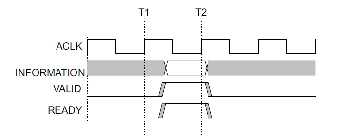

# AXI-Lite 总线通信

!!! 提醒
    指导书较为简略，后续会安排内容的讲解。附加实验提交DDL为第4个实验的DDL。

## AXI总线通信协议简介

#### 什么是协议？

- 我们在《计算机组成原理》实验一中实现了一个Cache，还记得这个Cache和CPU访问存在约定好的时序关系吗？

- 简单来说，不同的设备直接进行数据传输，需要一个约定俗成的时序关系（哪个信号表示数据有效，哪个信号表示地址有效，传输需要持续几个周期，什么时候开始传输）

- 这个约定俗成的规范，我们称之为协议

#### 我们认识哪些协议？

简单的：

- Xilinx的Block RAM IP核：T0给地址，t1出数据

- 组成原理实验中实现的Cache：给出地址，返回数据时同时拉高hit

复杂的：

- PCIE总线协议
- USB协议

不管是哪种协议，都有两个要素：**定义好的信号、信号之间的时序约定。**

#### 什么是AXI总线协议？

AXI总线是一种低延迟、高性能的总线，广泛地用于片上系统（SoC）中各个主从模块的互联通信。

AXI总线通信协议包括3种，分别为AXI-Full，AXI-Lite和AXI-Stream。

在FPGA设计中，AXI总线被广泛的使用，包括我们之前调用的Block RAM，也支持使用AXI总线的连接方式。Xilinx官方提供的很多IP核接口也多是以AXI协议的形式封装。

为了更深入地理解总线通信协议，实现简单的AXI通信协议是一个很好的途径。

## AXI总线的架构

### 通道划分

在AXI协议中，各个设备的具有很多接口，总的来说，这些接口被划分为5组，每组都具有不同的功能。在AXI的规范中，我们称这些“组”为“通道”。**“通道”即为一组接口。**共有5个通道，分别为：

- 读地址通道：信号以AR开头
- 读数据通道：信号以R开头
- 写地址通道：信号以AW开头
- 写数据通道：信号以W开头
- 写响应通道：信号以B开头

地址通道携带地址信息和相关的控制信息，而数据通道携带数据信息和相关的数据特征。

每个通道都是单向的。

#### 写通道

我们可以看到，上图展现了一次写操作所要使用到的通道。地址信息由**写地址通道**传输从主设备向从设备传输，并且突发传输写4个数据，数据信息由**写数据通道**由主设备向从设备传输，而写数据成功信号由**写响应通道**从设备向主设备传输。

#### 读通道

我们可以看到，上图展现了一次读操作所要使用到的通道。地址信息由**读地址通道**传输从主设备向从设备传输，并且突发传输读4个数据。数据信息由**读数据通道**由从设备向主设备传输，而读数据成功信号由**读数据通道**捎带传输。

### 通道内信号定义

在5组通道中，每一组通道都包含一个`Valid`信号和一个`Ready`信号，提供一个双方握手的机制。通道信息源通过`Valid`信号表示通道上的数据、地址或是控制信息当前有效，通道另一头的接收者通过`Ready`信号来表示自己可以接收相关的信息。

#### 读/写地址通道

读和写都有其独立的地址通道，携带本次操作需要的地址和数据信息。

#### 读数据通道

读数据通道携带从Slave设备读出的数据和响应信息，通道内包括的信号：

- 读出的数据
- 读数据是否成功

#### 写数据通道

该通道携带Master要写给Slave的数据信息。包括的信号：

- 要写入的数据
- store选通信号

#### 写响应通道

携带从Slave到Master的响应信息，包括写响应的状态。

## 握手方式

刚刚提到AXI协议是双向握手的协议，AXI协议的一大特点就是**每一个通道**都有一组`Valid`和`Ready`握手信号。无论是地址信息还是数据信息，在传输之前都需要进行握手。

- Valid信号：发送方控制，表示通道中的数据可用。发送方将`Valid`信号拉高，表示发送方已经把数据、地址或者控制信息准备好，放在总线上，并保证可以保持。
- Ready信号：接收方控制，表示接收方准备好接收通道的数据

通道中数据传输周期为1个周期，即在某个时钟上升沿，`Valid`和`Ready`信号同时为高时，通道中的信息将完成一次传输。

这种握手方式拥有很大的优势，即发送方和接收方可以通过控制各自的`Valid`和`Ready`信号，来实现双方传输速率的控制。

### Valid-Before-Ready握手

### Ready-Before-Valid握手

### 同时握手

**注意：**

发送方的Valid信号不能依赖于接收方的Ready信号，这两者是独立的，发送方不能通过等待接收方的Ready信号来设置自己的Valid信号。

## 要点总结

- 满足AXI协议的设备，有很多组IO接口，根据接口功能的不同，分为5个通道（5组信号）
- 每个通道的数据都需要进行握手操作，其中需要理解`Valid`,`Ready`握手信号
- 在一次数据传输过程中，需要经历的阶段是：地址握手、数据握手（如果是写操作，还需要对响应进行握手操作）
- 对于一系列的握手操作，建议使用状态机实现

## 实验步骤

### 创建AXI接口的Block RAM IP核

配置如下，实例化过程略：

### 设计状态机

- 根据AXI的三次握手特点，设计状态机，使之支持**单次读、单次写**操作（形式不限）
- 使用AXI4-Lite，不必实现猝发传输

## 提交方式

私信助教提交项目文件、仿真截图，并简要说明你的设计。

## 有用的资源

- AXI协议手册：https://static.docs.arm.com/ihi0022/g/IHI0022G_amba_axi_protocol_spec.pdf （Chapter A1, A2, A3, B1)
- AXI4-协议规范解析：https://wenku.baidu.com/view/9cdf46bccd7931b765ce0508763231126fdb7702.html?rec_flag=default&sxts=1586776352860 （大部分是在讲解完整的AXI4协议，我们只需要实现AXI4-Lite）