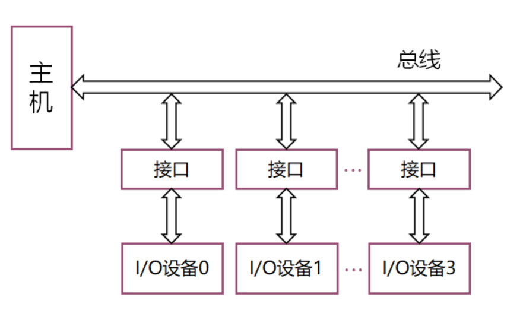

# 实验概述

## 实验前必读

- 实验测试的场景假定：

  - 本次实验的测试，每一次测试都是**独立**的，前后两行测试样例，并未存在关联关系。即默认：

    - 四个I/O设备同时提出请求，先获得许可的IO设备先进行总线的使用

    - 在一轮测试的过程中，当某个IO设备n在使用总线时，即代表其余所有优先级高于IO设备n的其他设备已经使用完毕总线，这些I/O设备**不会再提出请求**，不必考虑**抢占**的情况（仅限在本次实验的场景之下）

    - 设备同时提出请求，获得总线的顺序是**按照优先级从高到低**

    - 一行样例测试结束之后，所有的请求都会拉低一段时间，然后进行下一行样例的测试

- 如遇仿真输出`Iteration limit 10000 is reached`，请检查自己的组合逻辑设计是否存在环路（即A信号依赖于B信号，B信号依赖于A信号造成了电路震荡，**此处很可能是总线控制器`BG`和`BR`信号与IO接口的`BG`和`BR`信号出现了组合逻辑环路的情况**，请考虑上述的场景，适当删减某些不必要的逻辑，某些信号可能是**多余**的）
      

!!! 勘误说明
	- 本次实验下发的测试文件(topsim_*.v)中，请在`while(!$feof(fp_r))`语句下方加入一行代码：`req_vec = 0; #100`
	- 在本次实验下发的代码中，其中链式查询方法的测试样例文件命名有误，请自行将`link_test.txt.txt`文件更改为`link_test.txt`（删除一个扩展名即可）
	- 下发的代码中，对于`dout`接口，部分注释有误，`dout`统一改为“到数据总线的输出”

!!! Tips
	- 使用VSCode编写代码的同学注意设置编码为`GB2312`（在右下角设置），以防止乱码
	- 如遇仿真中途停止的问题（具体表现为输出停止在某一条语句），请在下方的Tcl Console中输入`run 10us` （其中10us为需要继续仿真的时间，可自行拟定），仿真则继续进行

## 实验目标

掌握集中式总线判优控制器的基本原理及其设计方法，实现**链式查询和计数器定时查询**两种总线判优控制器及接口电路。

## 实验内容

本实验的I/O接口设备共有4个，其设备ID分别为0、1、2、3，通过接口与主机连接。为防止有多个设备同时使用总线导致数据冲突，需要有一个总线判优控制器来解决总线使用权的仲裁。

总线判优控制可分为集中式和分布式两种，前者将控制逻辑集中在一处（如在CPU中），后者将控制逻辑分散在与总线连接的各个部件或设备上。常见的集中控制优先权仲裁方式有三种：链式查询、计数器定时查询和独立请求三种方式。本实验需要实现**链式查询**和**计数器定时查询**这两种方式的**总线控制器及接口电路**。
