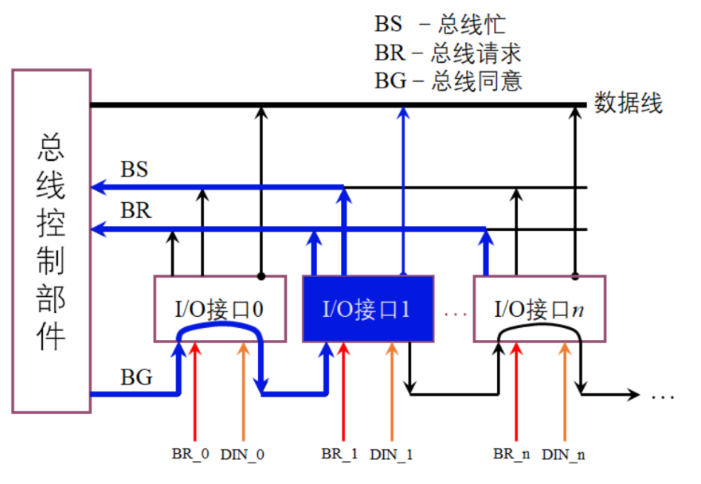
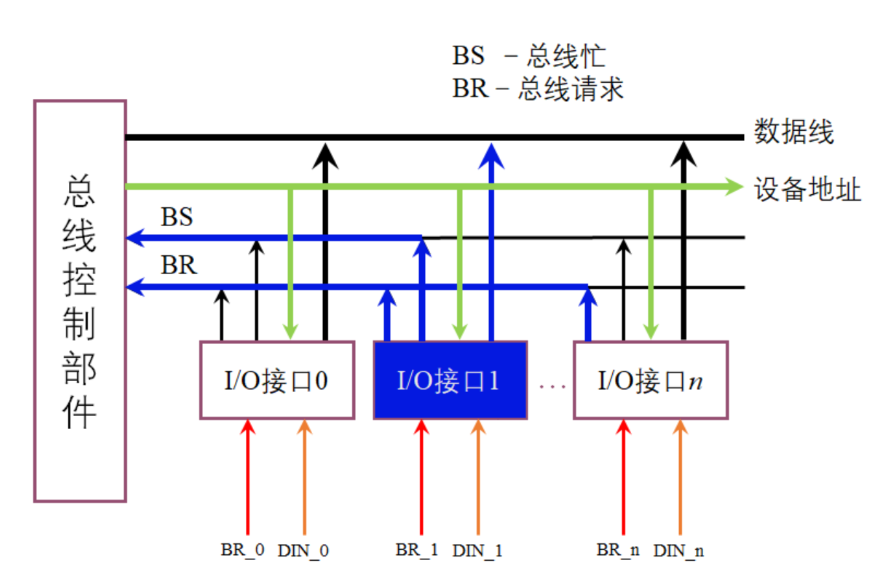

# 实验原理

## 链式查询

在链式查询中，控制总线中有3根线用于总线控制（`BS`总线忙、`BR`总线请求、`BG`总线同意），其中总线同意信号`BG`是串行地从一个I/O接口送到下一个I/O接口。如果`BG`到达的接口有总线请求，`BG`信号就不再往下传，意味着该接口获得了总线使用权，并建立总线忙`BS`信号，表示它占用了总线。可见在链式查询中，离总线控制部件最近的设备具有最高的优先级。这种方式的特点是：只需要很少几根就能按一定优先次序实现总线控制，并且很容易扩充设备，但对电路故障很敏感，且优先级别低的设备可能很难获得请求。

链式查询方式如图所示：

如上图所示，请注意各个部件的行为：

- **I/O接口**`1`和**I/O接口**`n`同时发出`BR`总线请求信号
- **总线控制部件**检测到有`BR`信号后，则送出`BG`总线同意信号
- 当`BG`信号到达I/O接口1时，该接口设备**发现自身有总线请求**，就**拦截**了`BG`信号
- 此时**I/O接口**`1`获得了总线的控制权，则**I/O接口**`1`将其`DIN_1`输入的数据放到了数据线上，并设置`BS`总线忙信号。
- **I/O接口**`1`完成了总线的使用，**撤下**了`BR_1`信号，不再封锁`BG`信号，并撤下`BS`信号。而此时**I/O接口**`n`的`BR_n`信号仍未撤下。
- **I/O接口**`n`得到了总线的使用权......

## 计数器定时查询

与链式查询相比，计数器定时查询多了一组设备地址线，少了一根总线同意线`BG`。总线控制部件接到有`BR`送来的总线请求信号后，在总线未被使用（`BS=0`）的情况下，总线控制部件中的计数器开始计数，并通过设备地址线，向各设备发出一组地址信号。当某个请求占用总线的设备地址与计数值一致时，便获得总线使用权，此时终止计数查询。

计数器定时查询两种不同的计数器模式：从终止点开始的循环模式（此时设备的优先级相等）和固定优先级模式（手动设置计数起点）

- **从终止点开始的循环模式**：计数从上一次计数的终止点开始，即是一种循环方法，此时设备使用总线的优先级相等；
- **固定优先级模式**：计数从设定的值`k`开始，此时一旦设备的优先次序被固定，设备的优先级就按`k, k+1, k+2, ... n, 0, 1, 2, ..., k-1`的顺序降序排列，而且固定不变； 

此外，计数器的初始值还可由程序设置，故优先次序可以改变。计数器定时查询对电路故障不如链式查询方式敏感，但增加了控制线（设备地址）数，控制也较复杂。

如上图所示，请注意各个阶段，**不同部件的动作：**

- **I/O接口**`1`和**I/O接口**`n`同时发出`BR`总线请求信号

- **总线控制部件**检测到有`BR`信号后，在`BS=0`的情况下，**总线控制部件**中的计数器从0**开始计数**
- 当计数器的值为1时，则**I/O接口**`1`（其设备地址为1）获得总线使用权，**总线控制部件**的计数器**终止计数**
- **I/O接口**`1`将数据放在总线上，设置`BS`忙线为“1”。
- **I/O接口**`1`完成数据传输，设置`BS`忙线为“0”，并撤除自身的`BR`信号。
- 计数器继续扫描，假设是从终止点开始的工作模式，则计数器计数`1,2,...n`，计数到`n`后，**I/O接口**`n`发现与自身设备地址相同，且自身有请求。

## 小结

综上所述，我们总结出两个信号的主要性质：

- `BR`信号：接口请求总线。
- `BS`信号：接口宣告占用总线，`BS`信号为高时，总线控制部件不再考虑将总线控制权授予其他设备。
