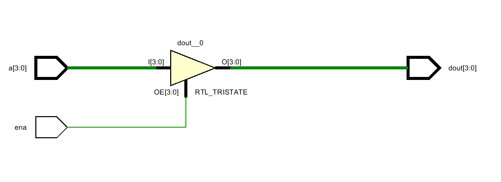
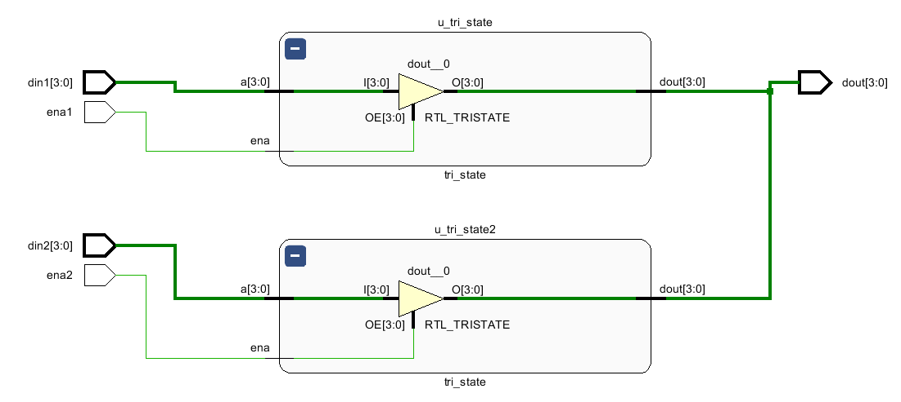

# 补充知识

## Verilog中的“三态”信号

本实验中，需要用到数据总线。同一时刻，仅能有一个设备在使用总线，而却有多个设备连接到了同一条总线。为了避免冲突，我们需要使用到Verilog中的三态信号。

### 三态门的描述

给出一个简单的模块：

``` 
module tri_state(
    input [3:0]a,
    input ena,
    output [3:0]dout
    );
    assign dout = ena ? a:4'bzzzz;    
endmodule
```

上述代码将综合出一个三态门：



当使能时，`dout`输出相关的数据。当使能无效时，`dout`为高阻态，输出值全部为`z`，相当于 **断路** 。需要注意的是， **需要指明高阻态值的位宽** 。

### 三态门的连接

现在，我们将上述使用的三态门实例化，连接对应的输入输出。

```
module top(
    input ena1,
    input ena2,
    input [3:0]din1,
    input [3:0]din2,
    output [3:0]dout
    );

tri_state u_tri_state(
	.a    (din1    ),
    .ena  (ena1  ),
    .dout (dout )
);

tri_state u_tri_state2(
	.a    (din2    ),
    .ena  (ena2  ),
    .dout (dout )
);
endmodule
```

需要注意的是，两个模块的`dout`都连接到了上层模块的`dout`上，两个模块共用了上层模块的`dout`信号，上层模块的`dout`就是我们实验中对应的”总线“。



在本次实验中，由于多个IO接口共用同一个数据总线，我们需要大量使用到连接到数据总线的三态信号，IO接口的数据输出与总线连接的方式，即为本小节所示的内容，请务必理解此小节内容。
