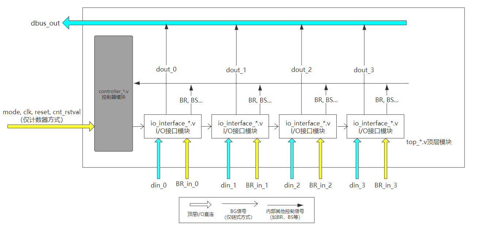

# 实验步骤

本实验需要完成多个模块的设计。模块之间的结构如下图所示。




## 总体步骤

根据上图所示，实验步骤如下：
- 编写链式查询/计数器定时查询的I/O接口模块`io_interface_*.v`、总线判优控制逻辑模块`controller_*.v`，以及顶层模块`top_*.v`；

- 自己编写Testbench，验证相关功能正确性； 

- 编写测试样例，使用提供的`topsim_link.v/topsim_counter.v`分别对链式查询控制器/计数器定时查询控制器进行测试、调试，根据输出的调试信息，定位错误点。

本实验分为两个Part，请按照相应的步骤完成

---

**以下是你需要完成的工作：**

## 链式查询方法（Part A）

项目文件位于`Lab_BusControl_A`文件夹中，模块之间的层次关系如图所示：

```
- topsim_link.v： 仿真模块，实例化顶层模块
    |  模拟I/O设备发起访问的过程，并接收来自数据总线的数据。
    |  本实验提供了测试框架，**需要编写5条测试样例**。
    | ---- top_link(top_link.v) ： 顶层模块，**需要实现**。
                | --- s0:io_interface_link.v ： I/O接口模块0，**需要实现**。     
                | --- s1:io_interface_link.v ： I/O接口模块1，**需要实现**。     
                | --- s2:io_interface_link.v ： I/O接口模块2，**需要实现**。 
                | --- s3:io_interface_link.v ： I/O接口模块3，**需要实现**。      
                | --- c0:controller_link.v ： 总线判优控制逻辑模块，**需要实现**。    
```


### io_interface_link.v

#### 模块行为

- 将总线请求信号输出到控制器

- 判断自己是否可以使用总线

- 控制数据的输出，确保不冲突使用总线

- 控制BG信号的传递

#### 模块IO定义

| **属性** | **名称** | **含义**                       | **位宽** |
| :------- | :------- | :----------------------------- | :------- |
| 输入     | BG_in    | 从上游设备进来的BG信号         | 1        |
| 输入     | BR_in    | 总线请求信号                   | 1        |
| 输入     | din      | 数据输入                       | 4        |
| 输出     | BG_out   | 输出到下游的BG信号             | 1        |
| 输出     | BR_out   | 总线请求信号                   | 1        |
| 输出     | BS_out   | 总线忙信号                     | 1        |
| 输出     | dout     | 输出到总线的数据，由三态门控制 | 4        |


#### 实现指南

- 完成`BG`信号传递逻辑
- 完成`BS`信号输出逻辑
- 传递`BR`信号到输出口
- 进行是否获得总线的判定，对数据输出的时机进行合理的判断，保证总线不冲突使用


### controller_link.v

#### 模块行为

- 根据输入的`BS`和`BR`信号，决定是否给出`BG`信号

#### 模块IO定义

| **属性** | **名称** | **含义**                 | **位宽** |
| :------- | :------- | :----------------------- | :------- |
| 输入     | BS       | 总线忙信号               | 1        |
| 输入     | BR       | IO设备总线使用请求       | 1        |
| 输出     | BG       | 输出给第一个设备的BG信号 | 1        |


#### 实现指南

- 完成控制器内部逻辑


### top_link.v

#### 模块行为

- 顶层模块，仅负责实例化和连线

#### 模块IO定义

| **属性** | **名称**                           | **含义**                               | **位宽** |
| :------- | :--------------------------------- | :------------------------------------- | :------- |
| 输入     | din_0, din_1, din_2, din_3         | IO数据输入（直接连接到IO设备）         | 4        |
| 输入     | BR_in_0, BR_in_1, BR_in_2, BR_in_3 | IO设备总线使用请求（直接连接到IO设备） | 1        |
| 输出     | dbus_out                           | 数据总线输出                           | 4        |


#### 实现指南

- 实例化四个IO接口模块io_interface_link.v和控制器模块controller_link.v，完成连线
- 生成`BS`、`BR`信号
- 实例化总线控制器

!!! 注意 
    - **BS/BR信号为多个IO接口输出的BS/BR的值“或”后的值。** 
    - 注意数据总线的连接，所有的模块的`dout`统一连接到`dbus_out`，理解三态信号。


## 计数器定时查询方法（Part B）

项目文件位于`Lab_BusControl_B`文件夹中，模块之间的层次关系如图所示：

```
- topsim_counter.v ： 仿真模块，实例化顶层模块
    |  模拟I/O设备发起访问的过程，并接收来自数据总线的数据。
    |  本实验提供了测试框架，**需要编写5条测试样例**。
    | ---- top_counter(top_counter.v) ： 顶层模块，**需要实现**。    
            | --- s0:io_interface_counter.v ： I/O接口模块0，**需要实现**。    
            | --- s1:io_interface_counter.v ： I/O接口模块1，**需要实现**。    
            | --- s2:io_interface_counter.v ： I/O接口模块2，**需要实现**。  
            | --- s3:io_interface_counter.v ： I/O接口模块3，**需要实现**。    
            | --- c0:controller_counter.v ： 总线判优控制逻辑模块，**需要实现**。    
```


### io_interface_counter.v

#### 模块行为

- 将总线请求信号输出到控制器

- 判断自己是否可以使用总线

- 控制数据的输出，确保不冲突使用总线

#### 模块IO定义 

| **属性** | **名称**  | **含义**                                       | **位宽** |
| :------- | :-------- | :--------------------------------------------- | :------- |
| 输入     | clk,rst   | 时钟和复位                                     | 1        |
| 输入     | device_id | 指定的设备号（在顶层模块中实例化时，直接指定） | 2        |
| 输入     | BR_in     | 总线请求信号                                   | 1        |
| 输入     | din       | 数据输入                                       | 4        |
| 输入     | cnt_in    | 控制器的计数器输入                             | 2        |
| 输出     | BR_out    | 总线请求信号                                   | 1        |
| 输出     | BS_out    | 总线忙信号                                     | 1        |
| 输出     | dout      | 输出到总线的数据，由三态门控制                 | 4        |


#### 实现指南

- 完成`BS`信号输出逻辑

- 传递`BR`信号到输出口

- 进行是否获得总线的判定，对数据输出的时机进行合理的判断，避免总线的冲突使用

  

### controller_counter.v

#### 模块行为

- 根据输入的`BS`和`BR`信号，以及计数器的工作模式，决定**计数器的启停和停止后的值**

#### 模块IO定义 

| **属性** | **名称**   | **含义**                                                     | **位宽** |
| :------- | :--------- | :----------------------------------------------------------- | :------- |
| 输入     | clk,rst    | 时钟和复位                                                   | 1        |
| 输入     | BS         | 总线忙信号                                                   | 1        |
| 输入     | BR         | IO设备总线使用请求                                           | 1        |
| 输入     | mode       | 计数模式，1：从终止点开始的循环模式，0：从固定值开始的固定优先级模式 | 1        |
| 输入     | cnt_rstval | 计数器初始值                                                 | 2        |
| 输出     | cnt        | 输出给各个设备的计数器信号                                   | 2        |


#### 实现指南

- 完成计数器启停的判断
- 完成两种模式的判断


### top_counter.v

#### 模块行为

- 顶层模块，仅负责连线。

#### 模块IO定义

| **属性** | **名称**                           | **含义**                               | **位宽** |
| :------- | :--------------------------------- | :------------------------------------- | :------- |
| 输入     | clk,rst                            | 时钟和复位                             | 1        |
| 输入     | din_0, din_1, din_2, din_3         | IO数据输入（直接连接到IO设备）         | 4        |
| 输入     | BR_in_0, BR_in_1, BR_in_2, BR_in_3 | IO设备总线使用请求（直接连接到IO设备） | 1        |
| 输入     | mode                               | 计数器工作模式，1：从终止点开始的循环模式，0：从固定值开始的固定优先级模式（直接连接到控制器模块） | 1        |
| 输入     | cnt_rstval                         | 计数器初始值（直接连接到控制器模块）   | 2        |
| 输出     | dbus_out                           | 数据总线输出                           | 4        |


#### 实现指南

- 实例化四个IO接口模块io_interface_counter.v和控制器模块controller_counter.v，完成连线
- 生成`BS`、`BR`信号
- 实例化总线控制器
- 为每一个设备分配唯一的ID（通过`device_id`接口，使用ID分别为`0,1,2,3`直接指定）。

!!! 注意 
    - **BS/BR信号为多个IO接口输出的BS/BR的值“或”后的值。** 
    - 注意数据总线的连接，所有的模块的`dout`统一连接到`dbus_out`，理解三态信号。