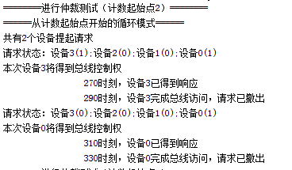
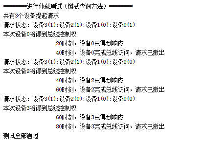

# 测试说明

!!! 注意
	本次实验采取 **不公开样例测试** 的方式，需自行在 **本地进行充分测试** 后，再将代码提交至服务器测试， **每人仅有5次提交机会，最终成绩取最高分** 。

本实验已提供仿真文件框架，但需要自行编写测试样例。

在本实验的仿真中，各个I/O接口的行为如下述：

- 各个I/O接口 **同时发起请求**
- 得到总线使用权的 **I/O接口** 将其 **设备编号** 输出到数据总线上，供上层模块评判是否正确
- `20ns`后，获得总线使用权的 **I/O接口** 撤下请求信号，退出仲裁。此时，剩余的I/O接口继续参与仲裁。

仿真时，你将看到相关的文字叙述。



注意：上述文字叙述的是仿真时各个I/O接口的行为，与你的实现无关，仅与你编写的样例有关。

## 测试样例编写说明

### topsim_link（Part A）

#### 样例格式介绍

输入的测试样例位于项目文件夹中，`.\Lab_Bus.sim\sim_1\behav\xsim\link_test.txt`

样例格式如下：

- 每一行为一个测试样例，共有`n`个值，用空格分隔。

- 第一个4位的二进制数，从高位到低位分别代表设备3到设备1的初始请求状态，对应位为1代表初始状态有请求。
- 此后几个用空格分隔的数，代表设备使用总线的先后顺序。

#### 实例

```
1100 2 3
1101 0 2 3
```

第一行的测试样例，一开始设备2和3同时发起请求，响应的顺序应该为先是设备2，再是设备3。

第二行的测试样例，一开始，设备0，2，3同时发起请求，响应的顺序应该为设备0，设备2，设备3。



### topsim_counter（Part B）

#### 样例格式介绍

输入的测试样例位于项目文件夹中，`.\Lab_Bus.sim\sim_1\behav\xsim\counter_test.txt`

样例格式如下：

- 每一行为一个测试样例，共有`n`个值，用空格分隔。

- 第一个值为计数器的工作模式，0代表从计数起始点开始，1代表从终止点开始。

- 第二个值为计数器的计数起始值。

- 第三个4位的二进制数，从高位到低位分别代表设备3到设备1的初始请求状态，对应位为1代表初始状态有请求。

- 此后几个用空格分隔的数，代表设备使用总线的先后顺序。

#### 实例

```
1 0 1100 2 3
0 2 1101 2 3 0
```

第一行的测试样例，代表计数方式从终止点开始，计数器起始值为0，一开始设备2和3同时发起请求，响应的顺序应该为先是设备2，再是设备3。

第二行的测试样例，代表计数方式从计数起始点开始，计数器起始值为2，一开始，设备0，2，3同时发起请求，响应的顺序应该为设备2，设备3，设备0。
