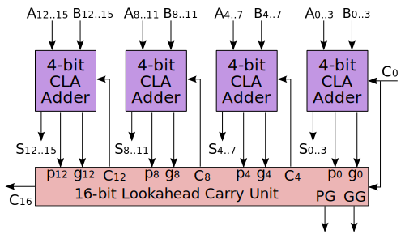
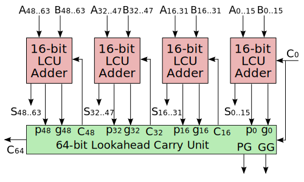

# 附录 B 基于冗余符号数的 4 位 Booth 算法（选做）

## 序、本节概览

在本附录中，我们将基于 **冗余符号数** *(Redundant Binary
Signed-Digit)* 的加法和 4 位 Booth 算法实现一个 32 位的乘法器。

设$x=x_0.x_1\ldots x_{31}$，$y=y_0.y_1\ldots y_{31}$，简单来说，我们先通过 4 位 Booth 算法计算$x$分别与$y_0\ldots y_3$,
$\ldots$, $y_{28}\ldots y_{31}$的冗余符号数 **部分积** *(Partial
Product)*，再通过 **冗余符号加法器** *(Redundant Binary
Adder)* 树将其分治求和，最后使用 **超前进位加法器** *(Carry-Lookahead
Adder)* 将其转为补码表示。

## 一、冗余符号数的运算

### 1、冗余符号数

冗余符号数是二进制数的一种表示方法。一般二进制数每一位的可能的取值为$\{0,1\}$，同时补码表示法也用 0 或者 1 来表示某一位。而冗余符号数的每一位$r_i\in\{0,1,-1\}$；其中
$-1$
也可以写成$\bar1$。而在计算机中冗余符号数的每一位$r_i$用一个数对$(r_i^+,r_i^-)$表示（见下表）。

| $r_i^+,r_i^-$ |  $r_i$  |
| :-----------: | :-----: |
|     $0,0$     |   $0$   |
|     $0,1$     | $\bar1$ |
|     $1,0$     |   $1$   |
|     $1,1$     |   $0$   |

### 2、冗余符号数与二进制数的转换

由于$\{0,1\}\subset\{0,1,-1\}$，所以二进制可以直接按位转换为冗余符号数。同时观察上表可知，每一位上的$(r_i^+,r_i^-)$与$r_i$满足

$$r_i=r_i^+-r_i^-$$

而对于一个冗余符号数$r=r_0.r_1\ldots r_n=(r_0^+,r_0^-).(r_1^+,r_1^-)\ldots (r_n^+,r_n^-)$而言，同样有：
$$
\begin{aligned}
\hspace{0pt}
        r & =\sum_{i=0}^n r_i\cdot 2^{-i}                                                               \\
          & =\left(\sum_{i=0}^n r_i^+ \cdot 2^{-i}\right) - \left(\sum_{i=0}^n r_i^-\cdot 2^{-i}\right) \\
          & =r^+-r^-                                                                                    \\
    \end{aligned}
$$

所以
$$
\begin{aligned}
\hspace{0pt}
        [r]_\text{补} & =[r^+]_\text{补}-[r^-]_\text{补}    \\
               & =r^++\overline{r^-}+1 \\
    \end{aligned}
$$

例如
$$
\begin{aligned}
\hspace{0pt}
        [\bar1\ 0\ 1\ \bar1]_{RB} & =[0\ 0\ 1\ 0]_2-[1\ 0\ 0\ 1]_2         \\
                                  & =[0\ 0\ 0\ 1\ 0]_\text{补}-[1\ 0\ 1\ 1\ 1]_\text{补} \\
                                  & =[1\ 0\ 0\ 1\ 1]_\text{补}                    \\
    \end{aligned}
$$

### 3、超前进位加法器

对于计算$[r]_\text{补}=r^++\overline{r^-}+1$，我们通常采用级联超前进位加法器来计算，此处我们采用4位CLA。参考全加器的真值表（下表）可知（$+,\cdot,\oplus$分别表示逻辑或，逻辑与和逻辑异或）
$$
\begin{aligned}
        s_i     & =a_i\oplus b_i\oplus c_i \\
        c_{i+1} & =a_ib_i+(a_i+b_i)c_{i}
    \end{aligned}
$$

| $a_i$ | $b_i$ | $c_i$ | $c_{i+1}$ | $s_i$ |
| :---: | :---: | :---: | :-------: | :---: |
|   0   |   0   |   0   |     0     |   0   |
|   0   |   0   |   1   |     0     |   1   |
|   0   |   1   |   0   |     0     |   1   |
|   0   |   1   |   1   |     1     |   0   |
|   1   |   0   |   0   |     0     |   1   |
|   1   |   0   |   1   |     1     |   0   |
|   1   |   1   |   0   |     1     |   0   |
|   1   |   1   |   1   |     1     |   1   |

定义 **生成** *(Generate)* 信号$g_i=a_i\cdot b_i$， **传播** *(Propagate)* 信号$p_i=a_i+b_i$，则有

$$c_{i+1}=g_i+p_ic_i$$

于是

$$
\begin{aligned}
        c_1 & =g_0+p_0c_0                                        \\
        c_2 & =g_1+p_1c_1                                        \\
            & =g_1+p_1(g_0+p_0c_0)                               \\
            & =g_1+p_1g_0+p_1p_0c_0                              \\
        c_3 & =g_2+p_2c_2                                        \\
            & =g_2+p_2(g_1+p_1g_0+p_0p_1c_0)                     \\
            & =g_2+p_2g_1+p_2p_1g_0+p_2p_1p_0c_0                 \\
        c_4 & =g_3+p_3c_3                                        \\
            & =g_3+p_3(g_2+p_2g_1+p_2p_1g_0+p_2p_0p_1c_0)        \\
            & =g_3+p_3g_2+p_3p_2g_1+p_3p_2p_1g_0+p_3p_2p_1p_0c_0 \\
    \end{aligned}
$$

为了与更高级的CLA级联，我们还需要输出小组传播信号$p_g$，小组生成信号$g_g$
$$
\begin{aligned}
        p_g & =p_3p_2p_1p_0                      \\
        g_g & =g_3+p_3g_2+p_3p_2g_1+p_3p_2p_1g_0 \\
        c_4 & =g_g+p_gc_0                        \\
    \end{aligned}
$$

#### 任务一：编写 64 位超前进位加法器

1. 打开项目`RBBE-4`。
2. 完成全加器模块`full_adder.v`，接口定义参照下表。

| 属性 | 名称  |     含义     | 位宽 |
| :--: | :---: | :----------: | :--: |
| 输入 | a_in  |    被加数    |  1   |
| 输入 | b_in  |     加数     |  1   |
| 输入 | c_in  |   进位输入   |  1   |
| 输出 | g_out | 生成信号输出 |  1   |
| 输出 | p_out | 传播信号输出 |  1   |
| 输出 | s_out |      和      |  1   |

3. 完成不带全加器 4 位 CLA 模块`cla4.v`，接口定义参照下表。

| 属性 | 名称  |       含义       | 位宽 |
| :--: | :---: | :--------------: | :--: |
| 输入 | g_in  |   生成信号输入   |  4   |
| 输入 | p_in  |   传播信号输入   |  4   |
| 输入 | c_in  |     进位输入     |  1   |
| 输出 | g_out | 小组生成信号输出 |  1   |
| 输出 | p_out | 小组传播信号输出 |  1   |
| 输出 | c_out |     进位输出     |  4   |

4. 利用前面的两个模块完成 4 位 CLA 模块`cla4_fa.v`，连接方式参照上图，接口定义参照下表。

| 属性 | 名称  |     含义     |  位宽   |
| :--: | :---: | :----------: | :-----: |
| 输入 | a_in  |    被加数    | 4/16/64 |
| 输入 | b_in  |     加数     | 4/16/64 |
| 输入 | c_in  |   进位输入   |    1    |
| 输出 | c_out |   进位输出   |    1    |
| 输出 | g_out | 生成信号输出 |    1    |
| 输出 | p_out | 传播信号输出 |    1    |
| 输出 | s_out |      和      | 4/16/64 |

5. 16 位和 64 位 CLA 已预先准备完成，测试已经完成的带全加器的 64 位 CLA 模块`cla64_fa.v`，测试文件在测试集`sim_cla64_fa`中。观察 s 和 s_ans 信号的输出是否一致。

#### 任务二：编写冗余二进制转补码模块

1.  利用 64 位超前进位加法器编写 64 位冗余二进制转补码模块
    `rb2nb.v`（提示：利用 $[r]_\text{补} =r^++\overline{r^-}+1$）

2.  测试该模块，测试文件在测试集`sim_rb2nb`中。观察 r_out 和 r_ans 信号的输出是否一致。

| 属性 |   名称   |      含义       | 位宽 |
| :--: | :------: | :-------------: | :--: |
| 输入 | r_pos_in |      $r^+$      |  64  |
| 输入 | r_neg_in |      $r^-$      |  64  |
| 输出 |  c_out   |    进位输出     |  1   |
| 输出 |  r_out   | $[r]_\text{补}$ |  64  |

### 4、冗余符号数的无进位加法

在补码加法运算中，串行进位和超前进位都会随着位数的增加而加大延迟，利用冗余符号数进行无进位加法的好处是可以增加位但不加大延迟。

设冗余符号数
$x=x_0.x_1\ldots x_{31}$，$y=y_0.y_1\ldots y_{31}$，需要计算
$z=x+y$，此时我们可以并行地计算出每一位$z_i$。具体做法如下：

1. 根据恒等式$x_i+y_i=2c_{i-1}+s_i$和下表计算得出$c_{i-1}$和$s_i$
2. 计算$z_i=c_i+s_i$，这一步不会产生进位。
   1. 若$c_i=1$，则$x_{i-1},y_{i-1}$均为非负值。若$s_i=1$，则推出$x_{i-1},y_{i-1}$不均为非负值，矛盾。
   2. 同理可知$c_i=s_i=\bar1$也会推出矛盾，故这一步不会产生进位。

|   $x_i,y_i$   | $x_{i+1},y_{i+1}$ | $c_{i-1}$ |  $s_i$  |
| :-----------: | :---------------: | :-------: | :-----: |
|     $1,1$     |         –         |    $1$    |   $0$   |
|     $1,0$     |    均为非负值     |    $1$    | $\bar1$ |
|               |     其他情况      |    $0$    |   $1$   |
|   $1,\bar1$   |         –         |    $0$    |   $0$   |
|     $0,0$     |         –         |    $0$    |   $0$   |
|   $0,\bar1$   |    均为非负值     |    $0$    | $\bar1$ |
|               |     其他情况      |  $\bar1$  |   $1$   |
| $\bar1,\bar1$ |         –         |  $\bar1$  |   $0$   |

例如，计算$[1\ 0\ \bar1\ 0\ \bar1\ 0\ 0\ \bar1]_{RB}+[1\ \bar1\ 1\ 0\ 0\ 1\ 1\ \bar1]_{RB}$

|       |      |                                              |              |
| :---: | :--: | -------------------------------------------: | -----------: |
| $x_i$ |      |         $1\ 0\ \bar1\ 0\ \bar1\ 0\ 0\ \bar1$ |  $[87]_{10}$ |
| $y_i$ |  \+  |             $1\ \bar1\ 1\ 0\ 0\ 1\ 1\ \bar1$ | $[101]_{10}$ |
| $s_i$ |      |             $0\ 1\ 0\ 0\ \bar1\ \bar1\ 1\ 0$ |              |
| $c_i$ |  \+  | $1\ \bar1\ 0\ 0\ 0\ 1\ 0\ \bar1\ \hphantom1$ |              |
| $z_i$ |      |          $1\ \bar1\ 1\ 0\ 0\ 0\ \bar1\ 0\ 0$ | $[188]_{10}$ |

#### 任务三：编写冗余二进制加法单元

1. 参照基本框架图（上图）、真值表（上上表）、接口定义（下表）编写冗余二进制加法单元 `rba.v`
2. 64 位 RBA 已预先准备完成（`rba64.v`），测试该模块，测试文件在测试集`sim_rba64`中。观察 z_pos_out、z_neg_out 和 z_pos_ans、z_neg_ans 信号的输出是否一致。

| 属性 |   名称    |              含义               | 位宽 |
| :--: | :-------: | :-----------------------------: | :--: |
| 输入 | x_pos_in  |             $x_i^+$             | 1/64 |
| 输入 | x_neg_in  |             $x_i^-$             | 1/64 |
| 输入 | y_pos_in  |             $y_i^+$             | 1/64 |
| 输入 | y_neg_in  |             $y_i^-$             | 1/64 |
| 输入 | c_pos_in  |             $c_i^+$             |  1   |
| 输入 | c_neg_in  |             $c_i^-$             |  1   |
| 输入 |  neg_in   | $x_{i+1},y_{i+1}$存在负数时拉高 |  1   |
| 输出 | c_pos_out |           $c_{i-1}^+$           |  1   |
| 输出 | c_neg_out |           $c_{i-1}^-$           |  1   |
| 输出 | z_pos_out |             $z_i^+$             | 1/64 |
| 输出 | z_neg_out |             $z_i^-$             | 1/64 |
| 输出 |  neg_out  |     $x_i,y_i$存在负数时拉高     |  1   |

### 5、基于冗余符号数的 4 位 Booth 算法

在附录 A 中，我们已经给出 2 位 Booth 算法，即根据$y_iy_{i+1},y_{i+2}$计算部分积。那么 4 位 Booth 算法就是根据$y_iy_{i+1}y_{i+2}y_{i+3},y_{i+4}$计算部分积（见下表，此外还存在 3 位 Booth 算法，5 位以上 Booth 算法由于电路太复杂一般不使用）。表中$k$表示部分积右移 4 位前加上几倍的$[x]_\text{补}$，$k^+,k^-$是$k$的冗余符号数表示形式。

Booth-4 算法的流程如下：

1. 将$[x]_\text{补}$分别左移 1、2、3 位得到$2[x]_\text{补},4[x]_\text{补},8[x]_\text{补}$
2. 使用 64 位 CLA 计算$5[x]_\text{补}=4[x]_\text{补}+[x]_\text{补}$，因为$\forall i,j\in \mathbb{N}, 2^i-2^j\ne 5$。
3. 根据下表计算$PP^+=k^+[x]_\text{补},PP^-=k^-[x]_\text{补}$

| $y_i\ldots y_{i+3}$ | $y_{i+4}$ | $k=k^+-k^-$ | $y_i\ldots y_{i+3}$ | $y_{i+4}$ | $k=k^+-k^-$ |
| :-----------------: | :-------: | :---------: | :-----------------: | :-------: | :---------: |
|       0 0 0 0       |     0     |  $+0=0-0$   |       1 0 0 0       |     0     |  $-8=0-8$   |
|       0 0 0 0       |     1     |  $+1=1-0$   |       1 0 0 0       |     1     |  $-7=1-8$   |
|       0 0 0 1       |     0     |  $+1=1-0$   |       1 0 0 1       |     0     |  $-7=1-8$   |
|       0 0 0 1       |     1     |  $+2=2-0$   |       1 0 0 1       |     1     |  $-6=2-8$   |
|       0 0 1 0       |     0     |  $+2=2-0$   |       1 0 1 0       |     0     |  $-6=2-8$   |
|       0 0 1 0       |     1     |  $+3=4-1$   |       1 0 1 0       |     1     |  $-5=0-5$   |
|       0 0 1 1       |     0     |  $+3=4-1$   |       1 0 1 1       |     0     |  $-5=0-5$   |
|       0 0 1 1       |     1     |  $+4=4-0$   |       1 0 1 1       |     1     |  $-4=0-4$   |
|       0 0 0 0       |     0     |  $+4=4-0$   |       1 0 0 0       |     0     |  $-4=0-4$   |
|       0 1 0 0       |     1     |  $+5=5-0$   |       1 1 0 0       |     1     |  $-3=1-4$   |
|       0 1 0 1       |     0     |  $+5=5-0$   |       1 1 0 1       |     0     |  $-3=1-4$   |
|       0 1 0 1       |     1     |  $+6=8-2$   |       1 1 0 1       |     1     |  $-2=0-2$   |
|       0 1 1 0       |     0     |  $+6=8-2$   |       1 1 1 0       |     0     |  $-2=0-2$   |
|       0 1 1 0       |     1     |  $+7=8-1$   |       1 1 1 0       |     1     |  $-1=0-1$   |
|       0 1 1 1       |     0     |  $+7=8-1$   |       1 1 1 1       |     0     |  $-1=0-1$   |
|       0 1 1 1       |     1     |  $+8=8-0$   |       1 1 1 1       |     1     |  $-0=0-0$   |

#### 任务四、编写基于冗余符号数的 4 位 Booth 算法模块

1. 根据框架图（上图）、MUX 表（上表）、接口定义（下表）编写 Booth-4 模块（`booth4.v`）
2. 测试该模块，测试文件在测试集`sim_booth64`中。观察 pp_pos_out、pp_neg_out 和 pp_pos_ans、pp_neg_ans 信号的输出是否一致。

| 属性 |    名称    |        含义         | 位宽 |
| :--: | :--------: | :-----------------: | :--: |
| 输入 |    x_in    |   $[x]_\text{补}$   |  64  |
| 输入 |    y_in    | $y_i\ldots y_{i+4}$ |  5   |
| 输出 | pp_pos_out |       $PP^+$        |  64  |
| 输出 | pp_neg_out |       $PP^-$        |  64  |

## 二、模块整合

### 1、模块整合

#### 任务五、模块整合

1. 根据框架图（见本章开头）、接口定义（下表）编写 RBBE-4 模块（`RBBE4.v`）
    1. 将 x_in 信号符号扩展至 64 位。
    2. 实例化 8 个 Booth-4 模块，生成 8 对部分积。
    3. 实例化 4 个 RBA64 模块，作为 RBA 树的第一层节点，生成 4 对部分积。
    4. 实例化 2 个 RBA64 模块，作为 RBA 树的第二层节点，生成 2 对部分积。
    5. 实例化 1 个 RBA64 模块，作为 RBA 树的第三层节点，生成冗余符号数表示的积。
    6. 实例化 1 个 RB2NB 模块，将冗余符号数表示的积转换为补码表示并输出。
2. 测试该模块，测试文件在测试集`sim_rdbe4`中。观察 `z_out` 和 `z_ans` 信号的输出是否一致。

| 属性 | 名称  |      含义       | 位宽 |
| :--: | :---: | :-------------: | :--: |
| 输入 | x_in  | $[x]_\text{补}$ |  32  |
| 输入 | y_in  | $[y]_\text{补}$ |  32  |
| 输出 | z_out | $[z]_\text{补}$ |  64  |