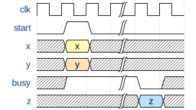
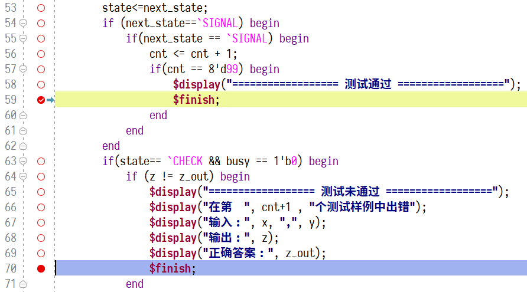

## 实验步骤

### 1、Booth 乘法器的 IO 定义

| 属性 | 名称  |     含义     | 位宽 |
| :--: | :---: | :----------: | :--: |
| 输入 |  clk  |     时钟     |  1   |
| 输入 |   x   |    被乘数    |  8   |
| 输入 |   y   |     乘数     |  8   |
| 输入 | start | 输入就绪信号 |  1   |
| 输出 |   z   |      积      |  16  |
| 输出 | busy  |  忙标志信号  |  1   |

### 2、Booth 乘法器的时序

如上图所示，当`start`信号拉高时，`x`、`y`信号有效 **且只会存在一个周期** ，乘法器接受到`start`时需要 **立即** 拉高`busy`信号，直到乘法器工作完成时拉低`busy`，同时输出运算结果`z`并保持至少一个周期。

!!! 注意
	- 请注意，本实验要求，`busy`的周期 **不得超过** 12，即乘法的运算周期不得过长，否则将被判定为无效实现。
	- 移位和加操作可以在同一周期内完成，请充分利用好组合逻辑和`assign`语句。

### 3、项目框架

- `top` (top.v) —— 顶层模块，模拟输入输出并进行正确性检查
  - `booth` (booth.v) —— Booth 乘法器模块（需要完成）

### 4、具体步骤

1. 完成 `booth.v`

!!! 注意
	- 请不要使用`*`完成乘法，但可以使用`+`。
	- 请不要使用`-`完成减法，应使用补码运算的方式完成。

2. 进行模拟测试，如果测试未通过，输出发生错误的数据（通过与未通过的终止位置见下图）。

## 提交文档

- `booth.v` 文件（位于 Booth.srcs\\sources_1\\new\\booth.v）
- Booth乘法器的硬件框图。（推荐使用ProcessOn, Visio, PowerPoint, Inkscape, Tikz等工具绘制，注意体现模块之间的划分与联系）

