# 零、前言

经过一个学期组成原理的学习，相信大家已经对计算机组成原理有了深刻而独到的认识，在本次实验中，我们提供一个框架，让你基于现有的框架，去设计控制单元，让一个简单的CPU真正跑起来。

在本次实验中，我们将关注**控制逻辑**的设计，你无需定义CPU的微架构、指令集，这些都已经提供，我们将做的是实现CPU的控制逻辑，通过不同的控制信号，在CPU内部建立**数据通路**，使CPU能够正确地取出指令、执行运算、写回结果。最终，我们将运行一个等差级数求和的测试程序，计算 `1+2+3+......+10`，以检验你设计的正确性。

**另：本次实验虽然并不复杂，但内容较多，请务必理解，认真阅读指导书很有必要，指导书内各个位置设置了暗号，请将暗号按顺序连起来读一遍，提交实验时，对暗号的下联，才可成功提交。**

# 一、实验目的

- 熟悉CPU内部微架构
- 了解数据通路的概念，掌握使用控制信号建立数据通路的方法
- 掌握微指令控制器的原理、设计方法和实现

# 二、实验内容

根据给出的指令集和CPU微架构，**设计微程序控制器，编写部分微程序，**与现有的CPU模型整合，使CPU正常执行指令。

# 三、实验背景

我们已经在组成原理的课程中，学习过两种控制器：组合逻辑控制器和微程序控制器。微程序控制器不直接使用组合逻辑和时序逻辑产生控制信号，而是将**控制信号**放在一个ROM中，在指令执行时，按照**正确的次序**去访问ROM中相应的存储单元，取出相应的微指令来控制执行各个微操作。

我们首先需要明确的是，任何复杂或简单的CPU系统，都是一个有限状态机。微程序控制器的输出也是如此。它开始于某个状态，在输入的数据（指令操作码和标识符等）的作用下，转移到另一个状态（输出不同的控制信号）。~~（暗号：天）~~

## 3.1 如何设计一个简单的CPU？

要设计一个CPU，我们首先需要设计一个简单的**指令系统**，然后根据该系统，搭建对的**数据通路**，然后在数据通路的基础上，实现我们的控制逻辑。

在这个实验中，我们已经完成了数据通路的设计，你所需要做的，只是设计相应的控制逻辑，控制数据通路的建立，驱动CPU正常地执行指令。

## 3.2 定义指令集

我们设计的CPU具有以下几个寄存器：

> PC：指令指针
>
> IR：指令寄存器
>
> MAR：内存地址寄存器
>
> MDR：内存数据寄存器
>
> ACC：累加寄存器
>
> SP：栈顶寄存器
>
> R：通用寄存器

其余参数如下：

- 机器字长为1个字节，8位
- 所有的寄存器宽度均为8位


正如每个厂家都会定义一套自己的指令集，如Intel和AMD的x86-64，arm的ARM，IBM的Power，我们将这次实现的CPU支持的指令集称为**awsI**（ **a**dvanced **w**asted **s**imple **I**nstruction set），**aswI**指令集包括整数移动指令、访存指令、条件跳转指令、无条件跳转指令、算术逻辑指令：

| 指令编码（不定长指令） | 指令       | 功能                    |
| -------------- | ---------- | ----------------------- |
| 00000000       | NOP        | 空操作                  |
| 00100000 [ADDR] | LOAD ADDR  | ACC  ←  M[ ADDR ]       |
| 00110000 [ADDR] | STORE ADDR | M[ ADDR ] ← ACC         |
| 01000000       | MOVE       | R  ← ACC                |
| 01010000       | ADD        | ACC  ←  ACC + R         |
| 01100000       | AND        | ACC  ←  ACC and R       |
| 01110000 [IMM] | JUMP IMM   | PC ← IMM                |
| 10000000 [IMM] | JUMPZ IMM  | if (ACC != 0) then PC ← IMM |
| 10010000 [IMM] | JUMPNZ IMM  | if (ACC == 0) then PC ← IMM |
| 10100000 [IMM] | LOADR IMM  | R ← IMM |

- 指令为**不定长指令**，其中，指令的第一个字节的高4位编码为操作码，可由操作码**唯一**识别出指令；指令第一个字节低4位保留，默认全部为0.~~（暗号：虎）~~。
- 若指令编码后有[IMM]或是[ADDR]字段，则代表是2字长指令。
- 若为2字长指令，则第二个字节为相关的立即数或是内存地址。


**同时，提供3条可选指令，作为附加题供同学们完成。**

| 指令编码      | 指令       | 功能          |
| ------------- | ---------- | ------------- |
| 11000000[IMM] | LOADSP IMM | SP ← IMM      |
| 11010000      | PUSH       | M[--SP]  ←  R |
| 11100000      | POP        | R  ←  M[SP++] |

附加指令不提供测试，请自行编写测试，并在实验报告中体现你的实现思路和测试代码，并附上测试截图。


# 四、实验原理

## 4.1 CPU的基本结构

简单而言，我们把CPU分成“数据通路”和”控制单元“两个部分，CPU从指令存储器中取出指令，根据指令译码找到微程序入口地址，执行微操作，生成相应的控制信号，驱动数据的流动。


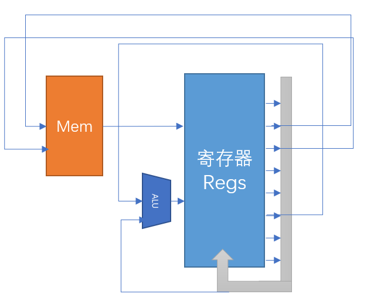

**上图仅是简单地描绘了我们本次实验数据通路的模型，在后面我们还好更加深入地体验数据通路的建立和数据的流动。**

顾名思义，”数据通路“部分，就是和”数据“打交道的。寄存器间、寄存器与主存、寄存器与ALU直接数据的传输，都是在这个单元里完成的。

> 例如：将PC中的数据移动入MAR，则给出信号：PC_o=1, MAR_i=1，此时建立了PC到MAR的数据通路，在下一个时钟上升沿，PC的值则进入了MAR。

控制单元，仅根据输入的指令，顺序地生成控制信号，驱动CPU的运行，下文将会详细叙述。


## 4.2 微程序控制方式

我们刚刚已经提到，CPU的运行原理，无非就是由**控制信号**控制数据通路的建立，由时钟激励，在每一个时钟上升沿，数据通路上发生着数据的流动。

微程序控制方式采用微程序控制器存储指令微操作码，读出微指令操作码，生成控制信号。在这个方式下，首先，我们需要对微指令格式进行设计，以满足**按照特定顺序控制**的需求，再根据微指令的格式，设计微指令控制器。

下面，我们先来设计微指令格式。

### 4.2.1 微指令格式


我们在设计微指令时，要考虑以下几个问题：

> 1. 如何知道这一步需要执行的操作？
> 2. 如何知道下一步要执行的操作？
>

考虑到以上问题，我们就可以将微指令区分为不同的字段，每个字段拥有不同的功能，分别解决不同的问题。

微指令可以分解成几个字段：

> 这一步要执行什么操作？

- 操作控制字段（微操作码）：输出的控制信号，控制建立数据通路

> 下一步要执行什么操作？

- 顺序控制字段：
  - 条件选择：若微指令存在条件跳转，则需要在字段中指明条件
  - 下地址选择：选择微指令下地址的寻址方式
    - 绝对寻址方式（通过微指令显式给出的下地址字段）
    - 顺序寻址方式（原微程序地址+1）
    - 直接映射方式（通过指令的操作码译码得到）
  - 直接下址：显式指明下一条微指令的地址，仅在下地址选择指明下址寻址方式为绝对寻址时有意义

>思考一下，上述提到的3中寻址方式（绝对、顺序、直接映射），不同的寻址方式分别适用于哪些指令？

我们将继续深入讨论微指令下地址生成逻辑。~~（暗号：王）~~

### 4.2.2 微指令下地址生成

我们看到，微指令中很大一部分都被下址字段占据，下地址生成，也是微指令控制的一个重要的逻辑。在执行一条微指令时，我们必须知道，下一条微指令的地址是什么。

得到下一条微指令的地址，有以下三种方式。

#### 4.2.2.1 由指令译码得到

我们在取得一条指令的时候，由IR将指令送往控制器，我们如何知道执行其对应的微代码的首地址呢？我们可以通过直接译码的方式。

一个简单的译码逻辑如下，可以使用`case`语句实现。

```
case(OPCode)
	4'b0000: EntryAddr = ......;
	.....
	default: ....
endcase
```

#### 4.2.2.2 由当前微地址+1得到

由于一条指令可能对应多个微操作，而一条指令对应的多个微操作往往是顺序的存储在控存中，它们之间的跳转，往往通过当前地址+1实现。

```
wire [? : 0] upcSeq = upc + 1'b1;	
```

#### 4.2.2.3 由微指令显式指出

当一条指令的执行周期结束的时候，又如何跳转到取下一条指令的微程序呢？这时候，就需要我们显式地在字段中指明取指微程序的下地址了。

```
wire [? :0] jmp_addr = ucode[ ? : ? ]; //ucode：微指令，jmp_addr：微指令跳转地址
```

#### 4.2.2.4 微指令的条件分支

我们看到，我们的指令集中包含了条件分支指令，那么，对于当前标志位寄存器的不同状态，我们应该跳转到不同的微程序入口，例如，`JMPZ`指令测试当前的`ZF`标志位，并根据不同的结果决定是继续取指还是修改`PC`——对应两段不同的微程序。因此，标志位也应该作为微程序控制器的输入。

于是，我们在下址逻辑的输入中，增加一个条件跳转标志位`condJMP`和条件选择位`CondSel`，并规定

- `CondJMP`为0时，下址寻址方式由`nextAddrSel`指明，不考虑条件位
- `CondJMP`为1时，条件位由`CondSel`指明，考察选中的条件位值是1或0，以决定不同的下地址。此时下地址共有2种可能：顺序寻址、绝对跳转。


#### 4.2.2.5 一个可能的下址生成逻辑

综上，我们可以拟定出一个可能的下地址生成逻辑。

```
assign Flag = CondSel ? .......;
always @(*)	begin
	nextAddr = 0;
    if (condJMP == ? && nextAddrSel == ? )	begin
        nextAddr = .......
    end else if(condJMP == ? && Flag == ? ) begin
        nextAddr = ....... 
    end else if(condJMP == ? && Flag == ? ) begin
        nextAddr = ....... 
.......
```


### 4.3 微程序控制器结构

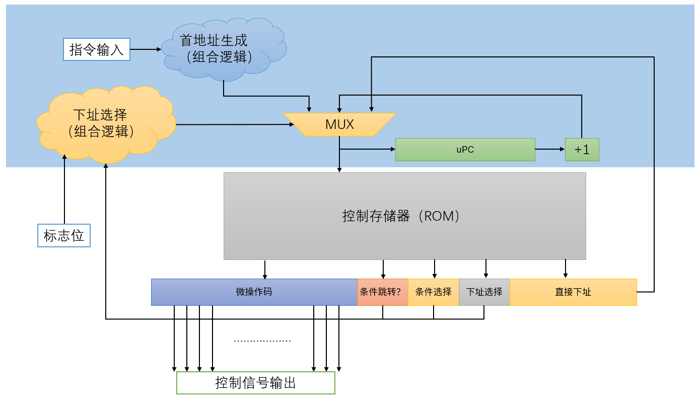

综上所述，我们可以梳理出微程序控制器的基本硬件框图。

本张图是理解微程序控制器结构的关键。

**微程序控制器由三大部分组成：控制存储器、下址生成逻辑和微地址寄存器uPC。**（类比状态机的思想，状态机的逻辑也分成两个部分：输出和次态计算）~~（暗号：盖）~~。

- 微程序存储在控制存储器中，微程序由一条条的微指令组成

- 下址生成逻辑（蓝色背景部分）：通过输入的指令操作码、微指令的下址字段和CPU的标志位产生下一条微指令的地址，保证微程序控制器按照正确的顺序取出微指令；其中包括以下几个部分
  - 下址选择：通过微指令的下址选择、条件选择字段，从多个可能的下地址中选择一个
  - 首地址生成逻辑：通常用于取指末尾的跳转，将指令的操作码译码，生成执行指令对应微程序的首地址
  - uPC：记录**当前**微指令的地址


# 五、实验步骤

## PartA: 熟悉框架

### 5.1 熟悉数据通路总体结构

我们为大家准备的实验大礼包中，包括以下内容：

```
logisim.exe     --- 电路仿真软件
DataPath.circ        --- 可仿真的CPU数据通路原理图
微指令表.xlsx     --- 微指令编写辅助表格
Lab4_Microcode  --- Vivado项目文件夹
```

#### 5.1.1 选读: Logisim基础入门

如果你对Logisim的使用已经熟悉，可以跳过。

参考链接：华中科技大学《计算机组成原理》Logisim使用指导：https://www.bilibili.com/video/BV1LE411q77o?p=2

#### 5.1.2 熟悉简易CPU的结构

其中，我们强烈推荐在进行实验之前，先对整个CPU的架构有一个完整的认知，所以我们使用简单的电路仿真软件`logisim.exe`，使用logisim打开`DataPath.circ`文件，你会看到我们设计的CPU的完整结构：

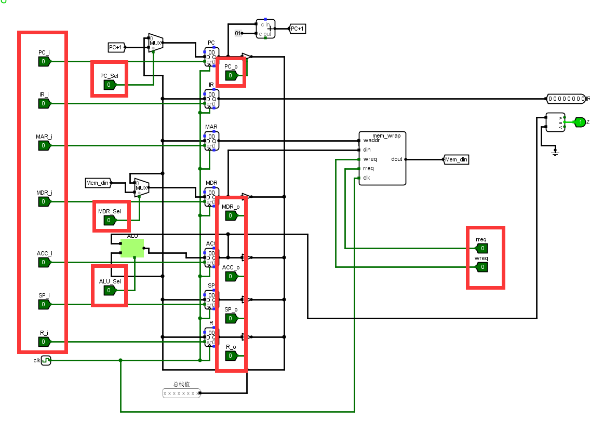

其中，红色框内标注的，就是我们所要实现的控制单元需要输出的控制信号。

我们的CPU中有7个寄存器，分别为：

> PC：指令指针
>
> IR：指令寄存器
>
> MAR：内存地址寄存器
>
> MDR：内存数据寄存器
>
> ACC：累加寄存器
>
> SP：栈顶寄存器
>
> R：通用寄存器

请务必熟悉：

- 哪些寄存器连接到了总线？
- 哪些寄存器没有连接到总线？
- 哪些寄存器有多个数据来源？
- ALU的端口是如何连接的？

其中，IR寄存器的输出连接到控制单元，`MAR`寄存器的输出连接到内存的地址端口，~~(暗号：地）~~其余所有寄存器都连接到内部总线，较为特殊的是`MDR`寄存器，不仅连接到内部总线，还连接到了主存的数据端口（用于写数据）。

在所有的寄存器中，`IR`, `MAR`, `SP`,`R`的值只能来源于总线输入，其余寄存器规定如下：

- `MDR`寄存器的值，既可以来源于总线输入，又可以来源于主存数据输出，由`MDRSel`控制
- `PC`寄存器的值，既可以来源于总线输入，又可以来源于自身+1的值，由`PCSel`控制
- `ACC`的值，既可以来源于总线输入，又可以来源于ALU的输出，ALU的功能由`ALUSel`控制

需要注意的是，ALU的输入值分别为ACC的值和总线的值。

#### 5.1.3 控制信号及其含义

| 控制信号                 | 含义                                           | 宽度 |
| ------------------------ | ---------------------------------------------- | ---- |
| *_i（例如PC_i, MDR_i等） | 寄存器写使能信号（高电平有效）                 | 1    |
| *_o（例如PC_o, MDR_o等） | 寄存器输出到总线使能（三态门使能，高电平有效） | 1    |
| PC_Sel                   | PC输入源（0：总线，1：PC+1）                   | 1    |
| MDR_Sel                  | MDR输入源（0：总线，1：主存）                  | 1    |
| ACC_Sel                  | ACC输入源（0：总线，1：ALU）                   | 1    |
| ALU_Sel                  | ALU功能选择（0：与，1：加）                    | 1    |
| MemRead，MemWrite        | 主存读写信号（高电平有效）                     | 1    |

**对于主存读时序，请参照后面的章节5.3.1.2：mem_wrap**

#### 5.1.4 思考

尝试改变各种控制信号，控制时钟脉冲，完成：

- 寄存器->寄存器传输操作
- 算术运算操作
- 寄存器->主存的双向数据交互
- 发挥你的想象力完成各种操作

**建议不要跳过这个步骤，直到你真正熟悉了各种时序关系。**

完成以下思考题，有助于你进行接下来的实验：

>1. 完成一次取指令操作（IR的值出现在IR_to_CU端口上）需要几个时钟周期？每一个周期内，各个控制信号是怎么样的（只需列出非0的控制信号）？数据的流动方向是什么？
>2. 完成一次寄存器之间的数据移动，需要几个时钟周期？控制信号是什么？
>3. 完成一次主存的写操作，需要几个时钟周期？每一个周期内，各个控制信号是怎么样的（只需列出非0的控制信号）？数据的流动方向是什么？
>4. 完成一次算术运算操作，并将结果写回到存储器，大概的流程是什么样？


### 5.2 熟悉项目结构

#### 5.2.1 模块层次结构

```
| ---- top(top.v): 顶层模块
   |---- Control_Unit(Control_Unit.v): 控制逻辑（需要完成）
   |---- DataPath(DataPath.v): 数据通路，包括寄存器、总线、ALU和主存
      |---- Regs(Regs.v): CPU内的通用寄存器
      |---- mem_wrap(mem_wrap.v): 主存模型
      |---- ALU(ALU.v): 算术逻辑单元
```

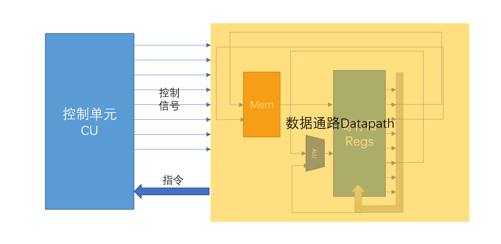

#### 5.2.2 查看原理图

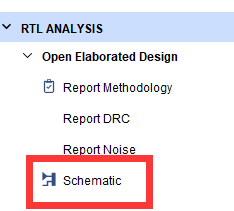

点击左侧的`RTL ANALYSIS`，点击`Schematic`，可以看到顶层模块的连接逻辑。

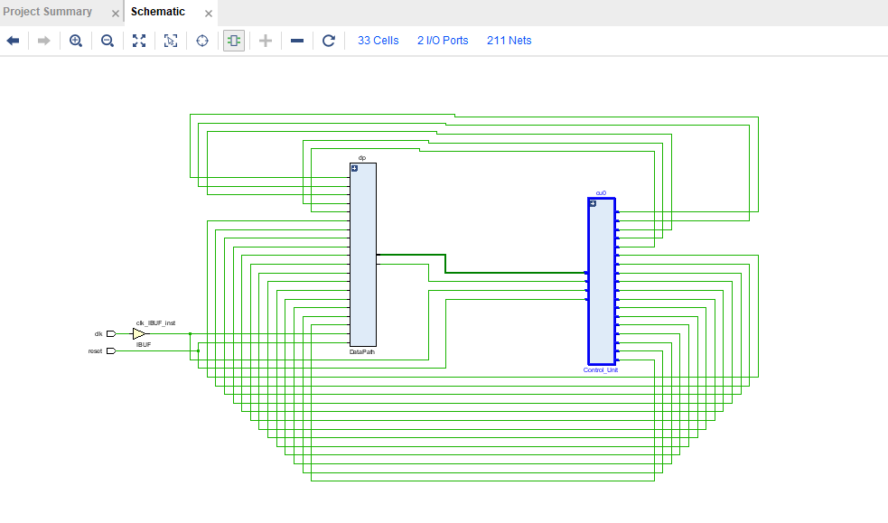

可以展开`dp`模块，查看内部连线逻辑。

**模块的IO和内部的互联方式，除了在Verilog中，我们将寄存器模块封装了以下，其他的与我们给出的logisim源文件是一致的，如果不熟悉，可以打开之前的原理图文件熟悉一下。**

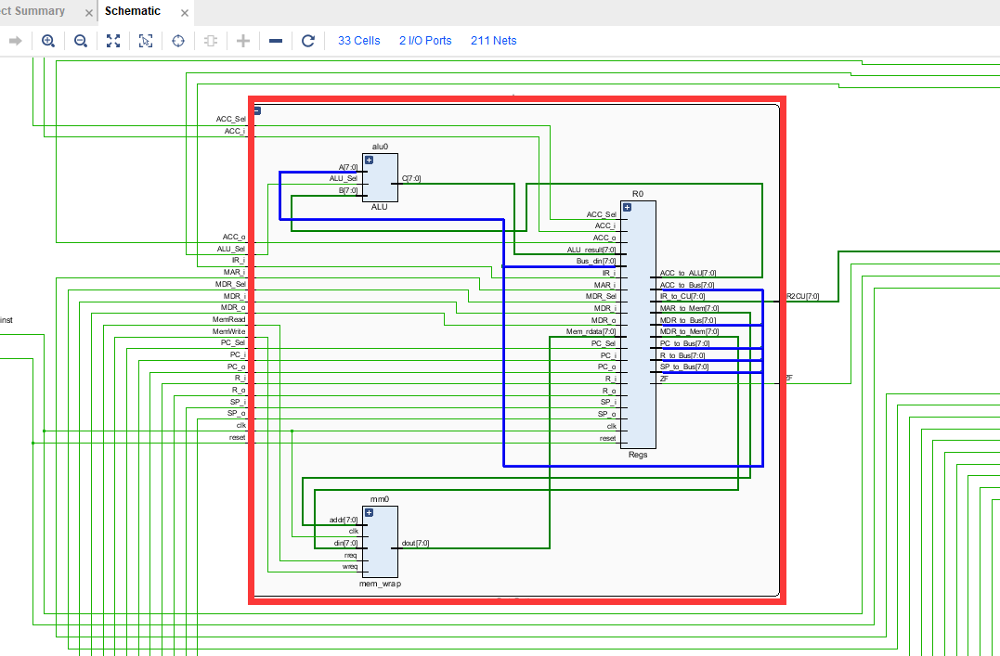


### 5.3 模块介绍

本实验采用数据通路和控制逻辑分离的方式，故`top`模块中，包含以下两个子模块。

#### 5.3.1 DataPath

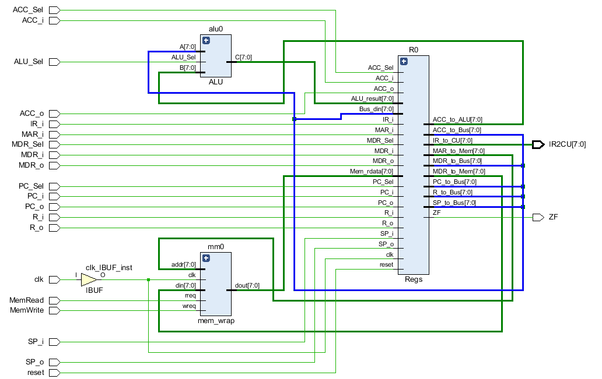

DataPath模块，与我们给出的`datapath.circ`原理图文件一致。主要职责是根据传入的控制信号，建立相应的数据通路，完成寄存器之间、寄存器和存储器之间、寄存器和ALU之间的数据传输。其模块IO定义如下：

| 输入信号                                | 描述                       | 来源       |
| --------------------------------------- | -------------------------- | ---------- |
| \*\_i,\*\_o, \*\_Sel, MemRead, MemWrite | 用以控制数据传输的控制信号 | 控制单元CU |
| clk, reset                              | 时钟和复位                 | 外部       |


| 输出信号 | 描述                 | 去向       |
| -------- | -------------------- | ---------- |
| IR2CU    | 取回的指令           | 控制单元CU |
| ZF       | 零标志位，ACC=0时为1 | 控制单元CU |

DataPath内部还有其他的子模块。

##### 5.3.1.1 Regs

| 输入信号             | 描述                             | 来源             |
| -------------------- | -------------------------------- | ---------------- |
| \*\_i,\*\_o, \*\_Sel | 用以寄存器之间数据传输的控制信号 | 上层模块DataPath |
| clk, reset           | 时钟和复位                       | 外部             |
| ALU_result           | ALU的运算结果                    | ALU              |
| Mem_rdata            | 主存读出的数据                   | mem_wrap         |
| Bus_din              | 寄存器总线数据输入               | 上层数据总线wire |

| 输出信号                           | 描述                           | 去向                     |
| ---------------------------------- | ------------------------------ | ------------------------ |
| \*\_to\_Bus                        | 寄存器输出到总线的数据（三态） | 上层数据总线wire         |
| ACC_to_ALU, MAR_to_MEM, MDR_to_MEM | 寄存器输出到功能部件的数据     | 其他功能部件（ALU，MEM） |
| IR2CU                              | 输出给外部的控制器             | 上层模块的IR2CU          |


##### 5.3.1.2 mem_wrap

**注意：`MemRead`和`MemWrite`实际上是控制信号寄存器，位于主存模块`mem_wrap`的内部。所以，在微操作中指明`MemRead=1`或是`MemWrite=1`时，实际上，在下一个时钟周期，`MemRead`或`MemWrite`才会真正变成1！**

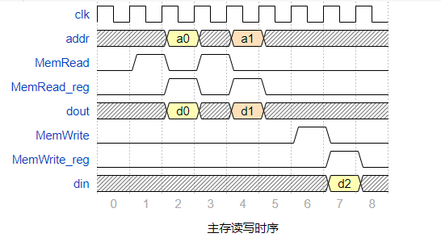


注意主存的读写时序，例如，在第1个周期时，控制器的输出信号`MemRead`为1，那么在第2个周期，主存内部的`MemRead_reg`才会变为1，在当前周期，主存读出有效的数据。

请务必理解`MemRead`和`MemWrite`是输出给**控制寄存器**的信号。

##### 5.3.1.3 ALU

ALU仅有2个功能，由ALUSel决定。

- ALUSel=0，则ALU执行按位与运算
- ALUSel=1，则ALU执行无符号加法运算


## Part B: 实现步骤

### 5.4 编写微指令（实验作业）

#### 5.4.1 微指令字段的编码及其意义

控制字段前面已经介绍过，此处不再赘述。

##### 5.4.1.1 condJMP

- 0：不考虑标志位
- 1：考虑标志位

##### 5.4.1.2 condSel（在condJMP为1时考虑）

- 0：ZF
- 1：~ZF

##### 5.4.1.3 nextAddrSel

- 00：uPC+1
- 01：直接下址
- 10：操作码译码的入口地址

##### 5.4.1.4 addr

- 显式指明的下地址字段


#### 5.4.2 微指令编写模板

打开实验大礼包中的`微指令表.xlsx`文件。

其中，粉红色的部分是你需要填写的控制信号，每一条微指令填写一行，绿色部分是微指令的下址字段，包括下址选择、标志选择和绝对地址字段，最后一列`microcode`是偷懒神器，你不必瞎眼的对着屏幕一个个打数字，只需表格填写完，就会按照从左至右、高位到低位的顺序自动拼接生成微指令。~~（暗号：王）~~

为了保护大家的视力，表格中为1的控制信号会自动变成绿色突出显示。

我们已经编写好了部分微指令，请你按照相应的方法完成剩余微程序的编写，注意充分参照表中已有的信息！

> 需要完成：
>
> - 取指微程序（可以在Logisim中先操作）
> - MOVE / ADD / AND
> - JUMPZ / JUMPNZ（可以参照给出的JUMP）
> - 所有微指令的下址字段 `nextAddrSel`和`addr`


由于一条指令可能对应多条微代码，擅长使用”合并单元格“工具，如下图：

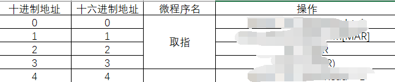

编写完毕后，请将最后一列直接选中，将自动生成的微指令的内容复制到`microcode.txt`文本文件中。

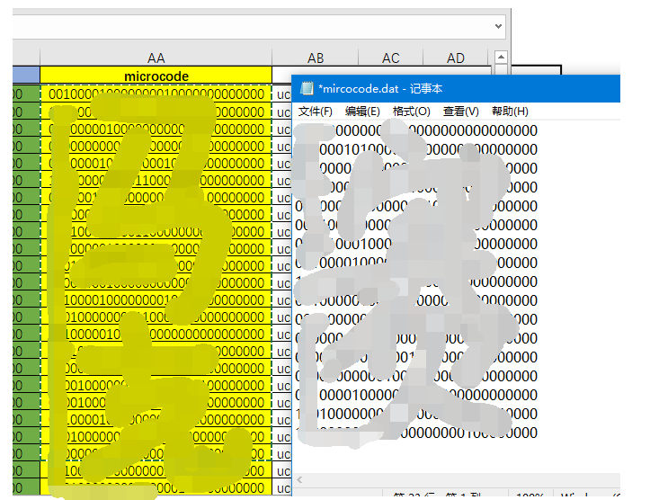


### 5.5 设计控制单元

#### 5.5.1 使用寄存器阵列实现控存

首先方框中的这一部分：

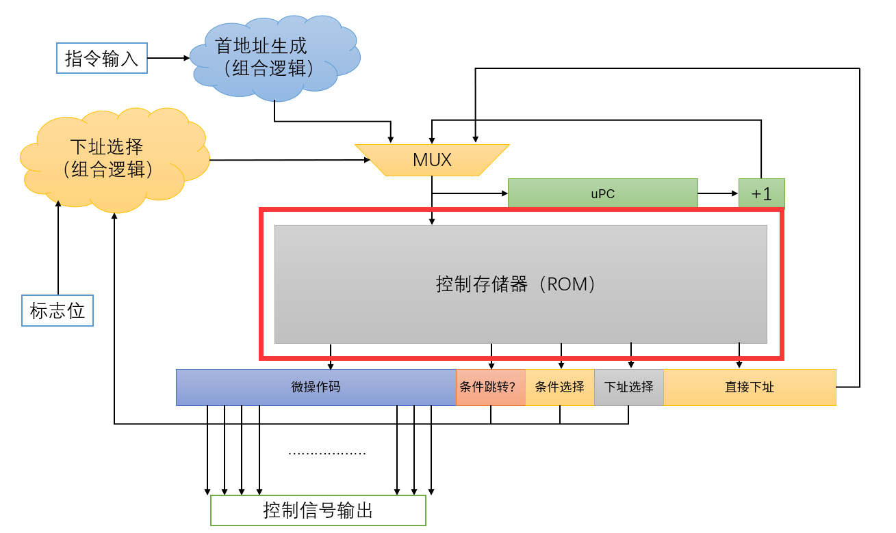

为实现方便，本次实验的所有存储器均采用仿真模型的方式构建，以避免过多综合IP核耗费时间。

同时，将自己编写的微代码复制到记事本中，并保存在项目`Lab4_Microcode.sim\sim_1\behav\xsim`文件夹，在`initial`语句中，初始化控存。

**此处一定注意：由于本次实验对存储器采用仿真模型（不要求上板），所以使用到了`initial`语句，在实际设计中，`intial`大多无法综合成电路！**

```
reg [? : ?] urom[? : ?];
initial begin
	$readmemb("microcode.txt", urom);
end
```

上述语句中，`$readmemb`的意思是，使用`microcode.dat`文件中的二进制来初始化`urom`寄存器阵列。再次强调，由于此次我们对所有存储器建立的都是**仿真模型**，仅可用于仿真验证，所以请不要在以后需要FPGA验证的实验中使用，在实际上板时，我们会使用`distributed ram`的IP核来完成这个设计。


#### 5.5.2 实现其他逻辑

请根据”实验原理“中的叙述，按照相应的框图，设计微指令控制单元。

要求：

- 微指令的编码方式为我们在”微指令表“中提供的编码方式，其中，`PC_i`信号为`MSB`，`addr`的最低位为`LSB`。
- 微指令控制器的设计，遵照上面的编码方式进行。


# 六、测试

## 6.1 单独测试

使用方法：文件列表如下，在`mem_wrap.v`的`$readmemb`语句中修改相应文件名即可进行测试。仿真时，注意观察各个寄存器的数据变化情况，请自行推断各个指令的执行结果。


### 6.1.1 load

主存`0x02`位置数据为`0xff`.

```
LOAD 0x02
```

### 6.1.2 store

主存`0x08`位置数据为`0xff`，`0x0f`数据为`0x00`.

```
LOAD 0x08
STORE 0x09
LOAD 0x0f
LOAD 0x09
```

### 6.1.3 move / add / and

```
LOADR 1
ADD
LOADR 2
ADD
LOADR 3
ADD
LOADR 2
AND 
MOVE
```

### 6.1.4 jump

```
0x00 LOADR 1
0x02 ADD
0x03 LOADR 2
0x05 ADD
0x06 JUMP 0x0b
0x08 LOADR 3
0x0a ADD
0x0b LOADR 4
0x0d ADD
```

### 6.1.5 jumpz_a

```
LOADR 1
ADD
LOADR 2
ADD
JUMPZ 0x09
LOADR 3
ADD
LOADR 4
ADD
```

### 6.1.6 jumpz_b

```
LOADR 1
ADD
LOADR 0
AND
JUMPZ 0x09
LOADR 3
ADD
LOADR 4
ADD
```

### 6.1.7 jumpnz_a

```
LOADR 1
ADD
LOADR 2
ADD
JUMPNZ 0x09
LOADR 3
ADD
LOADR 4
ADD
```

### 6.1.8 jumpnz_b

```
LOADR 1
ADD
LOADR 0
AND
JUMPZ 0x09
LOADR 3
ADD
LOADR 4
ADD
```


## 6.2 综合测试

将运行一个级数求和程序，此为在线测试的最终依据，请注意在线测试的`M1`，`M2`，`M3`和`IMM`均和本地不同。

```
	LOAD [M1]
START:
    MOVE
    LOAD [M2]
    ADD
    STORE [M2]
    LOAD [M1]
    LOADR 0xff 
    ADD
    STORE [M1]
    JMPNZ START

	// 此段代码不会执行
    JUMPZ END
    LOADR 0
    AND // clear ACC
    LOADR 0x0f
    ADD // set ACC = 1  
    STORE [M3]

END:
    LOADR 0
    AND // clear ACC
    LOADR [IMM]
    ADD // set ACC = 1  
    STORE [M3]
```

此处，`M1`为`0x23`，`M2`为`0x24`，`M3`为`0x25`，`M1`存放的是级数求和的`n`，`M2`存放的是级数求和的结果，`M3`存放的是程序结束标志，此处测试程序将等待该地址存放的数据变为`IMM`时，检测`M2`单元中的结果是否正确。


## 6.3 测试平台工具 待续

由于在线测试平台采用的是`Icarus Verilog`仿真器，其对`Verilog`的语法要求更加严格，不规范的电路描述会造成与`vivado`仿真器结果不一致。若提交后，结果与自测不一致，请自行安装`Icarus Verilog`和`GTKWave`进行调试，关于`Icarus Verilog`的使用，请参照https://www.cnblogs.com/lazypigwhy/p/10523712.html。

---

指导书到此结束，祝实验愉快！


# 七、提交方式

## 7.1 设计文件

请提交你实现的`CU.v`文件和`microcode.dat`文件，如果`CU.v`文件包含其他模块，请一并提交。

## 7.2 实验报告要求


# 八、实验课程总结与展望

首先，非常感谢大家能够耐心地完成我们给出的四个实验，并且积极提出问题，在调查问卷中给出宝贵的意见和建议，让我们能够朝着更好的方向继续前进。

因为是最后一次实验了，所以选择使用一种比较“皮”的方式完成实验指导书的编写，也是考虑到，大家课业负担很重，希望给大家平淡无奇的生活带来一些欢乐。

话说回来，希望同学们能够将"Get your hands dirty"的精神，带到未来的学习中，毕竟，学习知识最好的方法，就是去动手实践。”纸上得来终觉浅，绝知此事要躬行“，在这四个实验中，我们一起探索了计算机组成的奥秘，相信大家对理论知识有了更深层次的理解。经过这一学期的学习，迎接你的，将会是一个崭新的世界。

学习组成原理，不仅仅是为了让大家了解硬件知识，大家将来也不一定从事硬件开发的工作。但是，在日常的编程中，我们仍然会用到组成原理相关的知识。例如：时间局部性、空间局部性对循环效率的影响；分支的行为对处理器分支预测的影响；地址对齐以减少访存次数；SIMD在编程中的应用，等等......要写出效率高的程序，不仅仅需要高效的算法，也需要充分利用计算机底层硬件的特性，对程序代码进行相应的优化。这是一个很有意思的话题，感兴趣的同学可以了解一些优化技巧，例如Cache Blocking, Loop Unrolling等等。

如果同学们对组成原理、体系结构的知识感兴趣，推荐阅读几本书籍：《计算机组成与设计：软件/硬件接口》《深入理解计算机系统》《计算机体系结构：量化研究方法》，想必阅读完这些书籍，你对组成原理、体系结构的理解，又上了一个层次。其中，强烈推荐第二本书，它将陪伴你的整个大三的学习，帮助你建立系统思维。

同时，由于水平有限，指导书的编写、实验的设计难免存在瑕疵，感谢大家的谅解。如果有意愿想要参与实验设计的同学，欢迎联系老师加入下一届的助教团队！

在后续的《计算机设计与实践》课程中，我们将亲手设计一个更复杂的、能够执行更多指令的CPU，期待在《计算机设计与实践》课程再见！

祝好！

# 九、参考文献

- John D. Carpinelli, Computer Organization & architecture
- Computer Organization & Design: Hardware / Software Interface

