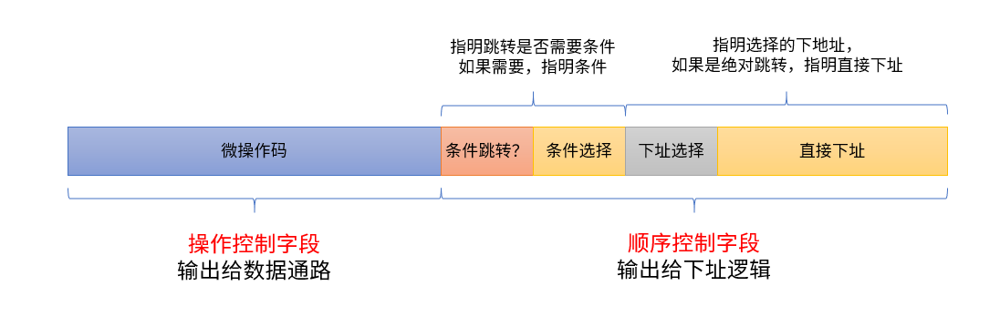

# 四、实验原理

## 4.1 CPU的基本结构

简单而言，我们把CPU分成“数据通路”和”控制单元“两个部分，CPU从指令存储器中取出指令，根据指令译码找到微程序入口地址，执行微操作，生成相应的控制信号，驱动数据的流动。


**上图仅是简单地描绘了我们本次实验数据通路的模型，在后面我们还好更加深入地体验数据通路的建立和数据的流动。**

顾名思义，”数据通路“部分，就是和”数据“打交道的。寄存器间、寄存器与主存、寄存器与ALU直接数据的传输，都是在这个单元里完成的。

> 例如：将PC中的数据移动入MAR，则给出信号：PC_o=1, MAR_i=1，此时建立了PC到MAR的数据通路，在下一个时钟上升沿，PC的值则进入了MAR。

控制单元，仅根据输入的指令，顺序地生成控制信号，驱动CPU的运行，下文将会详细叙述。


## 4.2 微程序控制方式

我们刚刚已经提到，CPU的运行原理，无非就是由 **控制信号** 控制数据通路的建立，由时钟激励，在每一个时钟上升沿，数据通路上发生着数据的流动。

微程序控制方式采用微程序控制器存储指令微操作码，读出微指令操作码，生成控制信号。在这个方式下，首先，我们需要对微指令格式进行设计，以满足 **按照特定顺序控制** 的需求，再根据微指令的格式，设计微指令控制器。

下面，我们先来设计微指令格式。

### 4.2.1 微指令格式

**注意：图中保留字段未画出！**



我们在设计微指令时，要考虑以下几个问题：

> 1. 如何知道这一步需要执行的操作？
> 2. 如何知道下一步要执行的操作？
>

考虑到以上问题，我们就可以将微指令区分为不同的字段，每个字段拥有不同的功能，分别解决不同的问题。

微指令可以分解成几个字段：

> 这一步要执行什么操作？

- 操作控制字段（微操作码）：输出的控制信号，控制建立数据通路

> 下一步要执行什么操作？

- 顺序控制字段：
  - 条件选择：若微指令存在条件跳转，则需要在字段中指明条件
  - 下地址选择：选择微指令下地址的寻址方式
    - 绝对寻址方式（通过微指令显式给出的下地址字段）
    - 顺序寻址方式（原微程序地址+1）
    - 直接映射方式（通过指令的操作码译码得到）
  - 直接下址：显式指明下一条微指令的地址，仅在下地址选择指明下址寻址方式为绝对寻址时有意义

>思考一下，上述提到的3中寻址方式（绝对、顺序、直接映射），不同的寻址方式分别适用于哪些指令？

我们将继续深入讨论微指令下地址生成逻辑。

### 4.2.2 微指令下地址生成

我们看到，微指令中很大一部分都被下址字段占据，下地址生成，也是微指令控制的一个重要的逻辑。在执行一条微指令时，我们必须知道，下一条微指令的地址是什么。

得到下一条微指令的地址，有以下三种方式。

#### 4.2.2.1 由指令译码得到

我们在取得一条指令的时候，由IR将指令送往控制器，我们如何知道执行其对应的微代码的首地址呢？我们可以通过直接译码的方式。

一个简单的译码逻辑如下，可以使用`case`语句实现。

```
case(OPCode)
	4'b0000: EntryAddr = ......;
	.....
	default: ....
endcase
```

#### 4.2.2.2 由当前微地址+1得到

由于一条指令可能对应多个微操作，而一条指令对应的多个微操作往往是顺序的存储在控存中，它们之间的跳转，往往通过当前地址+1实现。

```
wire [? : 0] upcSeq = upc + 1'b1;	
```

#### 4.2.2.3 由微指令显式指出

当一条指令的执行周期结束的时候，又如何跳转到取下一条指令的微程序呢？这时候，就需要我们显式地在字段中指明取指微程序的下地址了。

```
wire [? :0] jmp_addr = ucode[ ? : ? ]; //ucode：微指令，jmp_addr：微指令跳转地址
```

#### 4.2.2.4 微指令的条件分支

我们看到，我们的指令集中包含了条件分支指令，那么，对于当前标志位寄存器的不同状态，我们应该跳转到不同的微程序入口，例如，`JMPZ`指令测试当前的`ZF`标志位，并根据不同的结果决定是继续取指还是修改`PC`——对应两段不同的微程序。因此，标志位也应该作为微程序控制器的输入。

于是，我们在下址逻辑的输入中，增加一个条件跳转标志位`condJMP`和条件选择位`CondSel`，并规定

- `CondJMP`为0时，下址寻址方式由`nextAddrSel`指明，不考虑条件位
- `CondJMP`为1时，条件位由`CondSel`指明，考察选中的条件位值是1或0，以决定不同的下地址。此时下地址共有2种可能：顺序寻址、绝对跳转。


#### 4.2.2.5 一个可能的下址生成逻辑

综上，我们可以拟定出一个可能的下地址生成逻辑。

```
assign Flag = CondSel ? .......;
always @(*)	begin
	nextAddr = 0;
    if (condJMP == ? && nextAddrSel == ? )	begin
        nextAddr = .......
    end else if(condJMP == ? && Flag == ? ) begin
        nextAddr = ....... 
    end else if(condJMP == ? && Flag == ? ) begin
        nextAddr = ....... 
.......
```


### 4.3 微程序控制器结构


综上所述，我们可以梳理出微程序控制器的基本硬件框图。

本张图是理解微程序控制器结构的关键。

**微程序控制器由三大部分组成：控制存储器、下址生成逻辑和微地址寄存器uPC。** （类比状态机的思想，状态机的逻辑也分成两个部分：输出和次态计算）~~（暗号：盖）~~。

- 微程序存储在控制存储器中，微程序由一条条的微指令组成

- 下址生成逻辑（蓝色背景部分）：通过输入的指令操作码、微指令的下址字段和CPU的标志位产生下一条微指令的地址，保证微程序控制器按照正确的顺序取出微指令；其中包括以下几个部分
  - 下址选择：通过微指令的下址选择、条件选择字段，从多个可能的下地址中选择一个
  - 首地址生成逻辑：通常用于取指末尾的跳转，将指令的操作码译码，生成执行指令对应微程序的首地址
  - uPC：记录 **当前** 微指令的地址


