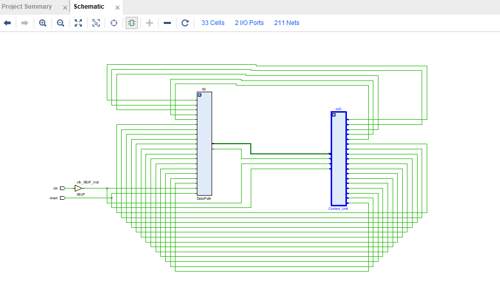
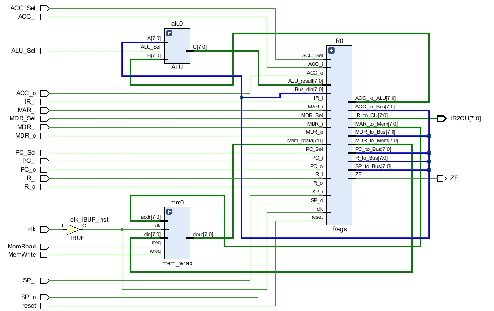
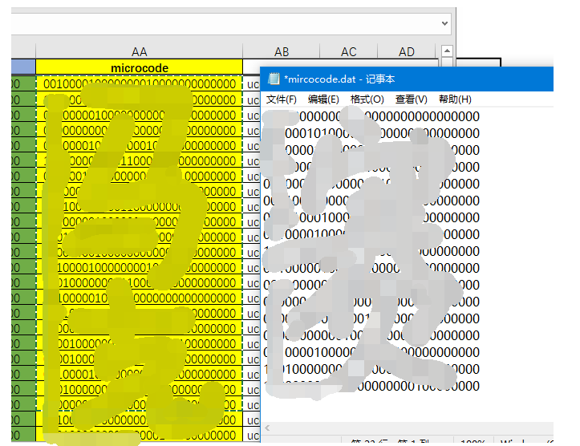

# 五、实验步骤

## PartA: 熟悉框架

### 5.1 熟悉数据通路总体结构

我们为大家准备的实验大礼包中，包括以下内容：

```
logisim.exe     --- 电路仿真软件
DataPath.circ        --- 可仿真的CPU数据通路原理图
微指令表.xlsx     --- 微指令编写辅助表格
Lab4_Microcode  --- Vivado项目文件夹
```

#### 5.1.1 选读: Logisim基础入门

如果你对Logisim的使用已经熟悉，可以跳过。

参考链接：华中科技大学《计算机组成原理》Logisim使用指导：https://www.bilibili.com/video/BV1LE411q77o?p=2

#### 5.1.2 熟悉简易CPU的结构

其中，我们强烈推荐在进行实验之前，先对整个CPU的架构有一个完整的认知，所以我们使用简单的电路仿真软件`logisim.exe`，使用logisim打开`DataPath.circ`文件，你会看到我们设计的CPU的完整结构：


其中，红色框内标注的，就是我们所要实现的控制单元需要输出的控制信号。

我们的CPU中有7个寄存器，分别为：

> PC：指令指针
>
> IR：指令寄存器
>
> MAR：内存地址寄存器
>
> MDR：内存数据寄存器
>
> ACC：累加寄存器
>
> SP：栈顶寄存器
>
> R：通用寄存器

请务必熟悉：

- 哪些寄存器连接到了总线？
- 哪些寄存器没有连接到总线？
- 哪些寄存器有多个数据来源？
- ALU的端口是如何连接的？

其中，IR寄存器的输出连接到控制单元，`MAR`寄存器的输出连接到内存的地址端口，~~(暗号：虎）~~其余所有寄存器都连接到内部总线，较为特殊的是`MDR`寄存器，不仅连接到内部总线，还连接到了主存的数据端口（用于写数据）。

在所有的寄存器中，`IR`, `MAR`, `SP`,`R`的值只能来源于总线输入，其余寄存器规定如下：

- `MDR`寄存器的值，既可以来源于总线输入，又可以来源于主存数据输出，由`MDRSel`控制
- `PC`寄存器的值，既可以来源于总线输入，又可以来源于自身+1的值，由`PCSel`控制
- `ACC`的值，既可以来源于总线输入，又可以来源于ALU的输出，ALU的功能由`ALUSel`控制

需要注意的是，ALU的输入值分别为ACC的值和总线的值。

#### 5.1.3 控制信号及其含义

| 控制信号                 | 含义                                           | 宽度 |
| ------------------------ | ---------------------------------------------- | ---- |
| *_i（例如PC_i, MDR_i等） | 寄存器写使能信号（高电平有效）                 | 1    |
| *_o（例如PC_o, MDR_o等） | 寄存器输出到总线使能（三态门使能，高电平有效） | 1    |
| PC_Sel                   | PC输入源（0：总线，1：PC+1）                   | 1    |
| MDR_Sel                  | MDR输入源（0：总线，1：主存）                  | 1    |
| ACC_Sel                  | ACC输入源（0：总线，1：ALU）                   | 1    |
| ALU_Sel                  | ALU功能选择（0：与，1：加）                    | 1    |
| MemRead，MemWrite        | 主存读写信号（高电平有效）                     | 1    |

**对于主存读时序，请参照后面的章节5.3.1.2：mem_wrap**

#### 5.1.4 思考

尝试改变各种控制信号，控制时钟脉冲，完成：

- 寄存器->寄存器传输操作
- 算术运算操作
- 寄存器->主存的双向数据交互
- 发挥你的想象力完成各种操作

**建议不要跳过这个步骤，直到你真正熟悉了各种时序关系。**

完成以下思考题，有助于你进行接下来的实验：

>1. 完成一次取指令操作（IR的值出现在IR_to_CU端口上）需要几个时钟周期？每一个周期内，各个控制信号是怎么样的（只需列出非0的控制信号）？数据的流动方向是什么？
>2. 完成一次寄存器之间的数据移动，需要几个时钟周期？控制信号是什么？
>3. 完成一次主存的写操作，需要几个时钟周期？每一个周期内，各个控制信号是怎么样的（只需列出非0的控制信号）？数据的流动方向是什么？
>4. 完成一次算术运算操作，并将结果写回到存储器，大概的流程是什么样？


### 5.2 熟悉项目结构

#### 5.2.1 模块层次结构

```
| ---- top(top.v): 顶层模块
   |---- Control_Unit(Control_Unit.v): 控制逻辑（需要完成）
   |---- DataPath(DataPath.v): 数据通路，包括寄存器、总线、ALU和主存
      |---- Regs(Regs.v): CPU内的通用寄存器
      |---- mem_wrap(mem_wrap.v): 主存模型
      |---- ALU(ALU.v): 算术逻辑单元
```


#### 5.2.2 查看原理图


点击左侧的`RTL ANALYSIS`，点击`Schematic`，可以看到顶层模块的连接逻辑。



可以展开`dp`模块，查看内部连线逻辑。

**模块的IO和内部的互联方式，除了在Verilog中，我们将寄存器模块封装了以下，其他的与我们给出的logisim源文件是一致的，如果不熟悉，可以打开之前的原理图文件熟悉一下。**


### 5.3 模块介绍

本实验采用数据通路和控制逻辑分离的方式，故`top`模块中，包含以下两个子模块。

#### 5.3.1 DataPath



DataPath模块，与我们给出的`datapath.circ`原理图文件一致。主要职责是根据传入的控制信号，建立相应的数据通路，完成寄存器之间、寄存器和存储器之间、寄存器和ALU之间的数据传输。其模块IO定义如下：

| 输入信号                                | 描述                       | 来源       |
| --------------------------------------- | -------------------------- | ---------- |
| \*\_i,\*\_o, \*\_Sel, MemRead, MemWrite | 用以控制数据传输的控制信号 | 控制单元CU |
| clk, reset                              | 时钟和复位                 | 外部       |


| 输出信号 | 描述                 | 去向       |
| -------- | -------------------- | ---------- |
| IR2CU    | 取回的指令           | 控制单元CU |
| ZF       | 零标志位，ACC=0时为1 | 控制单元CU |

DataPath内部还有其他的子模块。

##### 5.3.1.1 Regs

| 输入信号             | 描述                             | 来源             |
| -------------------- | -------------------------------- | ---------------- |
| \*\_i,\*\_o, \*\_Sel | 用以寄存器之间数据传输的控制信号 | 上层模块DataPath |
| clk, reset           | 时钟和复位                       | 外部             |
| ALU_result           | ALU的运算结果                    | ALU              |
| Mem_rdata            | 主存读出的数据                   | mem_wrap         |
| Bus_din              | 寄存器总线数据输入               | 上层数据总线wire |

| 输出信号                           | 描述                           | 去向                     |
| ---------------------------------- | ------------------------------ | ------------------------ |
| \*\_to\_Bus                        | 寄存器输出到总线的数据（三态） | 上层数据总线wire         |
| ACC_to_ALU, MAR_to_MEM, MDR_to_MEM | 寄存器输出到功能部件的数据     | 其他功能部件（ALU，MEM） |
| IR2CU                              | 输出给外部的控制器             | 上层模块的IR2CU          |


##### 5.3.1.2 mem_wrap

**注意：`MemRead`和`MemWrite`实际上是控制信号寄存器，位于主存模块`mem_wrap`的内部。所以，在微操作中指明`MemRead=1`或是`MemWrite=1`时，实际上，在下一个时钟周期，`MemRead`或`MemWrite`才会真正变成1！**


注意主存的读写时序，例如，在第1个周期时，控制器的输出信号`MemRead`为1，那么在第2个周期，主存内部的`MemRead_reg`才会变为1，在当前周期，主存读出有效的数据。

请务必理解`MemRead`和`MemWrite`是输出给 **控制寄存器** 的信号。

##### 5.3.1.3 ALU

ALU仅有2个功能，由ALUSel决定。

- ALUSel=0，则ALU执行按位与运算
- ALUSel=1，则ALU执行无符号加法运算


## Part B: 实现步骤

### 5.4 编写微指令（实验作业）

#### 5.4.1 微指令字段的编码及其意义

控制字段前面已经介绍过，此处不再赘述。

##### 5.4.1.1 condJMP

- 0：不考虑标志位
- 1：考虑标志位

##### 5.4.1.2 condSel（在condJMP为1时考虑）

- 0：ZF
- 1：~ZF

##### 5.4.1.3 nextAddrSel

- 00：uPC+1
- 01：直接下址
- 10：操作码译码的入口地址

##### 5.4.1.4 addr

- 显式指明的下地址字段


#### 5.4.2 微指令编写模板

打开实验大礼包中的`微指令表.xlsx`文件。

其中，粉红色的部分是你需要填写的控制信号，每一条微指令填写一行，绿色部分是微指令的下址字段，包括下址选择、标志选择和绝对地址字段，最后一列`microcode`是偷懒神器，你不必瞎眼的对着屏幕一个个打数字，只需表格填写完，就会按照从左至右、高位到低位的顺序自动拼接生成微指令。

为了保护大家的视力，表格中为1的控制信号会自动变成绿色突出显示。

我们已经编写好了部分微指令，请你按照相应的方法完成剩余微程序的编写，注意充分参照表中已有的信息！

> 需要完成：
>
> - 取指微程序（可以在Logisim中先操作）
> - MOVE / ADD / AND
> - JUMPZ / JUMPNZ（可以参照给出的JUMP）
> - 所有微指令的下址字段 `nextAddrSel`和`addr`


由于一条指令可能对应多条微代码，擅长使用”合并单元格“工具，如下图：


编写完毕后，请将最后一列直接选中，将自动生成的微指令的内容复制到`microcode.txt`文本文件中。




### 5.5 设计控制单元

#### 5.5.1 使用寄存器阵列实现控存

首先方框中的这一部分：


为实现方便，本次实验的所有存储器均采用仿真模型的方式构建，以避免过多综合IP核耗费时间。

同时，将自己编写的微代码复制到记事本中，并保存在项目`Lab4_Microcode.sim\sim_1\behav\xsim`文件夹，在`initial`语句中，初始化控存。

**此处一定注意：由于本次实验对存储器采用仿真模型（不要求上板），所以使用到了`initial`语句，在实际设计中，`intial`大多无法综合成电路！**

```
reg [? : ?] urom[? : ?];
initial begin
	$readmemb("microcode.txt", urom);
end
```

上述语句中，`$readmemb`的意思是，使用`microcode.dat`文件中的二进制来初始化`urom`寄存器阵列。再次强调，由于此次我们对所有存储器建立的都是 **仿真模型** ，仅可用于仿真验证，所以请不要在以后需要FPGA验证的实验中使用，在实际上板时，我们会使用`distributed ram`的IP核来完成这个设计。


#### 5.5.2 实现其他逻辑

请根据”实验原理“中的叙述，按照相应的框图，设计微指令控制单元。

要求：

- 微指令的编码方式为我们在”微指令表“中提供的编码方式，其中，`PC_i`信号为`MSB`，`addr`的最低位为`LSB`。
- 微指令控制器的设计，遵照上面的编码方式进行。


