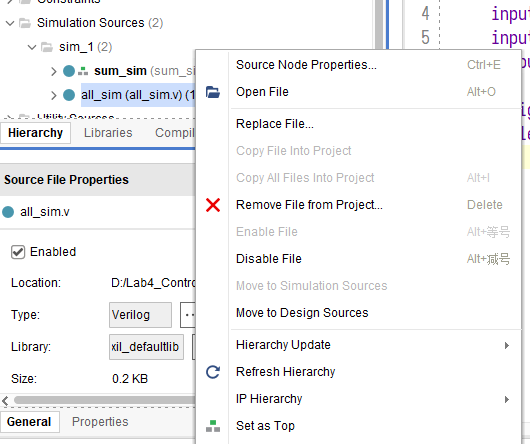
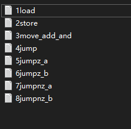
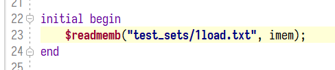

# 六、测试



提供了2个仿真文件，其中，`all_sim`用于单条指令测试，不会输出调试信息，且不会自动停止。`sum_sim`用于综合测试（级数求和），会输出提示信息，且会自动停止。

要切换仿真文件，请右键点击文件，`Set as Top`.

## 6.1 单独测试

使用方法：文件列表如下，在`mem_wrap.v`的`$readmemb`语句中修改相应文件名即可进行测试。仿真时，注意观察各个寄存器的数据变化情况，请自行推断各个指令的执行结果。





### 6.1.1 load

主存`0x02`位置数据为`0xff`.

```
LOAD 0x02
```

### 6.1.2 store

主存`0x08`位置数据为`0xff`，`0x0f`数据为`0x00`.

```
LOAD 0x08
STORE 0x09
LOAD 0x0f
LOAD 0x09
```

### 6.1.3 move / add / and

```
LOADR 1
ADD
LOADR 2
ADD
LOADR 3
ADD
LOADR 2
AND 
MOVE
```

### 6.1.4 jump

```
LOADR 1
ADD
LOADR 2
ADD
JUMP 0x0b
LOADR 3
ADD
LOADR 4
ADD
```

### 6.1.5 jumpz_a

```
LOADR 1
ADD
LOADR 2
ADD
JUMPZ 0x09
LOADR 3
ADD
LOADR 4
ADD
```

### 6.1.6 jumpz_b

```
LOADR 1
ADD
LOADR 0
AND
JUMPZ 0x09
LOADR 3
ADD
LOADR 4
ADD
```

### 6.1.7 jumpnz_a

```
LOADR 1
ADD
LOADR 2
ADD
JUMPNZ 0x09
LOADR 3
ADD
LOADR 4
ADD
```

### 6.1.8 jumpnz_b

```
LOADR 1
ADD
LOADR 0
AND
JUMPZ 0x09
LOADR 3
ADD
LOADR 4
ADD
```


## 6.2 综合测试

测试机器码位于`test_set/9sum.txt`

将运行一个级数求和程序，此为在线测试的最终依据，请注意在线测试的`M1`，`M2`，`M3`和`IMM`均和本地不同。

```
	LOAD [M1]
START:
    MOVE
    LOAD [M2]
    ADD
    STORE [M2]
    LOAD [M1]
    LOADR 0xff 
    ADD
    STORE [M1]
    JMPNZ START

	// 此段代码不会执行
    JUMPZ END
    LOADR 0
    AND // clear ACC
    LOADR 0x0f
    ADD // set ACC = 1  
    STORE [M3]

END:
    LOADR 0
    AND // clear ACC
    LOADR [IMM]
    ADD // set ACC = 1  
    STORE [M3]
```

此处，`M1`为`0x23`，`M2`为`0x24`，`M3`为`0x25`，`M1`存放的是级数求和的`n`，`M2`存放的是级数求和的结果，`M3`存放的是程序结束标志，此处测试程序将等待该地址存放的数据变为`IMM`时，检测`M2`单元中的结果是否正确，并停止仿真。


## 6.3 测试平台工具

由于在线测试平台采用的是`Icarus Verilog`仿真器，其对`Verilog`的语法要求更加严格，不规范的电路描述会造成与`vivado`仿真器结果不一致。若提交后，结果与自测不一致，请自行安装`Icarus Verilog`和`GTKWave`进行调试，关于`Icarus Verilog`的使用，请参照https://www.cnblogs.com/lazypigwhy/p/10523712.html。


