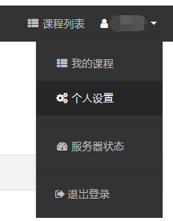
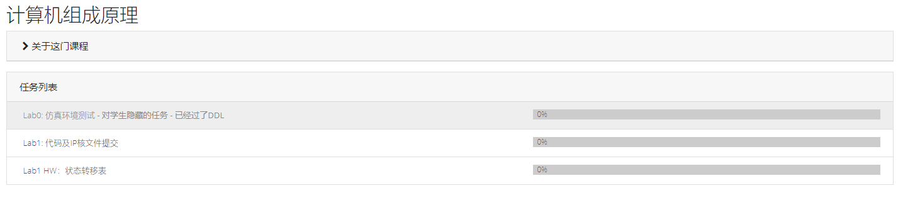
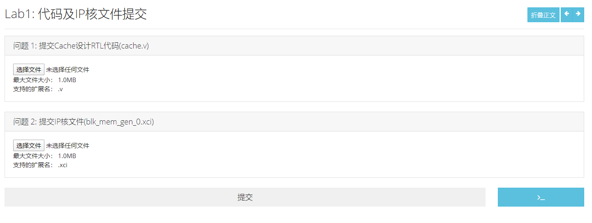
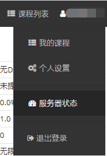
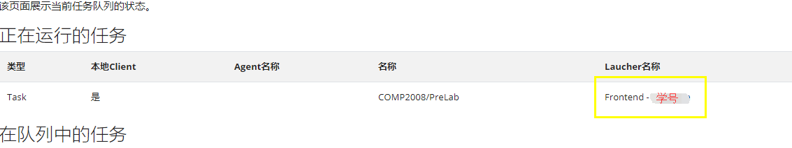

# 实验提交说明

!!! 注意事项
    - 系统上运行的测试程序和下发的测试文件一致，强烈建议在本地运行测试通过后再提交！！
    - 由于技术水平有限，不能保证系统稳定运行，提交后请仍然自己保留一份代码及文档，以免由于不可预知的情形，导致服务器宕机造成数据丢失，敬请谅解。

请通过VPN进入校园网，进入 [10.249.13.135/signin](10.249.13.135/signin) ，登录用户名为学号（例如 180110\*\*\*），密码为111111（6个1）。登录后，请在右上角“个人设置”修改密码。

登录完毕后，请点击”我的课程“内”计算机组成原理“

需要提交的任务列表如图所示。

点击任意一个任务，即可以选择相应的文件。

点击”提交“后，稍等片刻，系统即可得出结果。

如果碰到“Internal Server Error"，请稍等片刻后刷新页面，或前往右上角”服务器状态“查看，自己提交的答案是否已经交付测评。

如果自己提交的任务正在运行，请等待任务运行完毕后，返回查看自己的结果。