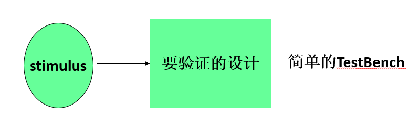

# 模块测试

- 测试平台（test bench）是一个无输入，有输出的顶层调用模块。
- 一个简单的测试平台包括：
  - 产生激励信号；
  - 实例化待测模块，并将激励信号加入到待测模块中。



- 激励模块通常是顶层模块
- 激励信号数据类型要求为reg，以便保持激励值不变，直至执行到吓一跳激励语句为止
- 输出信号的数据类型要求为wire，以便能随时跟踪激励信号的变化

```
  'timescale  1ns/1ns       //时间单位为1ns，精度为1ns
   module module_name_sim();         //模块名（无端口声明列表）
         reg [信号位宽] ;             //激励信号声明
         wire [信号位宽] ;           //输出信号声明
         module_name    instance_name (port_associations) ;     //实例化设计模块
	   initial 
		begin       //激励信号
			PS=1’b0;PD1=1’b1;      //语句1
		           #5 PS=1’b0;PD1=1’b1;      //语句2
                                ……	
             end	
    endmodule
```


## 四位全加器模块测试（接上例）

```
timescale 1ns / 1ps 
module add_4_sim();
         reg [3:0] A,B;
         reg CI;
         wire [3:0] S;
         wire CO;
         add_4 A1(A,B,CI,S,CO);
         initial
              begin
                   A=4'd0;B=4'd0;CI=1'b0;
                   #5 A=4'd3;B=4'd4;CI=1'B0;
                   #5 A=4'd2;B=4'd5;CI=1'b1;
                   #5 A=4'd9;B=4'd9;CI=1'b1;
                   #5 A=4'd0;B=4'd0;CI=1'b0;
              end
endmodule
```

