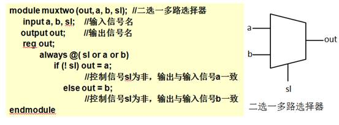
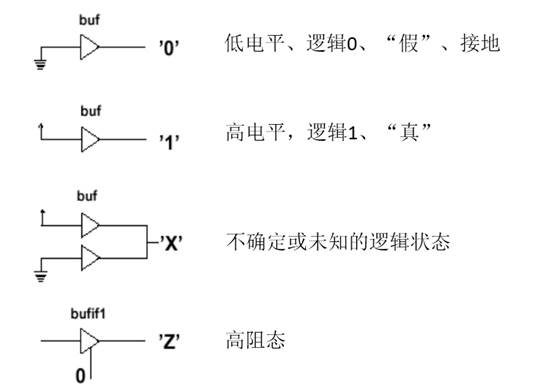
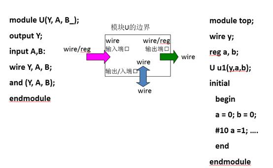

# 标识符和数据类型

## 标识符

- 赋给对象的唯一名称，可以是字母、数字、下划线和符号“$”的组合，且首字符只能是字母或者下划线。

- 大小写敏感。

- 关键词用小写字母定义，如：always,and,assign等

- 注释有两种：
  - 以“/\*”开头，以“\*/”结束。
  - 以“//”开头到本行结束。

## 数据类型

共有19种数据类型，分为物理数据类型和抽象数据类型

##### 物理数据类型

线网型wire、寄存器型reg、存储器型memory 等

##### 抽象数据类型

- 参数型parameter、整型integer、时间型time、实型real等

- 物理数据类型的抽象数据程度比较低，与实际硬件电路的映射关系明显。

- 抽象数据类型是用于进行辅助设计和验证的数据类型。

- 数据类型分为常量和变量，分别属于以上类型。
  - 常量：数字、参数型parameter
  - 变量：连线型wire、寄存器型reg、存储器型memory 等

---

### 线网类型（wire）

- 硬件电路中元件之间实际连线的抽象。( 如器件的管脚，内部器件如与非门的输出等)。

- 不存贮逻辑值，必须由器件驱动。通常由assign 进行赋值。
  - ​    如 assign Y = ~（A & C）；
- 当一个wire 类型的信号没有被驱动时，缺省值为Z（高阻）。

- 信号没有定义数据类型时，缺省为 wire 类型。

****

### 寄存器类型（reg）

- reg型的变量具有状态保存的作用。综合后常常是寄存器或触发器的输出，但不一定总是这样。

- 在过程块“always”块内被赋值的每一个信号都必须定义成reg型。

- reg型的变量只能在initial或always过程语句的内部被赋值。

- 没有赋值情况下默认为不定值x。

- reg型和wire型的区别：
  - reg型保持最后一次赋值
  - wire型需要持续的驱动

### 参数型（ parameter ）

- 定义格式：parameter 参数名1=表达式1，…，参数名n=表达式n；
  - 其中，表达式既可以是常数，也可以是表达式。参数定义完以后，程序中出现的所有的参数名都将被替换为相对应的表达式。
- parameter length=32,weight=16;//定义了两个参数

- 属于常量，常用来定义延迟时间和变量的位宽。

- 在模块或实例引用时，可通过参数传递改变在被引用模块或实例中已定义的参数。

### 数字

- 整数：
  - 二进制（b或B）、十进制（d或D）、十六进制（h或H）、八进制（o或O）
  - 表达方式：
    - <位宽><进制><数字>，这是一种全面的描述方式
    - 在<进制><数字>这种描述方式中，数字的尾款采用默认位宽（这又具体的机器系统决定，但至少32位）
    - 在< 数字>这种描述方式中，采用默认进制（十进制）
    - 8’b10101100//位宽为8的数的二进制表示，’b表示二进制
    - 8’ha2//位宽为8的数的十六进制表示，’h表示十六进制
- 负数
  - 在位宽表达式前加一个减号，减号必须写在数字定义表达式的最前面。
    - -8’d5    //5的补码

### 四种逻辑值

### 如何选择正确的数据类型？

- 输入端口（input）：可以由寄存器或线网连接驱动，但它本身只能驱动线网连接。

- 输出端口（output） ：可以由寄存器或线网连接驱动，但它本身只能驱动线网连接。

- 输入/输出端口（in/out）:只可以由线网连接驱动，但它本身只能驱动线网连接。

- 如果信号变量是在过程块（ initial块 或 always块）中被赋值的，必须把它声明为寄存器类型变量

