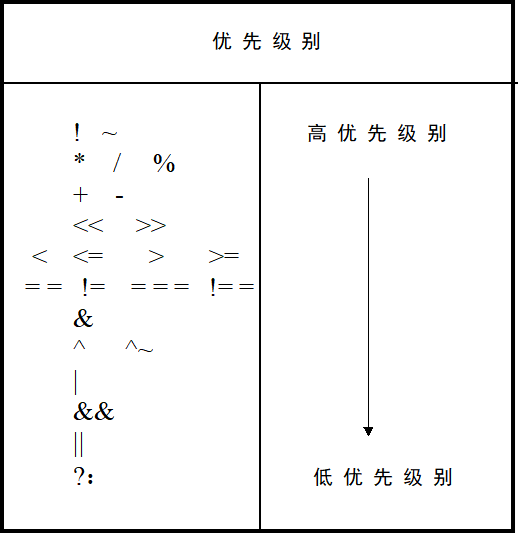

# 运算符及表达式

## 运算符

按功能分为以下几类：

- 算术运算符+，-，*，/，%

- 逻辑运算符： && ， || ， !

- 位运算符： ~, | , ^ ,& ,^~

- 赋值运算符 ：=，<=  

- 关系运算符：> ， < ， >= ， <=

- 条件运算符： ？：

- 移位运算符： << ,>>

- 拼接运算符 ：{}

- 等式运算符：==，！=，===，！==

- 其他

### 算术运算符 ：+，-，*，/，% 

- 在进行整数的除法运算时，结果要略去小数部分，只取整数部分；而进行取模运算时（%，亦称作求余运算符）结果的符号位采用模运算符中第一个操作数的符号。

- 在进行算术运算时，如果某一个操作数有不确定的值x，则整个结果也为不确定值x。

### 逻辑运算符： && ， || ， !

- 其中&&和||是双目运算符，其优先级别低于关系运算符，而 ！高于算术运算符。

### 位运算符： ~, | , ^ ,& ,^~

- 在不同长度的数据进行位运算时，系统会自动的将两个数右端对齐，位数少的操作数会在相应的高位补0，一时的两个操作数按位进行操作。

### 关系运算符：> ， < ， >= ， <=

- 如果关系运算是假的，则返回值是0，如果关系是真的，则返回值是1。 

- 关系运算符的优先级别低于算数运算符。如：a<size-1等同于a<(size-1)

- 如果某个操作数值不定，则关系是模糊的，返回值是不定值。

### 移位运算符： << ,>>

- a>>n其中a代表要进行移位的操作数，n代表要移几位。这两种移位运算都用0来填补移出的空位。如果操作数已经定义了位宽，则进行移位后操作数改变，但是其位宽不变。

### 拼接运算符 ：{}

- {信号1的某几位，信号2的某几位，......信号n的某几位} 将某些信号的某些为列出来，中间用逗号分开，最后用大括号括起来表示一个整体的信号。在位拼接的表达式中不允许存在没有指明位数的信号。

### 等式运算符：==，！=，===，！==

- ==，！=：X和Z进行比较时为X

- ===，！==：操作数相同结果为1，常用于case表达式的判别。

| ===  | 0    | 1    | x    | z    |      | ==   | 0    | 1    | x    | z    |
| ---- | ---- | ---- | ---- | ---- | ---- | ---- | ---- | ---- | ---- | ---- |
| 0    | 1    | 0    | 0    | 0    |      | 0    | 1    | 0    | x    | x    |
| 1    | 0    | 1    | 0    | 0    |      | 1    | 0    | 1    | x    | x    |
| x    | 0    | 0    | 1    | 0    |      | x    | x    | x    | x    | x    |
| z    | 0    | 0    | 0    | 1    |      | z    | x    | x    | x    | x    |

### 运算符优先级别表

