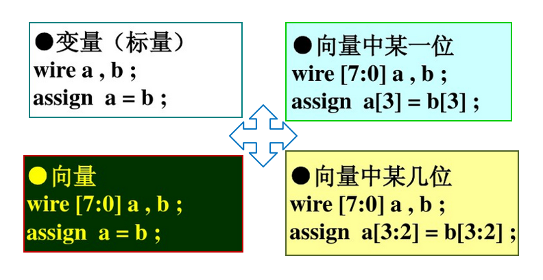
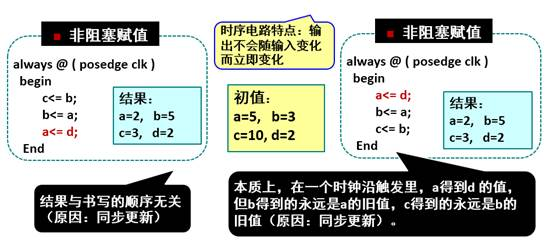
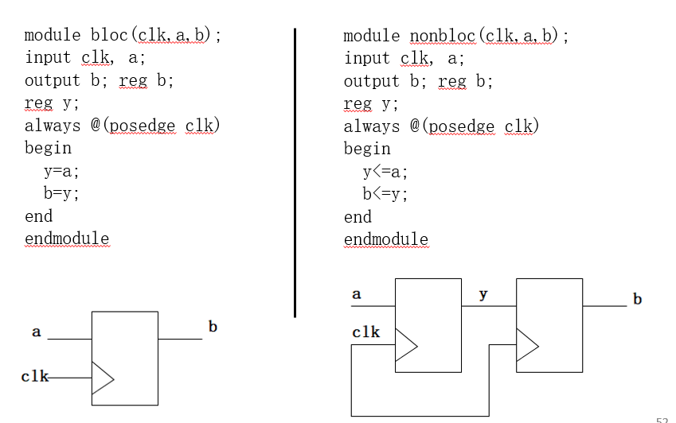

 

# 赋值语句和块语句

- 在Verilog中，变量是不能随意赋值的，需要使用连续赋值语句和过程赋值语句。

- assign称为连续赋值，对应于线网类型变量wire；

- initial或always称为过程赋值，对应于寄存器类型变量reg。


## 连续赋值语句

```
wire a；                  
assign a=1’b1；
```

- 语法格式： assign 线网型变量名=赋值表达式； 

- 等号右端赋值表达式的值会持续对被赋值变量产生连续驱动，而且只要等号右端赋值表达式的值改变，左端被赋值变量的值就会立即改变；

- 对应到电路中去，就是导线。


- 左侧数据类型必须是线网型数据（wire）；

- 所有右值都是敏感信号，右侧任何信号的变化都会激活该语句，使其被立即执行一次；

- 每条assign赋值语句相当于一个逻辑单元，等价于门级描述；

- 各个assign赋值语句之间是并发的关系；

- 在过程块（initial/always）外面；

- 描述组合电路。



## 过程赋值语句

```
reg a,c; 
always@(a) begin
  c<=c+a;
end      
```

```
reg c;  
initial begin
  c=1'b0;
end
```

- 在always/initial块中使用过程赋值语句；

- always不断执行，即每一次a的值改变时，c都会被重新赋值。

- initial只会执行一次，即只执行一次把c赋零的行为；

- 只能出现在过程块中（always/initial），主要描述时序电路；

- 过程赋值语句中： 没有关键词“assign”；

- 左侧数据类型必须是reg类型的变量；

- 每条过程赋值语句之间是顺序执行的关系。

- 包括阻塞赋值（运算符=）和非阻塞赋值（运算符（运算符<=）


### 阻塞赋值与非阻塞赋值

#### 阻塞（Blocking）赋值方式（如b = a ; ）

- 赋值语句执行完后，块才结束；

- b的值在赋值语句执行完后立刻就改变；

- 可能产生意想不到的结果。


#### 非阻塞（Non_Blocking）赋值方式（如b <= a;）

- 块结束后才完成赋值操作；
- b的值并不是立刻就改变；
- 这是一种比较常用的赋值方法。（特别在编写可综合模块时）
- 

#### 两者对比




### 区分阻塞赋值与非阻塞赋值

#### 时序逻辑

- 一定用非阻塞赋值“<=”,只要看到敏感列表有posedge就用“<=”。


#### 组合逻辑

- 一定用“=”，只要敏感列表没有posedge就用“=”。


#### 时序逻辑和组合逻辑分成不同的模块

- 即一个always模块里面只能出现非阻塞赋值“<=”或者“=”。


## 连续赋值与过程赋值的比较


|              | 过程赋值                                            | 连续赋值                                          |
| ------------ | ------------------------------------------------------- | ----------------------------------------------------- |
| assign   | 无assign  （过程性连续赋值除外）            | 有assign                                      |
| 符号     | 使用“=”，“<=”                           | 只使用“=”                                     |
| 位置     | 在always语句或initial语句中均可出现 | 不可出现于always语句和initial语句 |
| 执行条件 | 与周围其他语句有关                                  | 等号右端操作数的值发生变化时                      |
| 用途     | 驱动寄存器                                          | 驱动线网                                          |

 

## 过程块

- 过程块是行为模型的基础。


#### initial块

```
reg c;  
initial begin
  c=1'b0;
end    
```

- 只能执行一次。

- Inital语句不带触发条件。

- 它通常用于仿真模块。

- 格式如下

  ```
  Initial
  		begin
  			语句1；
  			语句2；
  			……
  			语句n;
  		end
  ```

  ```
  initial 
       begin    
            #20 begin a = 0;b = 0; cin= 1;end    
            #20 begin a = 0;b = 1; cin= 0;end   
            #20 begin a = 0;b = 1; cin= 1;end    
            #20 begin a = 1;b = 0; cin= 0;end    
            #20 begin a = 1;b = 0; cin= 1;end    
            #20 begin a = 1;b = 1; cin= 0;end    
        end
  ```

- begin_end为顺序块，用来标识顺序执行的语句。

#### always块

```
reg a,c; 
always@(a) begin
  c<=c+a;
end     
```

- 循环执行。

- always语句通常带触发条件，

-   满足触发条件则执行。

- 一个模块中有多个always块时，

-   可以并行进行
- 格式如下：

```
always @（<敏感信号列表>）
   begin
       //过程赋值
       //if-else、case选择语句
          //for、while等循环块
    end
```

- always语句通常带触发条件，触发条件被写在敏感信号列表中，只有当触发条件满足条件或发生变化时，其后的”begin-end”块语句才能被执行。

- 敏感信号列表中可以有多个信号，用关键字or连接；

- 敏感信号可分为两种：电平敏感、边沿敏感；

- 用关键字posedge和negedge限定信号敏感边沿。


- 电平触发的always块通常用于描述组合逻辑和带锁存器的组合逻辑；

- 边沿触发的always块通常用于描述时序逻辑。


```
module reg_ adder (out, a, b, clk);
   input clk;
   input [2: 0] a, b;
   output [3: 0] out;
   reg [3: 0] out;
   reg [3: 0] sum;
  always @( a or b) // 若a或b发生任何变化，执行
	 sum = a + b;
  always @( negedge clk) // 在clk下降沿执行
		out = sum;
endmodule
```

