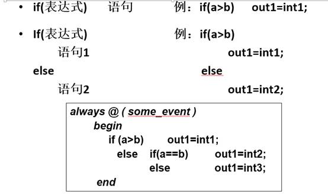
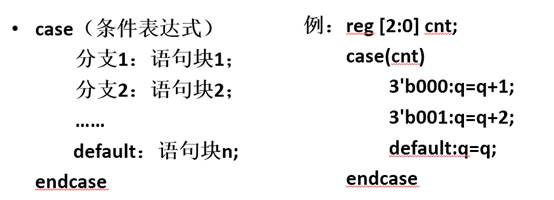

# 条件语句和循环语句

- 条件语句和循环语句都必须在过程块中使用

- 条件语句
  - if语句、case语句

- 循环语句
  - forever语句、repeat语句、while语句、for语句

## if语句

- 即使用不到else分支，语句中else分支也最好加上，否则电路有可能生成不稳定的电路，造成结果的错误。

## 条件语句-case语句

- case语句的所有表达式值的位宽必须相等

- 语句中default一般不要缺省。在”always”块内，如果给定条件下变量没有赋值，这个变量将保持原值（生成一个锁存器）

- 分支表达式中可以存在不定值x和高阻值z
  - 如2‘b0x，或2’b0z

## 条件语句if与case的区别

- if生成的电路是串行，是有优先级的编码逻辑；

- case生成的电路是并行的，各种判定情况的优先级相同。

- 因此，if生成的电路延时较大，占用硬件资源少；case生成的电路延时短，但占用硬件资源多。

## 循环语句

- Verilog的循环语句是依靠电路的重复生成实现的。

- 4种循环语句：
  - for 循环：执行给定的循环次数；
  - while 循环：执行语句直到某个条件不满足；
  - repeat 循环：连续执行语句N次；
  - forever 循环：连续执行某条语句。
-    for、while是可综合的，但循环的次数需要在编译之前就确定，动态改变循环次数的语句则是不可综合的

-    repeat语句在有些工具中可综合，有些不可综合

-    forever语句是不可综合的，常用于产生各类仿真激励

