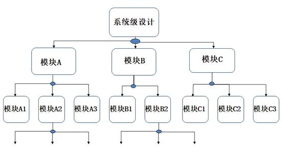

# 模块的调用

- 无论多么复杂的系统，总能划分成多个小的功能模块。系统的设计可以按照下面三个步骤进行：
  - （1）把系统划分成模块；
  - （2）规划各模块的接口；
  - （3）对模块编程并连接各模块完成系统设计。
- 模块是分层的。各模块连接完成整个系统需要一个顶层模块（top-module）。

- 高层模块通过调用、连接低层模块的实例来实现复杂的功能，即模块实例化。




## 模块实例化方法

- 调用模块实例的一般形式为：
  - <模块名><参数列表><实例名>（<端口列表>）;
  - `module_name   instance_name(port_associations) ;`
- 其中参数列表是传递到子模块的参数值。

- 信号端口可以通过位置或名称关联，但是关联方式不能够混合使用。

- 定义模块：`module Design(端口1，端口2，端口3……);`
  - 引用时，严格按照模块定义的端口顺序来连接，不用标明原模块定义时规定的端口名。
    - `Design u_1(u_1的端口1，u_1的端口2，……)；`//和Design对应
  - 引用时，用”.”符号，标明原模块定义时规定的端口名。
    - `Design u_2(  .(端口1(u_1的端口1), .(端口2(u_1的端口2),…… );`

---

```
 module  and1 (C,A,B);
 input A,B;
 output C;
 ...
```

-  `and1 A1 (T3,A,B);` //实例化时采用位置关联。

-  `and1 A2 (.C(T3), .A(A),.B(B) )；`//实例化时采用名字关联

-  `port_expr`可以是以下的任何类型：
  -  标识符（reg 或net)如` .C（T3）`，T3 为wire 型标识符。
  -  位选择，如 `.C（D[0]）`，C 端口接到D 信号的第0bit 位。
  -  部分选择，如` .Bus（Din[5：4]）`。
  -  上述类型的合并，如` .Addr（{ A1，A2[1：0]}`。
  -  表达式（只适用于输入端口），如` .A（wire Zire = 0 ）`。
-  例化名不能为元模块名或关键字。
