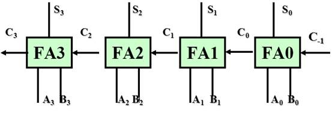
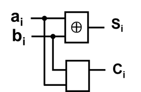
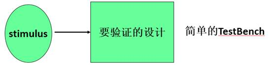
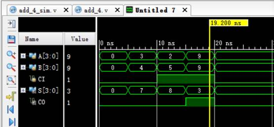

# 4位全加器设计实例



- 半加器模块：半加器由两个一位输入相加，输出一个结果位和进位。

- 1位全加器模块：由两个半加器和一个或门实现。

- 4位全加器模块：由4个1位全加器串联形成。

```
module half_adder(input a,input b, output sum,output c_out); //半加器
     assign sum = a^b;
     assign c_out = a&b;
endmodule
```

module full_adder(input a,input b,input c_in,output sum,output c_out);

     wire sum1;       

                                 

 

 

 

 

//1 位全加器

     wire c_out1,c_out2;    
     half_adder half_adder1(.a(a),.b(b),.sum(sum1),.c_out(c_out1));    
     half_adder half_adder2(.a(c_in),.b(sum1),.sum(sum),.c_out(c_out2));   
     assign c_out = c_out1|c_out2;
endmodule

 


4位全加器设计实例

 

module add_4 ( input [3:0] a, input [3:0]b, input c_in,           output [3:0] sum, output c_out ); //4位全加器
   wire [3:0] c_tmp; 
   full_adder i0 ( a[0], b[0], c_in, sum[0], c_tmp[0]); 
   full_adder i1 ( a[1], b[1], c_tmp[0], sum[1], c_tmp[1] ); 
   full_adder i2 ( a[2], b[2], c_tmp[1], sum[2], c_tmp[2] ); 
   full_adder i3 ( a[3], b[3], c_tmp[2], sum[3], c_tmp[3] ); 
   assign c_out = c_tmp[3];
endmodule

测试平台

- 测试平台（test bench）是一个无输入，有输出的顶层调用模块。

- 一个简单的测试平台包括：

  - 产生激励信号；

  - 
  - 实例化待测模块，并将激励信号加入到待测模块中。



TestBench模块

•   激励模块通常是顶层模块

•   激励信号数据类型要求为reg，以便保持激励值不变，直至执行到吓一跳激励语句为止

•   输出信号的数据类型要求为wire，以便能随时跟踪激励信号的变化

 'timescale 1ns/1ns    //时间单位为1ns，精度为1ns

  module module_name_sim();     //模块名（无端口声明列表）

     reg [信号位宽] ;       //激励信号声明
    
     wire [信号位宽] ;      //输出信号声明
    
     module_name  instance_name (port_associations) ;   //实例化设计模块
    
      initial 
    
       begin    //激励信号
    
           PS=1’b0;PD1=1’b1;   //语句1
    
             #5 PS=1’b0;PD1=1’b1;   //语句2
    
                …… 
    
       end  

  endmodule

4位全加器模块测试

`timescale 1ns / 1ps 

module add_4_sim();

     reg [3:0] A,B;
    
     reg CI;
    
     wire [3:0] S;
    
     wire CO;
    
     add_4 A1(A,B,CI,S,CO);
    
     initial
    
       begin
    
          A=4'd0;B=4'd0;CI=1'b0;
    
          #5 A=4'd3;B=4'd4;CI=1'B0;
    
          #5 A=4'd2;B=4'd5;CI=1'b1;
    
          #5 A=4'd9;B=4'd9;CI=1'b1;
    
          #5 A=4'd0;B=4'd0;CI=1'b0;
    
       end

endmodule

module add_4 ( input [3:0] a, input [3:0]b,            input c_in, output [3:0] sum, 

               output c_out );  

   wire [3:0] c_tmp; 

   full_adder i0 ( a[0], b[0], c_in, sum[0],          c_tmp[0]);

   full_adder i1 ( a[1], b[1], c_tmp[0],          sum[1], c_tmp[1] ); 

   full_adder i2 ( a[2], b[2], c_tmp[1],          sum[2], c_tmp[2] ); 

   full_adder i3 ( a[3], b[3], c_tmp[2],          sum[3], c_tmp[3] ); 

   assign c_out = c_tmp[3];

endmodule

