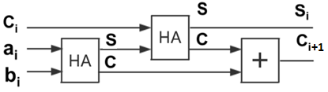

# 4位全加器设计实例


- 半加器模块：半加器由两个一位输入相加，输出一个结果位和进位。
- 1位全加器模块：由两个半加器和一个或门实现。
- 4位全加器模块：由4个1位全加器串联形成。

## 半加器


```
module half_adder(input a,input b, output sum,output c_out); //半加器
     assign sum = a^b;
     assign c_out = a&b;
endmodule
```
## 1位全加器



```
module full_adder(input a,input b,input c_in,output sum,output c_out);
	wire sum1;                                        
     wire c_out1,c_out2;    
     half_adder half_adder1(.a(a),.b(b),.sum(sum1),.c_out(c_out1));    
     half_adder half_adder2(.a(c_in),.b(sum1),.sum(sum),.c_out(c_out2));
     assign c_out = c_out1|c_out2;
endmodule
```


## 4位全加器

```
module add_4 ( input [3:0] a, input [3:0]b, input c_in,           output [3:0] sum, output c_out ); //4位全加器
   wire [3:0] c_tmp; 
   full_adder i0 ( a[0], b[0], c_in, sum[0], c_tmp[0]); 
   full_adder i1 ( a[1], b[1], c_tmp[0], sum[1], c_tmp[1] ); 
   full_adder i2 ( a[2], b[2], c_tmp[1], sum[2], c_tmp[2] ); 
   full_adder i3 ( a[3], b[3], c_tmp[2], sum[3], c_tmp[3] ); 
   assign c_out = c_tmp[3];
endmodule
```

