# 使用VSCode编写Verilog

众所周知，Vivado的编辑器由于某些原因，体验并不是很好，我们可以使用万能的VSCode来替代Vivado自带的编辑器，并集成Vivado的语法提示模块，提升书写Verilog代码的体验。（注意：仍然需要安装Vivado）

## 安装VSCode

略。

## 设置Vivado的默认编辑器为VSCode

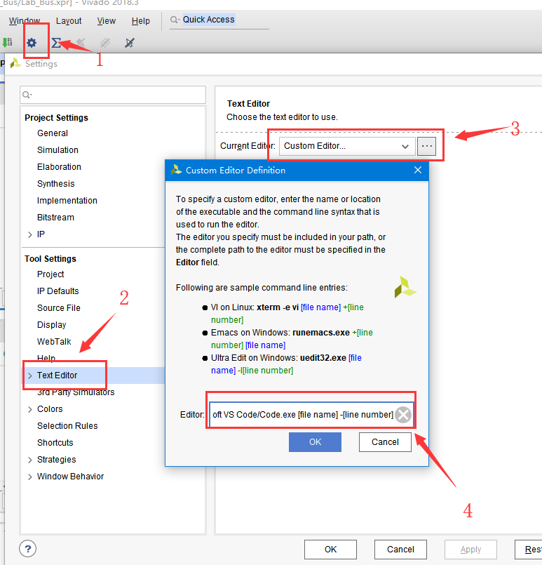

按照图中步骤，进入以上设置界面。

在框中填入你的VSCode安装路径，并在后面加上`[file name] -[line number]`，在我的机器上是`C:/Users/<用户名>/AppData/Local/Programs/Microsoft VS Code/Code.exe [file name] -[line number]`.

## VSCode安装对应插件

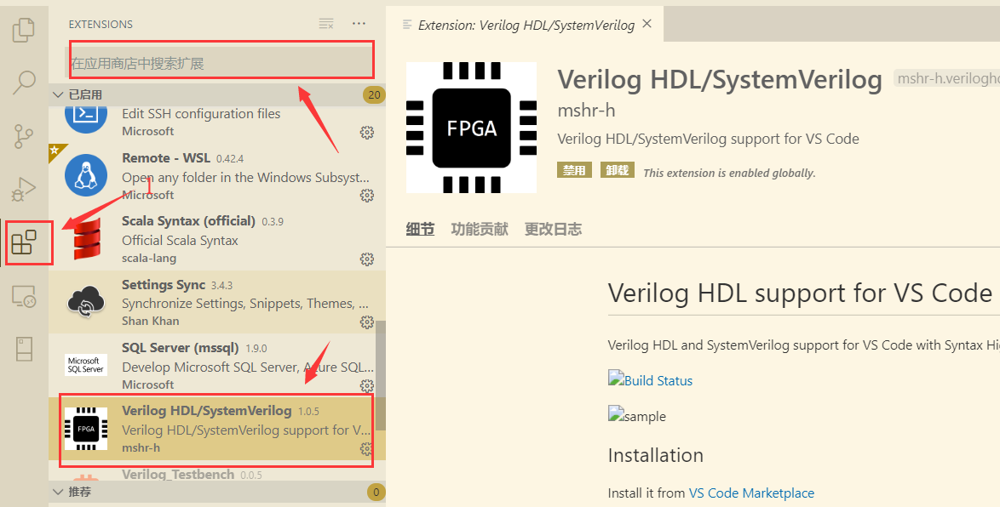

在VSCode插件商店中搜索并安装`Verilog HDL/SystemVerilog`插件。

## 下载CTags

到Github上下载CTags（https://github.com/universal-ctags/ctags-win32/releases），在Asset中选择

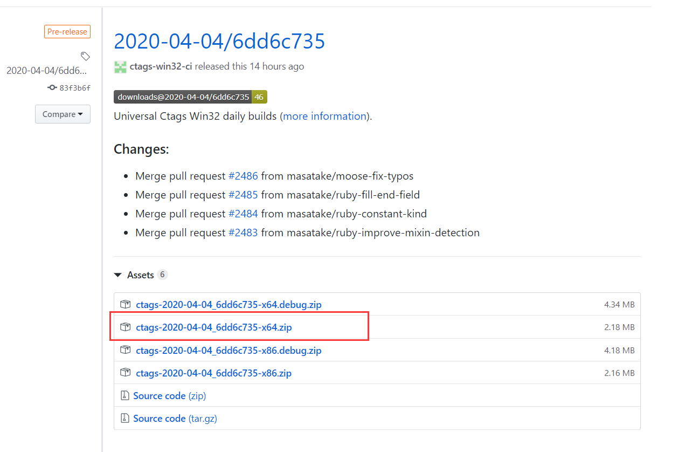

下载完成后，解压到任意位置，我解压到了`D:\\ctags`文件夹。

解压完毕后，点击扩展设置。

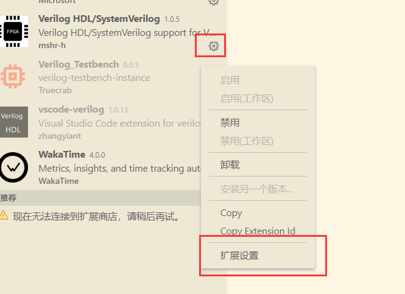

分别修改以下两个选项：

`Ctags:Path`即为你刚刚解压的路径，加上可执行文件名`ctags.exe`

`Linter`选择Vivado自带的xvlog.

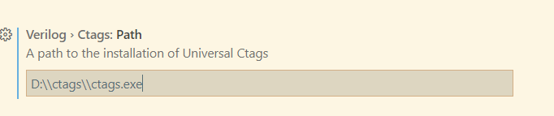

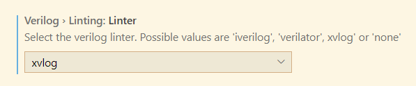

之后，就可以愉快地使用VSCode了。

## 功能

### 快速实例化

`Ctrl+Shift+P`，输入命令，快速实例化。

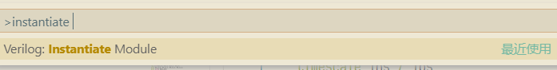

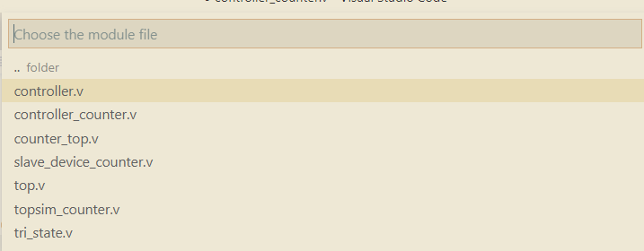

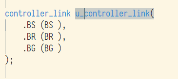

### 语法提示

调用Vivado的xvlog进行语法错误提示。

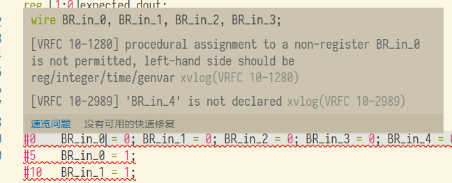

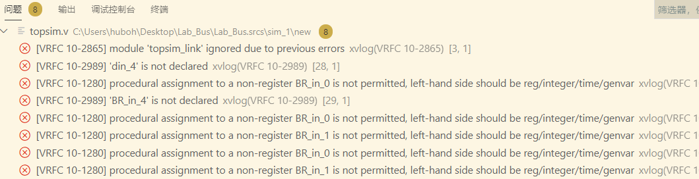

### 快速跳转和定义提示

鼠标悬浮，出现端口定义，按住`Ctrl`点击信号名，可跳转到信号定义。

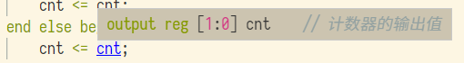

